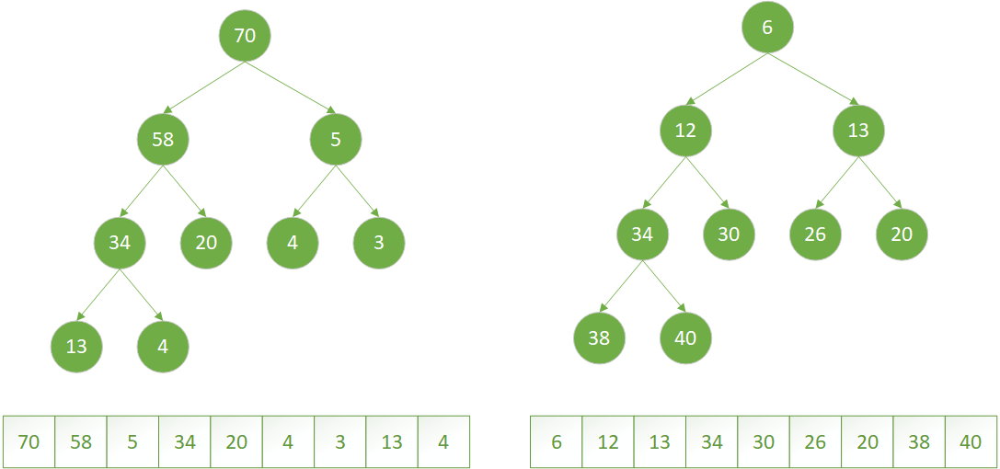
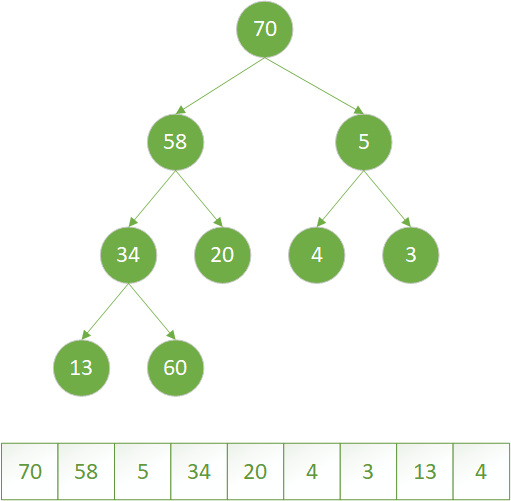
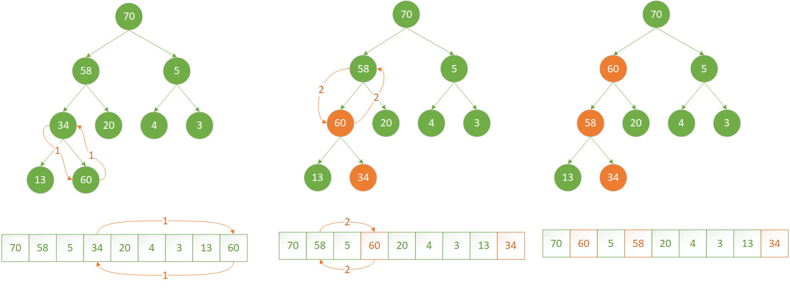
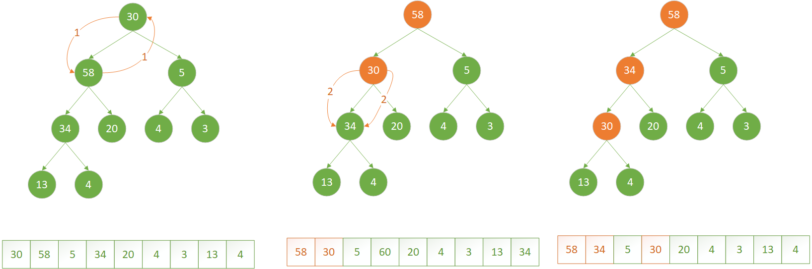
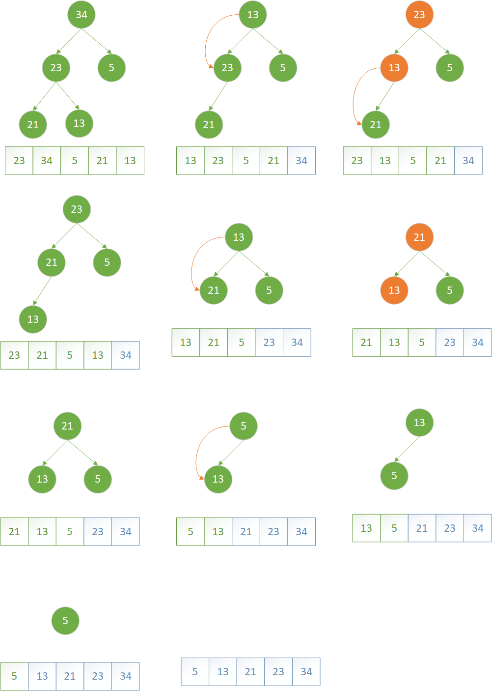

## 堆
### 堆的定义
任意一个子节点总是大于等于或者小于等于父节点的完全二叉树称之为堆，根据字节点和父节点的大小关系，堆又分为**大顶堆**和**小顶堆**

- **大顶堆：** 父节点的值总是大于等于子节点的值的堆称之为大顶堆，大顶堆的最大值总是在堆顶
- **小顶堆：** 父节点的值总是小于等于子节点的值的堆称之为小顶堆，小顶堆的最小值总是在堆顶
<center>
    
    <br>
    <div style="color:orange; border-bottom: 1px solid #d9d9d9;
    display: inline-block;
    color: #999;
    padding: 2px;">图1：大顶堆（图左）和小顶堆（图右）</div>
</center>

### 堆的存储结构
堆本质是一棵完全二叉树，则完全二叉树的所有性质都适合于堆。
对于二叉树我们一般定义节点的数据结构如下：
```
public class Node<T> {
    public T data;
    public Node left;   //左孩子节点
    public Node right;  //右孩子节点  
    public Node parent; //父节点
}
```
但是对于完全二叉树，将其按照层序遍历得到包含二叉树中所有元素的序列(${k_1,k_2,...,k_i,...k_n}$)，总是有给定一个节点$k_i$,那么其**左孩子**节点为$k_{2i+1}$，**右孩子**为$k_{2i+2}$，其**父节点**为$k_{(i-1)/2}$,那么就可以完全省略掉树节点中左孩子、右孩子以及父节点的相关定义，使用一维数组来存储堆。图1所示的堆使用数组表示后如图2所示

<center>
    
    <br>
    <div style="color:orange; border-bottom: 1px solid #d9d9d9;
    display: inline-block;
    color: #999;
    padding: 2px;">图2：大顶堆（图左）和小顶堆（图右）</div>
</center>

## 堆的基本操作
以图1表示的大顶堆为例，将其写成数组形式为{70,58,5,34,20,4,3,13,4}，如果此时将数组尾部的4换为60，那么此时如何将其调整一个最大堆呢？

<center>
    
    <br>
    <div style="color:orange; border-bottom: 1px solid #d9d9d9;
    display: inline-block;
    color: #999;
    padding: 2px;">图3：尾部换为60后侧二叉树</div>
</center>

#### 堆的上浮操作
如果堆的有序性因为某个节点的变化变得比其父节点更大（小），那么可以通过交换它与它的父节点来修复堆，如果交换后这个节点比它的两个子节点都大（小）（其中一个节点是它之前的兄弟节点，一个节点是交换之前的父节点），那么它有可能比它新的父节点还大（小），那么可以使用相同的办法一遍一遍交换使其恢复堆得秩序，直到碰到一个比其更大（小）的父节点或者至堆顶（图4），这个操作称之**上浮**
<center>
    
    <br>
    <div style="color:orange; border-bottom: 1px solid #d9d9d9;
    display: inline-block;
    color: #999;
    padding: 2px;">图4：堆的上浮操作</div>
</center>

代码实现：

```java
private void siftUp(int k) {
    while (k > 0) {
        int parent = (k - 1) >>> 1;
        if (!less(parent, k)) break;
        swap(parent, k);
        k = parent;
    }
}
```

#### 堆的下沉操作
如果堆的有序性因为某个节点的变化变得比其两个子节点（或其中一个）更小（大），那么可以通过交互它与它子节点中较大的一个来修复堆，交换后有可能在子节点处继续打破堆得有序性，那么便需要继续这一过程使堆恢复有序性（图5）。这个操作称之为**下沉**操作。
图5显示了根节点由70变为30后的整理堆的一个过程，使用的就是下沉操作
<center>
    
    <br>
    <div style="color:orange; border-bottom: 1px solid #d9d9d9;
    display: inline-block;
    color: #999;
    padding: 2px;">图5：堆的下沉操作</div>
</center>

```java
private void siftDown(int k) {
    int mid = queue.length >>> 1;

    while (k < mid) {
        int child = (k << 1) + 1;
        int r = child + 1;
        if (r < queue.length && less(child, r)) child = r;
        if (!less(k, child)) break;
        swap(k, child);
        k = child;
        
    }
}
```

#### 堆的构建
如何将给定的的$N$个元素构造成一个堆呢？
- 方法一：一种办法是从左至右遍历数组，将一个个元素插入到堆里面去（原地建堆，无需新的空间），保证在插入第$i+1$个元素之前，前$i$个元素已经是一个堆，插入第$i+1$个元素后，再使用上浮`siftUp`的方法将其放到合适的位置
- 方法二：另一个更有效的方式是从右往左扫面每个元素，保证以当前被扫描的元素为根节点的子树满足堆的特性，当新扫描到一个元素时，使用下沉`siftDown`的方式使的新的子树满足堆得有序性
**方法二**代码示例：
```
protected void buildHeap() {
    int i = (queue.size() >>> 1) - 1;
    while (i >= 0) {
        siftDown(i);
        i--;
    }
}
```

## 堆排序
先说一个结论：
- **从小到大排序需要构建大顶堆**
- **从大到小排序需要构建小顶堆**
- 如果头铁想从大到小排序用大顶堆也可以，就是算父节点和边界可能会崩溃

下文将按照从**大到小**排序来分析堆排序

1. 对于一个小顶堆一定有堆的堆顶元素是最小的
2. 从大到小排序最小的元素一定是在最尾部
3. 堆的最后一个元素一定是待排序列的最后一个元素

那么我们可以尝试将一个小顶堆的堆顶和堆最后一个元素（待排序列的最后一个元素）交换，再将除最后一个元素之外的堆通过下沉或者上浮的方式重新构造成一个小顶堆，再将堆顶元素与倒数第二个元素交换，依次递归，得到一个有序的序列。

  
<center>
    
    <br>
    <div style="color:orange; border-bottom: 1px solid #d9d9d9;
    display: inline-block;
    color: #999;
    padding: 2px;">图6：堆从小到大排序过程</div>
</center>

代码示例：
```java
public void sort() {
    int N = this.size() - 1;
    for (int i = N ; i >= 0; i--) {
        swap(0, i);
        siftDown(0, i);
    }
}

private void siftDown(int k, int N) {
    int mid = N >>> 1;

    while (k < mid) {
        int child = (k << 1) + 1;
        int r = child + 1;
        if (r < N && less(child, r)) child = r;
        if (!less(k, child)) break;
        swap(k, child);
        k = child;
    }
}
```

## 堆的使用范围
- 优先级队列（补充完优先级队列  这里上链接）


#### 参考资料：
[1] 算法第4版


 


