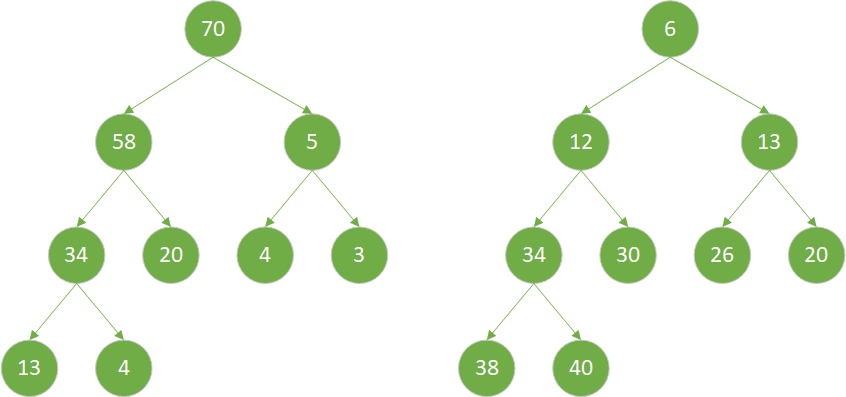

## 堆
### 堆的定义
任意一个子节点总是大于等于或者小于等于父节点的完全二叉树称之为堆，根据字节点和父节点的大小关系，堆又分为**大顶堆**和**小顶堆**

- **大顶堆：** 父节点的值总是大于等于子节点的值的堆称之为大顶堆，大顶堆的最大值总是在堆顶
- **小顶堆：** 父节点的值总是小于等于子节点的值的堆称之为小顶堆，小顶堆的最小值总是在堆顶
<center>
    
    <br>
    <div style="color:orange; border-bottom: 1px solid #d9d9d9;
    display: inline-block;
    color: #999;
    padding: 2px;">图1：大顶堆（图左）和小顶堆（图右）</div>
</center>

### 堆的存储结构
堆本质是一棵完全二叉树，则完全二叉树的所有性质都适合于堆。
对于二叉树我们一般定义节点的数据结构如下：
```
public class Node<T> {
    public T data;
    public Node left;   //左孩子节点
    public Node right;  //右孩子节点  
    public Node parent; //父节点
}
```
但是对于完全二叉树，将其按照层序遍历得到包含二叉树中所有元素的序列(${k_1,k_2,...,k_i,...k_n}$)，总是有给定一个节点$k_i$,那么其**左孩子**节点为$k_{2i+1}$，**右孩子**为$k_{2i+2}$，其**父节点**为$k_{(i-1)/2}$,那么就可以完全省略掉树节点中左孩子、右孩子以及父节点的相关定义，使用一维数组来存储堆。图1所示的堆使用数组表示后如图2所示

<center>
    
    <br>
    <div style="color:orange; border-bottom: 1px solid #d9d9d9;
    display: inline-block;
    color: #999;
    padding: 2px;">图2：大顶堆（图左）和小顶堆（图右）</div>
</center>

## 堆的基本操作
以图1表示的大顶堆为例，将其写成数组形式为{70,58,5,34,20,4,3,13,4}，如果此时在数字组尾部插入一个元素60（如图3左所示），那么此时如何将其调整一个最大堆呢？

<center>
    
    <br>
    <div style="color:orange; border-bottom: 1px solid #d9d9d9;
    display: inline-block;
    color: #999;
    padding: 2px;">图3：在数组尾插入60后的堆表示（左）及上浮表示（右）</div>
</center>

#### 堆的上浮操作
如果堆的有序性因为某个节点的变化变得比其父节点更大（小），那么可以通过交换它与它的父节点来修复堆，如果交换后这个节点比它的两个子节点都大（小）（其中一个节点是它之前的兄弟节点，一个节点是交换之前的父节点），那么它有可能比它新的父节点还大（小），那么可以使用相同的办法一遍一遍交换使其恢复堆得秩序，直到碰到一个比其更大（小）的父节点或者至堆顶，这个操作称之**上浮**。
图3左的上浮路线如图3右所示,先交换20和60，然后交换58和60.


