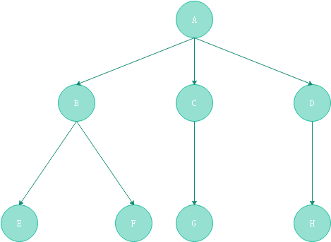
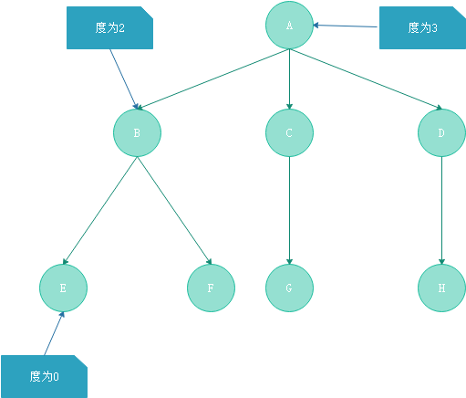
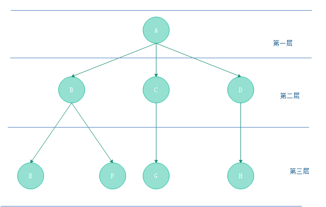
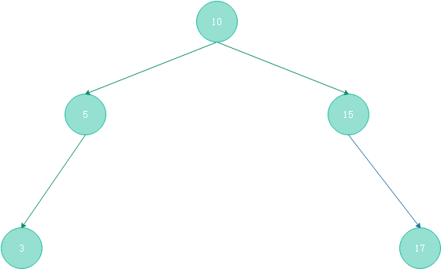
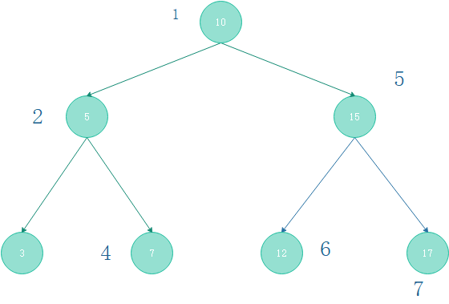
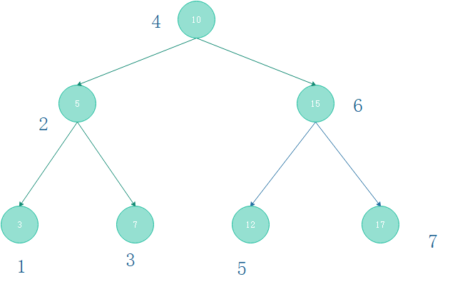
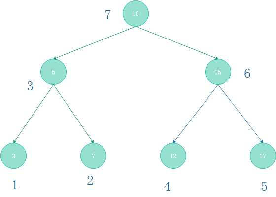

##目录
1. 树
2. 二叉树
3. 二叉树的遍历
4. 总结
- 参考资料

## 序
树是学习数据结构的时候非常重要的一个数据结构，尤其是二叉树更为重要。像`Java`的`HashMap`
就使用了红黑树，而`Mysql`的索引就使用到了B+树。恰好最近刷`leetcode`碰到了不少的有关
二叉树的题目，今天想着写个总结。

## 1. 树

#### 1.1 树的概念
树(Tree)是n(n>=0)个优先数据元素的结合。当n=0时，这棵树称之为空树，在一棵非空树T中：

1) 有一个特殊的元素被称之为根节点，根节点没有前驱节点
2) 若n>=1，除根节点外，其余元素分为m(m>0)个互不相交的集合T1、T2、.....、Tn，
其中每一个集合又是一棵树，并且称之为根的子树。

<center>
    
    <br>
    <div style="color:orange; border-bottom: 1px solid #d9d9d9;
    display: inline-block;
    color: #999;
    padding: 2px;">图(1-1)&nbsp;&nbsp;一颗普通的树</div>
</center>


#### 1.2 树的性质
1) 树的根节点没有前驱节点，除根节点之外所有的节点有且只有一个前驱节点
2) 树的所有节点可以有零个或者多个后继节点

#### 1.3 其他术语
- 节点的度：节点所拥有的子树的个数称为该节点的度。
<center>
    
    <br>
    <div style="color:orange; border-bottom: 1px solid #d9d9d9;
    display: inline-block;
    color: #999;
    padding: 2px;">图(1-2)&nbsp;&nbsp;节点的度</div>
</center>

- 树的度：树中个节点的度的最大值称为该树的度。图1-2中树的度为3.
- 叶节点：度为0的节点称之为叶节点
- 分支节点：度不为0的节点称之为分支节点或者非终端节点。一棵树的节点除了叶节点之外，其余的全是分支节点。
- 孩子、左孩子、右孩子、双亲、兄弟：树的一个节点的子树的根节点称之为这个节点的孩子。
在二叉树中，左子树的根称之为左孩子，右子树的跟称之为右孩子。反过来这个节点称之为他孩子节点的父节点。
具有同一个父节点的孩子互称为兄弟
- 路径、路径长度：如果一棵树中的一串节点n1、n2、......、nk有如下关系：节点ni是节点n(i+1)的父节点，
就把n1、n2、......、nk称之为一条从n1到nk的路径，这条路径的长度是k-1
- 节点的层数：规定树的根节点的层数是1，其余节点的层数等于他的父节点的层数+1
<center>
    
    <br>
    <div style="color:orange; border-bottom: 1px solid #d9d9d9;
    display: inline-block;
    color: #999;
    padding: 2px;">图(1-3)&nbsp;&nbsp;节点的层数</div>
</center>
- 有序树和无序树，如果一颗树中各个子树从左到右是有次序的，则称这棵树是有序的，反之称为无序树。
- 森林：有限棵不相交的树的集合称之为森林。

## 2.二叉树

#### 2.1 二叉树的定义
二叉树指书中节点的度不大于2的有序树，是一种最简单且最重要的树。

**递归定义：**二叉树是一棵空树或者是一颗由一个根节点和两颗互不相交二叉树组成的非空树。

<center>
    
    <br>
    <div style="color:orange; border-bottom: 1px solid #d9d9d9;
    display: inline-block;
    color: #999;
    padding: 2px;">图(2-1)&nbsp;&nbsp;二叉树</div>
</center>

**特点：**
>- 每个节点最多由两棵子树，所以二叉树中不存在度大于2的节点
>- 左子树和有子树是有顺序的，次序不能任意颠倒
>- 即使树中某节点只有一颗子树，也要区分他是左子树还是右子树

**有关二叉树的一些概念**：

>- 二叉树的深度：树种节点的最大层数称之为树的深度。
>- 满二叉树：如果一个二叉树每一层的节点数都到达了最大，这颗二叉树就称作满二叉树。
> 对于满二叉树，所有的分支节点都存在左子树和右子树，所有的叶结点都在同一层(最下面一层)。图(2-2)就是一颗满二叉树
><center>
>          box-shadow: 0 2px 4px 0 rgba(34,36,38,.12),0 2px 10px 0 rgba(34,36,38,.08);" 
>     src="满二叉树.png">
>     <br>
>     <div style="color:orange; border-bottom: 1px solid #d9d9d9;
>     display: inline-block;
>     color: #999;
>     padding: 2px;">图(2-2)&nbsp;&nbsp;满二叉树</div>
></center>
>- 完全二叉树：一颗深度为k的有那个节点的二叉树，对其节点按照从上至下，从左至右的顺序进行编号，如果编号i(1<=i<=n)
> 的节点与满二叉树种编号为i的节点在二叉树种的位置相同，则这棵二叉树称之为完全二叉树。完全二叉树的特点是：叶子节点只能出现在最下层
> 和次最下层，且下层的叶子节点集中在左侧。一棵慢二叉树必然是一颗完全二叉树，而完全二叉树未必是满二叉树。
><center>
>          box-shadow: 0 2px 4px 0 rgba(34,36,38,.12),0 2px 10px 0 rgba(34,36,38,.08);" 
>     src="完全二叉树.png">
>     <br>
>     <div style="color:orange; border-bottom: 1px solid #d9d9d9;
>     display: inline-block;
>     color: #999;
>     padding: 2px;">图(2-3)&nbsp;&nbsp;完全二叉树</div>
></center>
#### 2.2 二叉树的性质
- 二叉树的第i层上至多有2(i-1)(i≥1)个节点
- 深度为h的二叉树中至多含有2的h次方-1个节点
- 若任意一颗二叉树中右n0个叶子节点，右n2个度为2的节点，则必有n0=n2+1
- 在完全二叉树中，具有n个节点的完全二叉树的深度为[log2n]+1，其中[log2n]是向下取整。
- 若对含 n 个结点的**完全二叉树**从上到下且从左至右进行 1 至 n 的编号，则对完全二叉树中任意一个编号为 i 的结点有如下特性：
>1) 若 i=1，则该结点是二叉树的根，无双亲, 否则，编号为 [i/2] 的结点为其双亲结点;
>2) 若 2i>n，则该结点无左孩子， 否则，编号为 2i 的结点为其左孩子结点；
>3)  若 2i+1>n，则该结点无右孩子结点， 否则，编号为2i+1 的结点为其右孩子结点。


## 3 二叉树的遍历
二叉树的遍历是指从二叉树的根结点出发，按照某种次序一次访问二叉树中所有的节点，使得每个节点被访问且仅访问一次。

二叉树的访问次序可以分为四种:
- 前序遍历。访问顺序：父节点——>左子树——>右子树
- 中序遍历。访问数序：左子树——>父节点——>右子树
- 后序遍历。访问顺序：左子树——>右子树——>父节点
- 层序遍历。访问顺序：仅仅需按层次遍历就可以。

**节点定义：这里先将后续代码实例的节点进行定义，节点的结构如下：**
```java
public class TreeNode {
    public int val;

    public TreeNode left;

    public TreeNode right;

    public TreeNode(int x){
        this.val=x;
    }
}
```
#### 前序遍历
根据前面说的，访问顺序：父节点——>左子树——>右子树。那么对于图(2-2)所示的满二叉树
则有以下访问顺序：
<center>
    
    <br>
    <div style="color:orange; border-bottom: 1px solid #d9d9d9;
    display: inline-block;
    color: #999;
    padding: 2px;">图(3-1)&nbsp;&nbsp;前序遍历</div>
</center>
访问结果为：10、5、3、7、15、12、17

1) 使用递归进行遍历

```
public void preorderTraversal(TreeNode root){
    if(root==null) return;
    //先访问根节点
    System.out.println(root.val);
    //访问左子树
    preorderTraversal(root.left);
    //访问右子树
    preorderTraversal(root.left);
}
```
2) 使用迭代的方法遍历
使用迭代的方法需要借助栈来实现。

考虑，本着一个节点访问一次的原则，则访问一个节点的时候 除了将自身的值输出,还需要将两个子节点加入到栈中。
访问两个子树的时候需先访问左子树，在访问有子树，因此应该先将右孩子入栈(如果有)，再将左孩子入栈(如果有)。
然后再将节点出栈重复这个动作。直到栈为空。
```
public void preorderTraversal(TreeNode root){
    if(root==null) return;
    Stack<TreeNode> stack=new Stack<TreeNode>();
    stack.push(root);
    while (!stack.isEmpty()){
        TreeNode node=stack.pop();
        System.out.println(node.val);
        if(node.right!=null){
            stack.push(node.right);
        }
        if(node.left!=null){
            stack.push(node.left);
        }
    }
}
```

#### 中序遍历
根据前面说的，访问顺序：左子树——>父节点——>右子树。那么对于图(2-2)所示的满二叉树
则有以下访问顺序：
<center>
    
    <br>
    <div style="color:orange; border-bottom: 1px solid #d9d9d9;
    display: inline-block;
    color: #999;
    padding: 2px;">图(3-2)&nbsp;&nbsp;中序遍历</div>
</center>
访问结果为：3、5、7、10、12、15、17

1) 使用递归遍历
```
public void middleTraversal(TreeNode root){
    if(root==null) return;
    middleTraversal(root.left);
    System.out.println(root.val);
    System.out.println(root.right);
}
```
2) 使用迭代的方式遍历
使用迭代的方法需要借助栈来实现。

首先访问的顺序是左子树——>父节点——>右子树，我们有的线索就是一个根节点，需要先找到左子树的最左边的节点输出(图(3-2)中的3)，
然后输出父节点，再输出右节点，如果沿着最左边的路径全部入栈，那么从栈中弹出的第一个元素就是我们的第一个元素，现在栈顶的元素就是输出的元素的父节点。
输出，父节点已经有了就可以获取到右子树，右子树的根节点入栈，重复这样的动作，代码如下：
```
public void middleTraversal(TreeNode root){
    if(root==null) return;
    Stack<TreeNode> stack=new Stack<>();
    TreeNode node=root;
    while (node!=null||!stack.isEmpty()){
        while (node!=null){
            stack.push(node);
            node=node.left;
        }
        node=stack.pop();
        System.out.println(node.val);
        node=node.right;
    }
}
```

#### 后序遍历
根据前面说的，访问顺序：左子树——>右子树——>父节点。那么对于图(2-2)所示的满二叉树
则有以下访问顺序：
<center>
    
    <br>
    <div style="color:orange; border-bottom: 1px solid #d9d9d9;
    display: inline-block;
    color: #999;
    padding: 2px;">图(3-3)&nbsp;&nbsp;中序遍历</div>
</center>
访问结果为：3、7、5、12、17、15、10

1)使用递归遍历
```
public void postorderTraversal(TreeNode root){
    if (root==null) return;
    postorderTraversal(root.left);
    postorderTraversal(root.right);
    System.out.println(root.val);
}
```

2) 使用迭代遍历

```
public List<Integer> postorderTraversalUseStack(TreeNode root){
    if (root==null) return new LinkedList<Integer>();
    Stack<TreeNode> stack=new Stack<>();
    //因为这种办法访问的结果是反序的
    //因此这里使用了一个链表，目的是在头部插入数据
    //这样得到的结果就是目标结果
    //也可以使用ArrayList，再循环反序。
    LinkedList<Integer> res=new LinkedList<>();
    stack.push(root);
    TreeNode node;
    while (!stack.isEmpty()){
        node=stack.pop();
        res.addFirst(node.val);
        //因为要得到的结果是左-右，压栈的时候如果是正序是应该先右再左
        //但是访问的结果是反的，所以是先左后右
        if(node.left!=null){
            stack.push(node.left);
        }
        if(node.right!=null){
            stack.push(node.right);
        }
    }
    return res;
}
```
#### 层序遍历
层序遍历会比简单，只要使用一个队列，计算每层的长度，便利的时候按照左孩子，右孩子的顺序入队即可
```
public void levelOrder(TreeNode root){
    if(root==null) return;
    Queue<TreeNode> queue=new LinkedList<TreeNode>();
    queue.add(root);
    TreeNode node;
    while (queue.size()!=0){
        int len=queue.size();
        for (int i=0;i<len;i++){
            node=queue.poll();
            System.out.println(node.val);
            if(node.left!=null){
                queue.add(node.left);
            }
            if (node.right!=null){
                queue.add(node.right);
            }
        }
    }
}
```
## 4. 总结
本文简单介绍了树的概念与性质，重点介绍了二叉树的几种遍历方式，尽管递归遍历很简答，但是手写还是会写错，而且一般会要求通过迭代来完成。
刚才又看到了新的套路，`jvm`中的迭代的本质就是压栈和弹栈，然后可以把递归转化为迭代。后面还有很多种树的遍历方式。多多学习吧，希望自己能进个大厂喽。

## 参考资料
- 数据结构与算法Java版——罗文劼, 王苗, 张小莉编著
- [深入学习二叉树(一) 二叉树基础](https://www.jianshu.com/p/bf73c8d50dc2)


