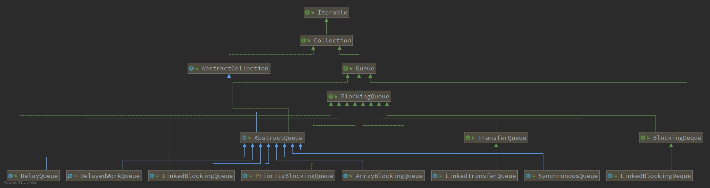

##目录
- 阻塞队列简介：介绍阻塞队列的特性与应用场景
- java中的阻塞队列：介绍java中实现的供开发者使用的阻塞队列
- `BlockQueue`中方法：介绍阻塞队列的`API`接口
- 阻塞队列的实现原理：具体的例子说明阻塞队列的实现原理
- 总结

##阻塞队列简介

阻塞队列(BlockingQueue)首先是一个支持先进先出的队列，与普通的队列完全相同；
其次是一个支持阻塞操作的队列，即：
- 当队列满时，会阻塞执行插入操作的线程，直到队列不满。
- 当队列为空时，会阻塞执行获取操作的线程，直到队列不为空。

阻塞队列用在多线程的场景下，因此阻塞队列使用了锁机制来保证同步，这里使用的可重入锁；
而对于阻塞与唤醒机制则有与锁绑定的`Condition`实现

应用场景：生产者消费者模式

##java中的阻塞队列
java中的阻塞队列根据容量可以分为有界队列和无界队列：

- 有界队列：队列中只能存储有限个元素，超出后存放元素线程会被阻塞或者失败。
- 无界队列：队列中可以存储无限个元素。

java8中提供了7种阻塞队列阻塞队列供开发者使用，如下表：

|类名|描述|
|:---:|:---:|
|ArrayBlockingQueue|一个由数组结构组成的有界阻塞队列|
|LinkedBlockingQueue|由链表结构组成的有界阻塞队列(默认大小Integer.MAX_VALUE）|
|PriorityBlockingQueue|支持优先级排序的无界阻塞队列|
|DelayQueue|使用优先级队列实现的延迟无界阻塞队列|
|SynchronousQueue|不存储元素的阻塞队列，即单个元素的队列|
|LinkedTransferQueue|由链表结构组成的无界阻塞队列|
|LinkedBlockingDeque|由链表结构组成的双向阻塞队列|

另外还有一个在`ScheduledThreadPoolExecutor`中实现的`DelayedWorkQueue`阻塞队列，
但这个阻塞队列开发者不能使用。它们之间的UML类图如下图：


`BlockingQueue`接口是阻塞队列对外的访问接口，所有的阻塞队列都实现了`BlockQueue`中的方法

## `BlockQueue`中方法
作为一个队列的核心方法就是入队和出队。由于存在阻塞策略，`BlockQueue`将出队入队的情况分为了四组，每组提供不同的方法：
- 抛出异常：当队列满时，如果再往队列中插入元素，则抛出`IllegalStateException`异常；
当队列为空时，从队列中获取元素则抛出`NoSuchElementException`异常。

- 返回特定值(布尔值)：当队列满时，如果再往队列中插入元素，则返回false；当队列为空时，从队列中获取元素则返回null。

- 一直阻塞：当队列满时，如果再往队列中插入元素，阻塞当前线程直到队列中至少一个被移除或者响应中断退出；
当队列为空时，则阻塞当前线程直到至少一个元素元素入队或者响应中断退出。

- 超时退出：当队列满时，如果再往队列中插入元素，阻塞当前线程直到队列中至少一个被移除或者达到指定的等待时间退出或者响应中断退出；
当队列为空时，则阻塞当前线程直到至少一个元素元素入队或者达到指定的等待时间退出或者响应中断退出。

对于每种情况`BlockingQueue`提供的方法如下表：

|方法\处理方式|抛出异常|返回特定值(布尔值)|一直阻塞|超时退出|
|:---:|:---:|:---:|:---:|:---:|
|插入|add(e)|offer(e)|put(e)|offer(e,time,unit)|
|移除|remove()|poll()|take()|poll(time.unit)|
|检查|element()|peek()|不可用|不可用|

上述方法一般用于生产者-消费者模型中，是其中的生产和消费操作队列的核心方法。
除了这些方法，`BlockingQueue`还提供了一些其他的方法如下表：

|方法名称|描述|
|:---:|:---:|
|remove(Object o)|从队列中移除一个指定值|
|size()|获取队列中元素的个数|
|contains(Object o)|判断队列是否包含指定的元素，但是这个元素在这次判断完可能就会被消费|
|drainTo(Collection<? super E> c)|将队列中元素放在给定的集合中，并返回添加的元素个数|
|drainTo(Collection<? super E> c, int maxElements)|将队列中元素取maxElements(不超过队列中元素个数)个放在给定的集合中，并返回添加的元素个数|
|remainingCapacity()|计算队列中还可以存放的元素个数|
|toArray()|以objetc数组的形式获取队列中所有的元素|
|toArray(T[] a)|以给定类型数组的方式获取队列中所有的元素|
|clear()|清空队列，危险的操作|


##阻塞队列的实现原理

阻塞队列的实现依靠通知模式实现：当生产者向满了的队列中添加元素时，会阻塞住生产者，
直到消费者消费了一个队列中的元素后会通知消费者队列可用，此时再由生产者向队列中添加元素。反之亦然。

阻塞队列的阻塞唤醒依靠`Condition`——条件队列来实现。

以`ArrayBlockingQueue`为例说明：

`ArrayBlockingQueue`的定义：
```java
public class ArrayBlockingQueue<E> extends AbstractQueue<E>
        implements BlockingQueue<E>, java.io.Serializable {
   
    /** The queued items */
    //以数组的结构存储队列的元素，采用的是循环数组
    final Object[] items;

    /** items index for next take, poll, peek or remove */
    //队列的队头索引
    int takeIndex;

    /** items index for next put, offer, or add */
    //队列的队尾索引
    int putIndex;

    /** Number of elements in the queue */
    //队列中元素的个数
    int count;

    /** Main lock guarding all access */
    //对于ArrayBlockingQueue所有的操作都需要加锁，
    final ReentrantLock lock;

    /** Condition for waiting takes */
    //条件队列，当队列为空时阻塞消费者并在生产者生产后唤醒消费者
    private final Condition notEmpty;

    /** Condition for waiting puts */
    //条件队列，当队列满时阻塞生产者，并在消费者消费队列后唤醒生产者
    private final Condition notFull;
}
```
根据类的定义字段可以看到，有两个`Condition`条件队列，猜测以下过程
- 当队列为空，消费者试图消费时应该调用`notEmpty.await()`方法阻塞，并在生产者生产后调用`notEmpty.single()`方法
- 当队列已满，生产者试图放入元素应调用`notFull.await()`方法阻塞，并在消费者消费队列后调用`notFull.single()`方法

向队列中添加元素`put()`方法的添加过程。
```
    /**
    * 向队列中添加元素
    * 当队列已满时需要阻塞当前线程
    * 放入元素后唤醒因队列为空阻塞的消费者
    */
    public void put(E e) throws InterruptedException {
        checkNotNull(e);
        final ReentrantLock lock = this.lock;
        lock.lockInterruptibly();
        try {
            //当队列已满时需要notFull.await()阻塞当前线程
            //offer(e,time,unit)方法就是阻塞的时候加了超时设定
            while (count == items.length)
                notFull.await();
            //放入元素的过程
            enqueue(e);
        } finally {
            lock.unlock();
        }
    }
    
    /**enqueue实际添加元素的方法*/
    private void enqueue(E x) {
        // assert lock.getHoldCount() == 1;
        // assert items[putIndex] == null;
        final Object[] items = this.items;
        items[putIndex] = x;
        if (++putIndex == items.length)
            putIndex = 0;
        count++;
        //如果条件队列中存在等待的线程
        //唤醒
        notEmpty.signal();
    }
```

从队列中获取元素`take()`方法的获取过程。
```
    /**
    * 从队列中获取元素
    * 当队列已空时阻塞当前线程
    * 从队列中消费元素后唤醒等待的生产线程
    */
    public E take() throws InterruptedException {
        final ReentrantLock lock = this.lock;
        lock.lockInterruptibly();
        try {
            //队列为空需要阻塞当前线程
            while (count == 0)
                notEmpty.await();
            //获取元素的过程
            return dequeue();
        } finally {
            lock.unlock();
        }
    }
    
    /**dequeue实际消费元素的方法*/
    private E dequeue() {
       // assert lock.getHoldCount() == 1;
       // assert items[takeIndex] != null;
       final Object[] items = this.items;
       @SuppressWarnings("unchecked")
       E x = (E) items[takeIndex];
       items[takeIndex] = null;
       if (++takeIndex == items.length)
           takeIndex = 0;
       count--;
       if (itrs != null)
           itrs.elementDequeued();
       //消费元素后从唤醒阻塞的生产者线程
       notFull.signal();
       return x;
    }
```

##总结
阻塞队列提供了不同于普通队列的增加、删除元素的方法，核心在与队列满时阻塞生产者和队列空时阻塞消费者。
这一阻塞过程依靠与锁绑定的`Condition`对象实现。`Condition`接口的实现在AQS中实现，具体的实现类是
`ConditionObject`


