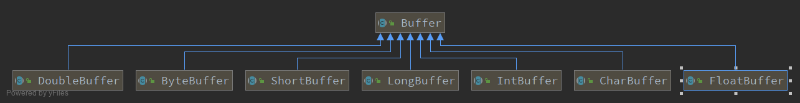
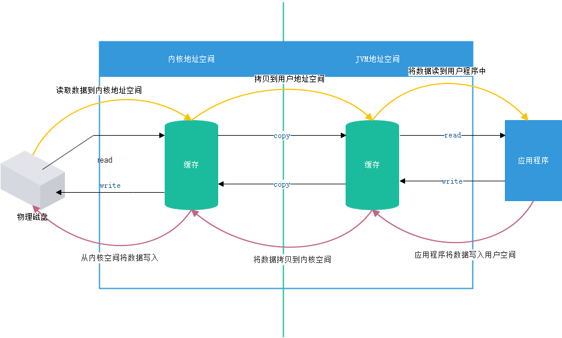
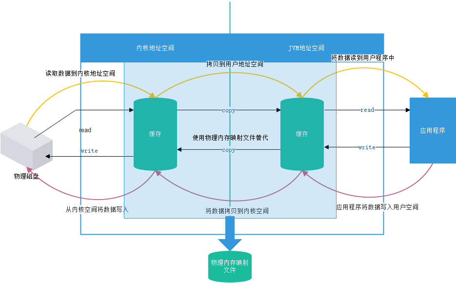

## 目录
- `Buffer`简介
- `Buffer`的核心属性
- `Buffer`的创建与使用(`ByteBuffer`为例)
- 总结
- 参考资料

## Buffer简介
缓冲区(`Buffer`):本质上是一个数组，用于临时保存、写入以及读取数据。在`Java NIO`中，
该内存块包含在`NIO Buffer`对象当中，`NIO Buffer`对象还提供了一组接口来访问该内存块。

根据数据类型的不同，`Java`为除了`boolean`类型之外的其余7种基本类型提供了相应类型的缓冲区，
分别是`ByteBuffer`、`CharBuffer`、`ShortBuffer`、`IntBuffer`、`LongBuffer`、
`FloatBuffer`、`DoubleBuffer`。他们都继承自抽象类`Buffer`类，他们的管理方式也都几乎一样。
`UML`类图如下：


## Buffer的核心属性
`BUffer`类的部分实现如下：
```java
public abstract class Buffer {
    // Invariants: mark <= position <= limit <= capacity
    private int mark = -1;
    private int position = 0;
    private int limit;
    private int capacity;

    //构造方法
    Buffer(int mark, int pos, int lim, int cap) {       // package-private
        if (cap < 0)
            throw new IllegalArgumentException("Negative capacity: " + cap);
        this.capacity = cap;
        limit(lim);
        position(pos);
        if (mark >= 0) {
            if (mark > pos)
                throw new IllegalArgumentException("mark > position: ("
                                                   + mark + " > " + pos + ")");
            this.mark = mark;
        }
    }
    
    /**
     * Returns this buffer's capacity.
     *
     * @return  The capacity of this buffer
     */
    //返回这个Buffer的容量
    public final int capacity() {
        return capacity;
    }

    /**
     * Returns this buffer's position.
     *
     * @return  The position of this buffer
     */
    //返回这个Buffer中当前的位置(当前操作数)
    public final int position() {
        return position;
    }

    /**
     * Returns this buffer's limit.
     *
     * @return  The limit of this buffer
     */
    //返回当前Buffer中可以被操作的元素的个数
    public final int limit() {
        return limit;
    }

    /**
     * Sets this buffer's mark at its position.
     *
     * @return  This buffer
     */
    //记录当前position的位置
    public final Buffer mark() {
        mark = position;
        return this;
    }
    
    public final Buffer reset() {
        int m = mark;
        if (m < 0)
            throw new InvalidMarkException();
        position = m;
        return this;
    }

}
```
其中定义了四个`Buffer`属性，对应的描述如下

|属性|描述|
|:---:|:---:|
|capacity|容量；用于描述这个Buffer大小，即创建的数组的长度，一旦声明不可以被改变|
|position|位置，表示当前缓冲区中正在操作的数据的位置，在切换读取时会将其置0|
|limit|界限、限制；表示当前缓冲区中可以操作的数据的大小，默认情况下为Buffer的大小，切换为读取模式后为数组中元素的个数(准确的说时切换之前position的值)|
|mark|标记；用于记录当前position的位置，后续操作过程中可以使用reset()方法将position还原至最后一次mark的位置|

## Buffer的创建与使用(ByteBuffer为例)

#### Buffer的创建
在`Java NIO`中可以使用对应`Buffer`类的`allocate()`或者`allocateDirect()`静态方法创建。
```
//使用allocate()创建
ByteBuffer byteBuffer=ByteBuffer.allocate(1024);

//使用allocateDirect()创建
ByteBuffer byteBuffer = ByteBuffer.allocateDirect(1024);
```
而`Buffer`的本质是一个数组，创建时需要指定数组的大小

#### Buffer的使用
`Buffer`的使用一般分为四个步骤
1. 向`Buffer`中写入数据
2. 将`Buffer`切换为读取模式
3. 读取`Buffer`
4. 将`Buffer`清空，供后续写入使用

**1. 写如数据**
```
//使用put()方法向Buffer中写入数据
byteBuffer.put("bmilk".getBytes());

//使用Channel#read()向Buffer中写入数据
channel.read(byteBuffer);
```
`put()`方法的核心过程
```
    public final ByteBuffer put(byte[] src) {
        return put(src, 0, src.length);
    }

    //真实的写入方法
    public ByteBuffer put(byte[] src, int offset, int length) {
        //检查边界溢出
        checkBounds(offset, length, src.length);
        if (length > remaining())
            throw new BufferOverflowException();
        int end = offset + length;
        //循环将源数据写入缓冲区的数组
        //这里不展开，因为缓冲区的分类问题，分类不同缓冲区对应的内存位置不同
        for (int i = offset; i < end; i++)
            this.put(src[i]);
        return this;
    }

```
**2. 将`Buffer`切换为读取模式**

可以通过调用`flip()`方法将`Buffer`从写模式切换到读模式。
```
byteBuffer.flip()
```
调用`flip()`方法会将`position`设回0，并将`limit`设置成之前`position`的值。
即，现在使用`position`标记读的位置，`limit`表示之前写进了多少个`byte`,也就是现在
能读取多少个`byte`等。

`flip()`方法源码
```
    public final Buffer flip() {
        limit = position;
        position = 0;
        mark = -1;
        return this;
    }
```

**3. 读取`Buffer`**
读取`Buffer`有两种方式：

1. 从`Buffer`种读取数据到`Channel`
2. 使用`get()`方法从`Buffer`种读取数据
```
//从Buffe中将数据写入通道
inChannel.write(byteBuffer)

//使用get()方法从BUffer中读取数据
byte[] bytes=new byte[byteBuffer.limit()];
byteBuffer.get(bytes);
```

**4. 将`Buffer`清空，供后续写入使用**
使用`clear()`清空缓冲区，清空缓冲区只是使各个指针恢复初始位置，
更具体的说是`position`设置为0，`limit`设置为容量的初始大小。
并不会真实清空其中数据，但是可以通过后续的写覆盖之前的数据
```
byteBuffer.clear()
```

`clear()`方法源码
```
    //清空Buffer
    //仅仅将指针归为，并不会删除数据，可以通过get(int index)方法获取其中的数据
    //获取到的数据可能是初始值，因为Buffer中可能存在之前并未使用的空间。
    public final Buffer clear() {
        position = 0;
        limit = capacity;
        mark = -1;
        return this;
    }
```
#### 其他的一些方法
1. 使用`rewind()`从`Buffer`重复读取数据
```
//使用`rewind()`从`Buffer`重复读取数据
//Buffer.rewind()将position设回0，所以你可以重读Buffer中的所有数据。
//limit保持不变，仍然表示能从Buffer中读取多少个元素（byte、char等）。
Buffer rewind = byteBuffer.rewind();
```

2. `compact()`方法

`clear()`会使使各个指针恢复初始位置，但是实际中可能存在部分数据还没有被使用，而后续需要使用。
又必须清理一部分`Buffer`的空间，`compact()`方法会将所有未读数据拷贝到Buffer的起始处，
然后将`position`指针设置到最后一个未读元素的后面，现在`Buffer`可以进行写数据，
但是不会覆盖前面的未读的数据。

3. `mark()`方法与`reset()`方法

通过调用Buffer.mark()方法，可以标记Buffer中的当前的position。之后可以通过调用Buffer.reset()方法恢复到这个position。
```
//使用mark标记当前的position位置
byteBUffer.mark()
//使用reset方法使position指针返回这个位置
byteBuffer.reset()
```

4.`equals()`方法与`compareTo()`方法

当需要比较两个`Buffer`时可以使用`equals()`方法与`compareTo()`方法。

`equals()`方法判断两个方式是否相等，当满足下列条件时，表示两个`Buffer`相等
>- 有相同的类型（`byte`、`char`、`int`等）
>- `Buffer`中剩余的`byte`、`char`等的个数相等。
>- $\color{#FF3030}{`Buffer`中所有剩余的`byte`、`char`等都相同}$

`compareTo()`方法比较两个两个`Buffer`的大小，仅比较剩余元素(`byte`、`char`等) 
如果满足下列条件，则认为一个`Buffer`“小于”另一个`Buffer`：
>- 第一个不相等的元素小于另一个Buffer中对应的元素 
>- 所有元素都相等，但第一个Buffer比另一个先耗尽(第一个Buffer的元素个数比另一个少)。

## 直接缓冲区与非直接缓冲区
- 非直接缓冲区：通过`allocate()`方法分配缓冲区，将缓冲区建立在JVM内存中
- 直接缓冲区：通过`allocateDirect()`方法分配直接缓冲区，将缓冲区建立在物理内存中，可以在某些情况下提高效率

#### 非直接缓冲区
- 非直接缓冲区数据流向图


#### 直接缓冲区
- 直接缓冲区数据流向图


直接缓冲区（物理内存映射文件）：相比非直接缓冲区省略了`copy`的过程，所以说直接缓区可以一定程度上提高效率

弊端：
- 开辟空间时资源消耗大
- 不安全，`java`程序将数据写入物理内存映射文件中，之后数据将不受`Java`程序控制，
什么时候写入硬盘无法控制（由操作系统控制），当垃圾回收机制释放引用后才能断开与之的连接

#### 总结
- 缓冲区要么是直接的，要么是非直接的如果为直接字节缓冲区，则`java`虚拟机会见最大努力直接在此缓冲区上执行本机`I/O`。
也就是说，每次调用基础操作系统的`I/O`之前或之后，虚拟机都回尽量避免将缓冲区的内容复制到中间缓冲区或者从中间缓冲区中复制内容。
- 直接字节缓冲区可以通过调用此类的`allocateDirect()`工厂方法来创建，
此方法返回的缓冲区进行分配和取消分配所需的程本通常高于非直接缓冲区，
直接缓冲区的内容可以驻留在常规的垃圾回收堆之外，因此他们对应用程序内存需求造成的影响可能并不明显，
所以建议直接缓冲区主要分配给易受基础系统的本机I/O操作影响的大型、持久得缓冲区。
一般情况下，最好尽在直接缓冲区能在程序性能方面带来明显好处时分配他们。
- 直接字节缓冲区还可以通过`FileChannel`的`map()`方法，将文件区域直接映射到内存中来创建，
该方法返回`MappedByteBuffer`。`Java`的实现有助于`JNI`从本地及代码创建直接字节缓冲区，
如果以上这些缓冲区中的某个缓冲区实例指的是不可访问的内存区域。
则试图访问该区域不会更改缓冲区的内容，并且将会在访问期间或稍后的时间导致抛出不确定的异常
- 字节缓冲区是直接缓冲区还是非直接缓冲区可以通过调用其`isDirect()`方法来确定，提供此方法是为了能够在性能关键型代码中执行显式缓冲区管理。

## 总结
本文简单介绍了`Buffer`的种类，并对常用方法进行乐简单的介绍

## 参考资料
[Java NIO系列教程（三） Buffer](https://ifeve.com/buffers/#read)


