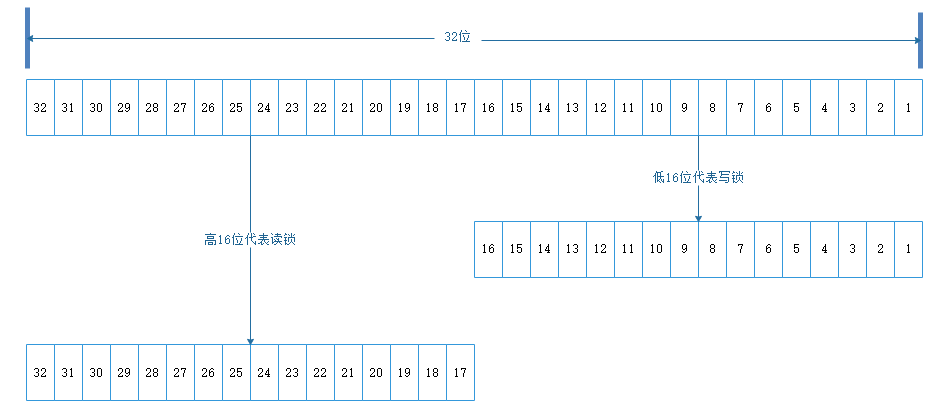

##本文结构
- 读写锁简介：介绍读写锁、读写锁的特性以及类定义信息
- 公平策略及Sync同步器：介绍读写锁提供的公平策略以及同步器源码分析
- 读锁：介绍读锁的一些常用操作和读锁的加锁、解锁的源码分析
- 写锁：介绍写锁的一些常用操作和写锁的加锁、解锁的源码分析
- 总结：总结全文，附读写锁全部源码理解

##读写锁简介

在之前的文章提到了可重入锁，这是一种排他锁，核心原理是同一时间只允许一个线程访问。除了排他锁还有一种共享锁，这种锁在同一时间支持多线程同时访问，
将排他锁和共享锁进行组合便有了读写锁。读写锁维护了一组锁——读锁和写锁。读锁在同一时间可以有多个线程共同访问，是一个共享锁；而写锁在同一时间仅支持
一个线程访问，是一个排他锁。通过读锁的允许多个线程同时访问，使得并发性相比单纯的排他锁效率有很大的提升。


在读写锁中，需要保证写锁对于读锁的可见性，也就是说当写锁更改数据之后读锁需要能够立刻获知。假设有一组线程访问同一个缓存区，其中只有一个线程向其中写数据，
其他的线程都是读数据，这块区域大部分的时间都是用户的读操作，只有很少的时间是写操作，多个线程的读并不会相互影响，那么就可以使用读写锁，只需要保证写操作
之后，数据立刻对于其他的读操作可见即可。

 $\color{#FF3030}{读写锁是一个锁，只是可以进行共享或者排他的两种操作模式。}$读写锁是一个锁，只是可以进行共享或者排他的两种操作模式。

####读写锁的特性
一般情况下，读写锁的性能会优于排他锁，因为程序中大多数场景都是读取数据，很少一部分是写数据。在读取并发多的情况下，可以提供比排他锁更好的吞吐量。

|特性|说明|
|:---:|:---:|
|公平性|读写锁可以选择公平和非公平性两种特性，默认为非公平模式，并且吞吐量非公平由于公平模式|
|可重入性|读(写)锁支持线程的重入。当一个线程获取读(写)锁后，这个线程可以再次获取这个读(写)锁|
|锁降级|当一个线程获取写锁之后，可以获取读锁，在释放写锁完成锁降级过程|

####读写锁的定义
`ReentrantReadWriteLock`简单分析，主要介绍类由哪些部分组成及每部分的作用，具体的实现后面按照内部类及提供主要操作细解
```
public class ReentrantReadWriteLock implements ReadWriteLock, java.io.Serializable {
    private static final long serialVersionUID = -6992448646407690164L;
    /** Inner class providing readlock */
    //读锁，读锁类是读写锁的内部类
    private final ReentrantReadWriteLock.ReadLock readerLock;
    /** Inner class providing writelock */
    //写锁，写锁类是读写锁的内部类
    private final ReentrantReadWriteLock.WriteLock writerLock;
    /** Performs all synchronization mechanics */
    //同步器，完成核心的加锁释放锁的过程，公平机制委派其子类实现
    final Sync sync;

    /**
     * Creates a new {@code ReentrantReadWriteLock} with
     * default (nonfair) ordering properties.
     */
    //默认的读写锁构造函数，默认使用非公平模式
    public ReentrantReadWriteLock() {
        this(false);
    }

    /**
     * Creates a new {@code ReentrantReadWriteLock} with
     * the given fairness policy.
     *
     * @param fair {@code true} if this lock should use a fair ordering policy
     */
    //带公平策略选择的构造器，其中参数为true代表公平模式，false代表非公平模式
    public ReentrantReadWriteLock(boolean fair) {
        sync = fair ? new FairSync() : new NonfairSync();
        readerLock = new ReadLock(this);
        writerLock = new WriteLock(this);
    }
    
    //获取写锁
    public ReentrantReadWriteLock.WriteLock writeLock() { return writerLock; }

    //获取读锁
    public ReentrantReadWriteLock.ReadLock  readLock()  { return readerLock; }
    
    //同步器类，实现核心的加锁解锁同步队列的操作，委派子类实现公平非公平策略
    abstract static class Sync extends AbstractQueuedSynchronizer {......}

    //非公平模式同步器，继承Sync并实现非公平策略
    static final class NonfairSync extends Sync{....}

    //公平模式同步器，继承Sync并实现公平策略
    static final class FairSync extends Sync{....}

    //写锁类，使用与外部类一致的公平策略
    public static class WriteLock implements Lock, java.io.Serializable{......}

    //读锁类，使用与外部类一致的公平策略
    public static class ReadLock implements Lock, java.io.Serializable{......}
```

##公平策略及Sync同步器

读写锁提供了公平与非公平策略，并由`Sync`的子类实现。`NonfairSync`与`FairSync`主要用来判断获取读锁和写锁的时候是否需要阻塞，
其获取锁的过程全部交由`Sync`实现。也可以说使`Sync`分为公平与非公平两个版本。
####非公平策略
非公平版本的同步器，详细解释见源码注释
```
//公平版本的同步器
static final class NonfairSync extends Sync {
    private static final long serialVersionUID = -8159625535654395037L;
    //用于判断获取写锁的时，获取写锁的线程是否需要进入同步队列等待
    //写锁是一个排他锁，在非公平模式下永远不需要阻塞，同可重入锁
    final boolean writerShouldBlock() {
        return false; // writers can always barge
    }
    
    //用于判断获取读锁的时，获取读锁的线程是否需要进入同步队列等待
    //讲道理，在非公平模式下是可以抢占式的获取锁，但是由于读锁是一个共享锁，在一定范围内可以不阻塞获取读锁的线程，
    //后来的也可以获取，不需要关注队列中是否有线程等待。
    //而写锁是排他锁，在读锁被持有的情况下会需要等待，而此时源源不断的线程获取读锁，那么写锁将一直不能获取锁，
    //造成饥饿，因此需要进行饥饿避免。
    final boolean readerShouldBlock() {
        /* As a heuristic to avoid indefinite writer starvation,
         * block if the thread that momentarily appears to be head
         * of queue, if one exists, is a waiting writer.  This is
         * only a probabilistic effect since a new reader will not
         * block if there is a waiting writer behind other enabled
         * readers that have not yet drained from the queue.
         */
        //避免写锁饥饿的策略，当队列中的头节点的后继节点是一个尝试获取写锁的节点
        //则使获取读锁的线程进入同步等待队列排队并阻塞
        return apparentlyFirstQueuedIsExclusive();
    }
}

//这个方法在AQS中实现，目的就是执行的操作就是判断队列的头节点的后继节点是不是获取写锁
final boolean apparentlyFirstQueuedIsExclusive() {
    Node h, s;
    return (h = head) != null &&
        (s = h.next)  != null &&
        !s.isShared()         &&
        s.thread != null;
}
```
####公平策略
公平版本的同步器，详细解释见源码注释
```
//相比非公平版本就会简单很多，只需要判断队列中是否有现成在等待就可以
static final class FairSync extends Sync {
        private static final long serialVersionUID = -2274990926593161451L;
        final boolean writerShouldBlock() {
            return hasQueuedPredecessors();
        }
        final boolean readerShouldBlock() {
            return hasQueuedPredecessors();
        }
    }
```

####Sync同步器
`Sync`实现了主要的加锁解锁的操作。读写锁同样依赖`AQS`来实现同步功能，在AQS中由`State`整型字段代表所数量而这里是两种锁，因此使用位操作来代表不同的锁，
使用高16位代表共享锁(读锁)，低16位代表排他锁(写锁)如下图，并且所有与为操有关的事情都在这里完成，`AQS`中仅提供一些判断接口及队列操作。



具体代码解释见注释
```
abstract static class Sync extends AbstractQueuedSynchronizer {
    private static final long serialVersionUID = 6317671515068378041L;

    /*
     * 读锁和写锁的一些常数和函数
     * 将锁状态在逻辑上分为两个无符号的短整型
     * 低位代表排他锁(写锁)的计数器
     * 高位代表共享锁(读锁)的计数器
     */

    //共享锁的偏移量——16位
    static final int SHARED_SHIFT   = 16;
    //共享锁计数器加一或者减一的基数
    static final int SHARED_UNIT    = (1 << SHARED_SHIFT);
    //锁计数器的最大值，做最大可以被同时或者重入获取的次数
    static final int MAX_COUNT      = (1 << SHARED_SHIFT) - 1;
    //写锁的掩码 和锁状态state按位与操作可以得到写锁的计数器
    static final int EXCLUSIVE_MASK = (1 << SHARED_SHIFT) - 1;

    //计算共享锁的持有量(读锁)
    static int sharedCount(int c)    { return c >>> SHARED_SHIFT; }
    //计算排他锁的持有量(写锁)
    static int exclusiveCount(int c) { return c & EXCLUSIVE_MASK; }

    /**
     * 每个线程持有的读锁的计数器.
     * 作为ThreadLocal维护; 最后一成功加锁的线程信息缓存在cachedHoldCounter
     */
    static final class HoldCounter {
        //线程持有的读锁的数量
        int count = 0;
        // Use id, not reference, to avoid garbage retention
        //使用id而不使用引用避免垃圾保留
        final long tid = getThreadId(Thread.currentThread());
    }

    /**
     * ThreadLocal 子类. 重写了initialValue方法，
     * 在第一次get时(之前也没进行过set操作)返回count值为0而不是null
     */
    static final class ThreadLocalHoldCounter
        extends ThreadLocal<HoldCounter> {
        public HoldCounter initialValue() {
            return new HoldCounter();
        }
    }

    /**
     * The number of reentrant read locks held by current thread.
     * Initialized only in constructor and readObject.
     * Removed whenever a thread's read hold count drops to 0.
     */
    //读锁被当前线程持有的次数，仅在构造函数和readObject中初始化
    //当线程的读锁持有数量为0时删除
    private transient ThreadLocalHoldCounter readHolds;

    /**
     * The hold count of the last thread to successfully acquire
     * readLock. This saves ThreadLocal lookup in the common case
     * where the next thread to release is the last one to
     * acquire. This is non-volatile since it is just used
     * as a heuristic, and would be great for threads to cache.
     *
     * <p>Can outlive the Thread for which it is caching the read
     * hold count, but avoids garbage retention by not retaining a
     * reference to the Thread.
     *
     * <p>Accessed via a benign data race; relies on the memory
     * model's final field and out-of-thin-air guarantees.
     */
    //最后一个成功获取读锁的线程持有的读锁的数量
    private transient HoldCounter cachedHoldCounter;

    /**
     * firstReader is the first thread to have acquired the read lock.
     * firstReaderHoldCount is firstReader's hold count.
     *
     * <p>More precisely, firstReader is the unique thread that last
     * changed the shared count from 0 to 1, and has not released the
     * read lock since then; null if there is no such thread.
     *
     * <p>Cannot cause garbage retention unless the thread terminated
     * without relinquishing its read locks, since tryReleaseShared
     * sets it to null.
     *
     * <p>Accessed via a benign data race; relies on the memory
     * model's out-of-thin-air guarantees for references.
     *
     * <p>This allows tracking of read holds for uncontended read
     * locks to be very cheap.
     */
    //最后一个将读锁计数器从0改为1的线程，并且一直没有释放读锁
    //如果不存在这个线程则为null
    private transient Thread firstReader = null;
    private transient int firstReaderHoldCount;

    //构造函数
    Sync() {
        readHolds = new ThreadLocalHoldCounter();
        setState(getState()); // ensures visibility of readHolds
    }

    /*
     * Acquires and releases use the same code for fair and
     * nonfair locks, but differ in whether/how they allow barging
     * when queues are non-empty.
     */

    /**
     * Returns true if the current thread, when trying to acquire
     * the read lock, and otherwise eligible to do so, should block
     * because of policy for overtaking other waiting threads.
     */
    //获取和释放读写锁，公平版本和非公平版本使用同样的代码结构
    //但在当前线程是否需要排队阻塞，如何阻塞方面存在差异
    //返回true表示当前线程试图获取读锁应当被阻塞，
    abstract boolean readerShouldBlock();

    /**
     * Returns true if the current thread, when trying to acquire
     * the write lock, and otherwise eligible to do so, should block
     * because of policy for overtaking other waiting threads.
     */
    //true表示当前线程尝试获取写锁应该被阻塞
    abstract boolean writerShouldBlock();

    /*
     * Note that tryRelease and tryAcquire can be called by
     * Conditions. So it is possible that their arguments contain
     * both read and write holds that are all released during a
     * condition wait and re-established in tryAcquire.
     */
    
    //releases：释放写锁的次数，该值小于等于当前线程持有的写锁的数量
    //返回这个线程是否继续持有这个写锁
    protected final boolean tryRelease(int releases) {
        
        //判断当前线程是否持有这个排他锁
        if (!isHeldExclusively())
            throw new IllegalMonitorStateException();
        //计算释放之后持有这个锁的次数
        int nextc = getState() - releases;
        boolean free = exclusiveCount(nextc) == 0;
        //释放后不在持有这个写锁
        if (free)
            //设置锁属于的线程为null
            setExclusiveOwnerThread(null);
        //设置锁的状态
        setState(nextc);
        return free;
    }

    //尝试获取写锁
    protected final boolean tryAcquire(int acquires) {
        /*
         * Walkthrough:
         * 1. If read count nonzero or write count nonzero
         *    and owner is a different thread, fail.
         * 2. If count would saturate, fail. (This can only
         *    happen if count is already nonzero.)
         * 3. Otherwise, this thread is eligible for lock if
         *    it is either a reentrant acquire or
         *    queue policy allows it. If so, update state
         *    and set owner.
         */
        /*
         * 需要完成的工作:
         * 1. 如果锁状态(包含读锁和写锁)不为0，并且当前线程没有持有写锁则失败
         * 2. 如果写锁计数器大于最大值则获取失败
         * 3. 否则如果是重入的获取锁，则会被允许.
         */
        Thread current = Thread.currentThread();
        //获取锁状态
        int c = getState();
        //获取写锁的锁状态
        int w = exclusiveCount(c);
        //如果锁被不为null即可能被任何一个线程持有
        if (c != 0) {
            // (Note: if c != 0 and w == 0 then shared count != 0)
            //w==0则读锁被某个线程持有或者写锁被其他线程持有则获取锁失败
            //进入队列排队
            if (w == 0 || current != getExclusiveOwnerThread())
                return false;

            //写所已经被当前线程持有则判断再次加锁后是否会超过写锁的最大可以被加锁的次数
            //超过则加锁失败
            if (w + exclusiveCount(acquires) > MAX_COUNT)
                throw new Error("Maximum lock count exceeded");
            // Reentrant acquire
            //重入的获取锁
            setState(c + acquires);
            return true;
        }
        //锁没有被任何线程持有，则需要根据公平策略来判断当前线程是否需要阻塞
        //公平锁：检查同步等待队列，若队列中存在等待时间更长的线程则需要阻塞
        //非公平锁：可以抢占式获取写锁，不需要阻塞

        //需要被阻塞或者CAs操作失败则进入同步队列
        if (writerShouldBlock() ||
            !compareAndSetState(c, c + acquires))
            return false;
        //不需要阻塞并且加锁成功，设置排他锁的所属线程信息
        setExclusiveOwnerThread(current);
        return true;
    }

    //尝试释放共享锁，与加共享锁一致，只能一个一个的释放
    //unused参数没有被使用
    protected final boolean tryReleaseShared(int unused) {
        Thread current = Thread.currentThread();
        //当前线程是firstReader并且仅持有一次读锁，在释放读锁后firstReader应该置null
        if (firstReader == current) {
            // assert firstReaderHoldCount > 0;
            if (firstReaderHoldCount == 1)
                firstReader = null;
            else
                firstReaderHoldCount--;
        } else {
            //获取当前线程的HoldCounter信息
            HoldCounter rh = cachedHoldCounter;
            if (rh == null || rh.tid != getThreadId(current))
                rh = readHolds.get();
            int count = rh.count;
            //当读诵持有数量归零时，会从线程的threadLocals中删除readHolds
            if (count <= 1) {
                readHolds.remove();
                //没持有锁的县城不能释放锁
                if (count <= 0)
                    throw unmatchedUnlockException();
            }
            --rh.count;
        }
        //使用cas操作原子的减少锁状态，避免CAS操作失败的情况
        for (;;) {
            int c = getState();
            //减少一个读锁
            int nextc = c - SHARED_UNIT;
            if (compareAndSetState(c, nextc))
                // 释放读锁对于读操作没有影响,
                // 但是如果现在读锁和写锁都是空闲的
                // 可能会使等待的获取写锁的操作继续
                
                //返回锁是否还被任何一个线程持有
                return nextc == 0;
        }
    }

    private IllegalMonitorStateException unmatchedUnlockException() {
        return new IllegalMonitorStateException(
            "attempt to unlock read lock, not locked by current thread");
    }

    //获取读锁
    //unused参数没有被使用，一个一个加锁
    protected final int tryAcquireShared(int unused) {
        /*
         * Walkthrough:
         * 1. If write lock held by another thread, fail.
         * 2. Otherwise, this thread is eligible for
         *    lock wrt state, so ask if it should block
         *    because of queue policy. If not, try
         *    to grant by CASing state and updating count.
         *    Note that step does not check for reentrant
         *    acquires, which is postponed to full version
         *    to avoid having to check hold count in
         *    the more typical non-reentrant case.
         * 3. If step 2 fails either because thread
         *    apparently not eligible or CAS fails or count
         *    saturated, chain to version with full retry loop.
         */
        /*
         * 待办事项:
         * 1. 如果写锁被其他线程获取，则失败.
         * 2. 否则这个线程就有资格使用锁的状态，因此需要判断是否因为
         *    因为同步等待策略而阻塞，否则尝通过cas操作尝试授予锁
         *    可重入性的操作在fullTryAcquireShared中进行
         *    避免在不可重入的情况下检查锁状态
         * 3. 如果步骤2失败，因为线程不符合条件或者cas失败
         *    则进入fullTryAcquireShared中循环重试
         */
        Thread current = Thread.currentThread();
        int c = getState();
            //写锁被其他线程持有则获取读锁失败，需要进入同步等待队列
        if (exclusiveCount(c) != 0 &&
            getExclusiveOwnerThread() != current)
            return -1;
        int r = sharedCount(c);
            
            /**
             * 判断当前线程是否需要阻塞
             * 不同的公平策略有不同的判断方式
             * 非公平模式下，如果存在同步等待队列且第一个是尝试获取写锁的
             * 其他线程则需要阻塞
             * 公平模式下，队列中存在排队等待的线程则需要进入队列等待
             */
    
            //如果当前线程已经获取乐写锁，则这可以是一个锁降级的过程
            //不用进入队列排队
        if (!readerShouldBlock() &&
            //锁的获取次数不能超过最大的可获取的次数
            r < MAX_COUNT &&
            //不需要阻塞，锁的计数没有超过最大值则尝试通过cas操作加锁
            //可能会失败，如果存在多个线程同时竞争
            compareAndSetState(c, c + SHARED_UNIT)) {
            //加锁成功，判断是否是第一个加锁的线程，是则设置firstReader信息
            //firstReader信息将不会在threadLocals中保存
            if (r == 0) {
                firstReader = current;
                firstReaderHoldCount = 1;
    
                //firstReader的重入情况
            } else if (firstReader == current) {
                firstReaderHoldCount++;
            } else {
                //当前线程是最后一个获取读锁的线程，
                //需要将当前线程设置为cachedHoldCounter
                HoldCounter rh = cachedHoldCounter;
                //当前线程不是在此之前最后一次获取读锁的线程
                //需要从ThreadLocals中获取当前锁的计数信息
                //并且将当前线程设置为最后一个获取读锁的线程
                if (rh == null || rh.tid != getThreadId(current))
                    cachedHoldCounter = rh = readHolds.get();
                //如果当前线程就是在此之前最后一次获取读锁的信息
                //并且锁计数器为0，则需要设置当前线程的threadLcoals中保存的锁计数信息
                //因为锁计数器为0的时候会从ThreadLocals中删除readHolds的信息
                else if (rh.count == 0)
                    readHolds.set(rh);
                rh.count++;
            }
            return 1;
        }
        //需要被阻塞、锁计数器超过最大值、或者cas设置锁状态失败
        //进入完整版本的获取锁的过程
        return fullTryAcquireShared(current);
    }

    /**
     * Full version of acquire for reads, that handles CAS misses
     * and reentrant reads not dealt with in tryAcquireShared.
     */
    final int fullTryAcquireShared(Thread current) {
        /*
         * This code is in part redundant with that in
         * tryAcquireShared but is simpler overall by not
         * complicating tryAcquireShared with interactions between
         * retries and lazily reading hold counts.
         */
        HoldCounter rh = null;
        //死循环获取锁，获取锁的结果要么阻塞，要么获取成功
        for (;;) {
            int c = getState();
                //写锁被获取
            if (exclusiveCount(c) != 0) {
                    //写锁被其他线程获取则获取失败
                    //写锁被当前线程获取则可以直接获取读锁，在后面处理
                if (getExclusiveOwnerThread() != current)
                    return -1;
                //如果写锁被当前线程获取而因为尝试获取读锁阻塞，会造成死锁
                // else we hold the exclusive lock; blocking here
                // would cause deadlock.
                
                //写锁没有被获取并且存在同步等待队列
                //且第一个等待的节点是非当前线程的获取写锁的节点
            } else if (readerShouldBlock()) {
                // Make sure we're not acquiring read lock reentrantly
    
                //当前线程是firstReader再次获取读锁
                //firstReader变量存在的前提是获取读锁的线程没有被释放读锁
                //则是一种重入的情况，可以直接判断并增加锁计数器
                if (firstReader == current) {
                    // assert firstReaderHoldCount > 0;
                
                //当前线程不是firstReader
                } else {
                    if (rh == null) {
                        //rh：当前线程对应的锁计数器信息
                        //在当前线程的threadLocals中存储
                        rh = cachedHoldCounter;
                        if (rh == null || rh.tid != getThreadId(current)) {
                            rh = readHolds.get();
                            //当前线程没有获取锁，从threadLocals中移除这个锁信息
                            //因为readHolds.get()从当前线程的threadLocals中获取HoldCounter对象时
                            //如果threadLocals中不存在当前锁的状态信息，get的时候会初始化一个，count=0
                            if (rh.count == 0)
                                readHolds.remove();
                        }
                    }
                    //当前线程不是重入的获取锁
                    //并且同步等待队列的第一个等待节点尝试获取写锁。且不失当前线程
                    //当前线程需要排队等待
                    //目的：避免写锁的无限及饥饿
                    //当前线程已经获取锁
                    if (rh.count == 0)
                        return -1;
                }
            }
            //可以获取读锁的情况：写锁被当前线程获取或者重入的获取锁
            //或者不用阻塞写锁也没有被其他线程获取，到这里的原因可能是tryAcquireShared中CAS操作失败
            //如果是当前线程已经获取乐写锁，则这是一个锁降级的过程
          
            //超过读锁计数器的最大值
            if (sharedCount(c) == MAX_COUNT)
                throw new Error("Maximum lock count exceeded");
    
            //cas的获取锁，如果cas操作失会循环获取
            if (compareAndSetState(c, c + SHARED_UNIT)) {
                //如果当前线程是将读锁从0->1,则是firstReader
                if (sharedCount(c) == 0) {
                    firstReader = current;
                    firstReaderHoldCount = 1;
                //firstReader重入的获取锁
                } else if (firstReader == current) {
                    firstReaderHoldCount++;
    
                //其他重入的获取锁，或者满足不阻塞条件的第一次获取锁
                } else {
                    if (rh == null)
                        rh = cachedHoldCounter;
                    if (rh == null || rh.tid != getThreadId(current))
                        rh = readHolds.get();
                    else if (rh.count == 0)
                        readHolds.set(rh);
                    rh.count++;
    
                    //设置cachedHoldCounter
                    cachedHoldCounter = rh; // cache for release
                }
                return 1;
            }
        }
    }

    /**
     * Performs tryLock for write, enabling barging in both modes.
     * This is identical in effect to tryAcquire except for lack
     * of calls to writerShouldBlock.
     */
    final boolean tryWriteLock() {
        Thread current = Thread.currentThread();
        int c = getState();
        if (c != 0) {
            int w = exclusiveCount(c);
            if (w == 0 || current != getExclusiveOwnerThread())
                return false;
            if (w == MAX_COUNT)
                throw new Error("Maximum lock count exceeded");
        }
        if (!compareAndSetState(c, c + 1))
            return false;
        setExclusiveOwnerThread(current);
        return true;
    }

    /**
     * Performs tryLock for read, enabling barging in both modes.
     * This is identical in effect to tryAcquireShared except for
     * lack of calls to readerShouldBlock.
     */
    final boolean tryReadLock() {
        Thread current = Thread.currentThread();
        for (;;) {
            int c = getState();
            if (exclusiveCount(c) != 0 &&
                getExclusiveOwnerThread() != current)
                return false;
            int r = sharedCount(c);
            if (r == MAX_COUNT)
                throw new Error("Maximum lock count exceeded");
            if (compareAndSetState(c, c + SHARED_UNIT)) {
                if (r == 0) {
                    firstReader = current;
                    firstReaderHoldCount = 1;
                } else if (firstReader == current) {
                    firstReaderHoldCount++;
                } else {
                    HoldCounter rh = cachedHoldCounter;
                    if (rh == null || rh.tid != getThreadId(current))
                        cachedHoldCounter = rh = readHolds.get();
                    else if (rh.count == 0)
                        readHolds.set(rh);
                    rh.count++;
                }
                return true;
            }
        }
    }

    //返回当前线程是否持有写锁
    protected final boolean isHeldExclusively() {
        // While we must in general read state before owner,
        // we don't need to do so to check if current thread is owner
        return getExclusiveOwnerThread() == Thread.currentThread();
    }

    // Methods relayed to outer class
    //返回一个与锁关联的Condition
    final ConditionObject newCondition() {
        return new ConditionObject();
    }

    //获取持有写锁的线程
    final Thread getOwner() {
        // Must read state before owner to ensure memory consistency
        return ((exclusiveCount(getState()) == 0) ?
                null :
                getExclusiveOwnerThread());
    }
    
    //获取所有线程持有的总的读锁的数量
    final int getReadLockCount() {
        return sharedCount(getState());
    }

    final boolean isWriteLocked() {
        return exclusiveCount(getState()) != 0;
    }

    获取当前线程持有的写锁的数量
    final int getWriteHoldCount() {
        return isHeldExclusively() ? exclusiveCount(getState()) : 0;
    }

    //获取当前线程持有的读锁的数量
    final int getReadHoldCount() {
        if (getReadLockCount() == 0)
            return 0;

        //如果当前线程是firstReader则直接返回
        Thread current = Thread.currentThread();
        if (firstReader == current)
            return firstReaderHoldCount;

        //如果当前线程是最后一个持有读锁的线程
        HoldCounter rh = cachedHoldCounter;
        if (rh != null && rh.tid == getThreadId(current))
            return rh.count;

        //获取当前线程的HoldCounter中存储的持有锁的数量
        int count = readHolds.get().count;
        if (count == 0) readHolds.remove();
        return count;
    }

    /**
     * Reconstitutes the instance from a stream (that is, deserializes it).
     */
    private void readObject(java.io.ObjectInputStream s)
        throws java.io.IOException, ClassNotFoundException {
        s.defaultReadObject();
        readHolds = new ThreadLocalHoldCounter();
        setState(0); // reset to unlocked state
    }

    final int getCount() { return getState(); }
}
```
##读锁

读锁是一个支持重入的共享锁，只要没有超过锁计数器的范围，锁可以被任意多个线程获取。
锁状态为0且写锁没由被获取的情况下，读锁总能被获取，后续的获取操作也只是原子的增加锁计数器。
但是由于不同线程都持有锁，需要保存每个线程持有这个锁的次数，这就用到了`ThreadLocalHoldCounter`将线程的持有锁的次数保存在
现成的`threadLocals`字段中。
####读锁的定义
读锁的定义很简单，读锁中也存在一个同步器，与外部类同步器保持一致，所有的操作交由同步器完成
```
public static class ReadLock implements Lock, java.io.Serializable {
    private static final long serialVersionUID = -5992448646407690164L;
    private final Sync sync;

    /**
     * Constructor for use by subclasses
     *
     * @param lock the outer lock object
     * @throws NullPointerException if the lock is null
     */
    protected ReadLock(ReentrantReadWriteLock lock) {
        sync = lock.sync;
    }
    ......
}
```
####读锁中的一些方法
|方法名|方法描述|
|:----:|:----:|
|lock()|尝试获取读锁，根据不同的公平策略，有不同的获取过程，忽略中断|
|lockInterruptibly()|同上，会响应中断，实现上是在获取锁和在队列中从阻塞唤醒后判断是否发生中断，若有则抛出中断异常|
|tryLock()|抢占式的尝试一次获取读锁，失败则返回不会进入同步等待队列|
|tryLock(long timeout, TimeUnit unit)|尝试获取读锁，会响应中断，同时具有超时功能，实现上是在`lockInterruptibly()`的基础上使用具有超时功能的`LockSupport.parkNanos(Object blocker, long nanos)`|
|unlock() |释放一个获取的读锁|
|newCondition()|构造一个条件等待队列，在使用条件等待队列阻塞前，会释放所有的锁|

####读锁加锁
```
/**
 * Acquires the read lock.
 *
 * <p>Acquires the read lock if the write lock is not held by
 * another thread and returns immediately.
 *
 * <p>If the write lock is held by another thread then
 * the current thread becomes disabled for thread scheduling
 * purposes and lies dormant until the read lock has been acquired.
 */
//申请读锁
//如果写锁没有被其他线程持有，则立刻获得读锁并返回
//如果写锁没有被其他线程持有，处于线程调度的目的，当前线程会进入waiting状态直到获取到锁
public void lock() {
    sync.acquireShared(1);
}
```
`acquireShared()`方法：至少会调用一次同步器的`tryAcquireShared()`方法
```
/**
 * Acquires in shared mode, ignoring interrupts.  Implemented by
 * first invoking at least once {@link #tryAcquireShared},
 * returning on success.  Otherwise the thread is queued, possibly
 * repeatedly blocking and unblocking, invoking {@link
 * #tryAcquireShared} until success.
 *
 * @param arg the acquire argument.  This value is conveyed to
 *        {@link #tryAcquireShared} but is otherwise uninterpreted
 *        and can represent anything you like.
 */
//以忽略中断、共享模式获取锁，至少会调用一次tryAcquireShared方法，成功获取锁则返回1，
//失败则返回-1，线程会进入同步等待队列，满足条件时会被阻塞直到前一个线程（写锁）释放或者(读锁)被获取
public final void acquireShared(int arg) {
    if (tryAcquireShared(arg) < 0)
        doAcquireShared(arg);
}
//tryAcquireShared方法由同步器重写获取过程，是真正的获取锁的过程
//doAcquireShared中获取锁的步骤依然是交给tryAcquireShared完成，自身更多完成排队等待的动作
```
`tryAcquireShared()`方法
```
protected final int tryAcquireShared(int unused) {
    /*
     * 待办事项:
     * 1. 如果写锁被其他线程获取，则失败.
     * 2. 否则这个线程就有资格使用锁的状态，因此需要判断是否因为
     *    因为同步等待策略而阻塞，否则尝通过cas操作尝试授予锁
     *    可重入性的操作在fullTryAcquireShared中进行
     *    避免在不可重入的情况下检查锁状态
     * 3. 如果步骤2失败，因为线程不符合条件或者cas失败
     *    则进入fullTryAcquireShared中循环重试
     */
    Thread current = Thread.currentThread();
    int c = getState();
        //写锁被其他线程持有则获取读锁失败，需要进入同步等待队列
    if (exclusiveCount(c) != 0 &&
        getExclusiveOwnerThread() != current)
        return -1;
    int r = sharedCount(c);
        
        /**
         * 判断当前线程是否需要阻塞
         * 不同的公平策略有不同的判断方式
         * 非公平模式下，如果存在同步等待队列且第一个是尝试获取写锁的
         * 其他线程则需要阻塞
         * 公平模式下，队列中存在排队等待的线程则需要进入队列等待
         */

        //如果当前线程已经获取乐写锁，则这可以是一个锁降级的过程
        //不用进入队列排队
    if (!readerShouldBlock() &&
        //锁的获取次数不能超过最大的可获取的次数
        r < MAX_COUNT &&
        //不需要阻塞，锁的计数没有超过最大值则尝试通过cas操作加锁
        //可能会失败，如果存在多个线程同时竞争
        compareAndSetState(c, c + SHARED_UNIT)) {
        //加锁成功，判断是否是第一个加锁的线程，是则设置firstReader信息
        //firstReader信息将不会在threadLocals中保存
        if (r == 0) {
            firstReader = current;
            firstReaderHoldCount = 1;

            //firstReader的重入情况
        } else if (firstReader == current) {
            firstReaderHoldCount++;
        } else {
            //当前线程是最后一个获取读锁的线程，
            //需要将当前线程设置为cachedHoldCounter
            HoldCounter rh = cachedHoldCounter;
            //当前线程不是在此之前最后一次获取读锁的线程
            //需要从ThreadLocals中获取当前锁的计数信息
            //并且将当前线程设置为最后一个获取读锁的线程
            if (rh == null || rh.tid != getThreadId(current))
                cachedHoldCounter = rh = readHolds.get();
            //如果当前线程就是在此之前最后一次获取读锁的信息
            //并且锁计数器为0，则需要设置当前线程的threadLcoals中保存的锁计数信息
            //因为锁计数器为0的时候会从ThreadLocals中删除readHolds的信息
            else if (rh.count == 0)
                readHolds.set(rh);
            rh.count++;
        }
        return 1;
    }
    //需要被阻塞、锁计数器超过最大值、或者cas设置锁状态失败
    //进入完整版本的获取锁的过程
    return fullTryAcquireShared(current);
}
```
`fullTryAcquireShared()`方法
```
/**
 * 获取读锁操作的完整版本，处理CAS遗漏和可重入读操作，
 * tryAcquireShared中没有处理
 */

final int fullTryAcquireShared(Thread current) {
    /*
     * This code is in part redundant with that in
     * tryAcquireShared but is simpler overall by not
     * complicating tryAcquireShared with interactions between
     * retries and lazily reading hold counts.
     */
    HoldCounter rh = null;
    //死循环获取锁，获取锁的结果要么阻塞，要么获取成功
    for (;;) {
        int c = getState();
            //写锁被获取
        if (exclusiveCount(c) != 0) {
                //写锁被其他线程获取则获取失败
                //写锁被当前线程获取则可以直接获取读锁，在后面处理
            if (getExclusiveOwnerThread() != current)
                return -1;
            //如果写锁被当前线程获取而因为尝试获取读锁阻塞，会造成死锁
            // else we hold the exclusive lock; blocking here
            // would cause deadlock.
            
            //写锁没有被获取并且存在同步等待队列
            //且第一个等待的节点是非当前线程的获取写锁的节点
        } else if (readerShouldBlock()) {
            // Make sure we're not acquiring read lock reentrantly

            //当前线程是firstReader再次获取读锁
            //firstReader变量存在的前提是获取读锁的线程没有被释放读锁
            //则是一种重入的情况，可以直接判断并增加锁计数器
            if (firstReader == current) {
                // assert firstReaderHoldCount > 0;
            
            //当前线程不是firstReader
            } else {
                if (rh == null) {
                    //rh：当前线程对应的锁计数器信息
                    //在当前线程的threadLocals中存储
                    rh = cachedHoldCounter;
                    if (rh == null || rh.tid != getThreadId(current)) {
                        rh = readHolds.get();
                        //当前线程没有获取锁，从threadLocals中移除这个锁信息
                        //因为readHolds.get()从当前线程的threadLocals中获取HoldCounter对象时
                        //如果threadLocals中不存在当前锁的状态信息，get的时候会初始化一个，count=0
                        if (rh.count == 0)
                            readHolds.remove();
                    }
                }
                //当前线程不是重入的获取锁
                //并且同步等待队列的第一个等待节点尝试获取写锁。且不失当前线程
                //当前线程需要排队等待
                //目的：避免写锁的无限及饥饿
                //当前线程已经获取锁
                if (rh.count == 0)
                    return -1;
            }
        }
        //可以获取读锁的情况：写锁被当前线程获取或者重入的获取锁
        //或者不用阻塞写锁也没有被其他线程获取，到这里的原因可能是tryAcquireShared中CAS操作失败
        //如果是当前线程已经获取乐写锁，则这是一个锁降级的过程
      
        //超过读锁计数器的最大值
        if (sharedCount(c) == MAX_COUNT)
            throw new Error("Maximum lock count exceeded");

        //cas的获取锁，如果cas操作失会循环获取
        if (compareAndSetState(c, c + SHARED_UNIT)) {
            //如果当前线程是将读锁从0->1,则是firstReader
            if (sharedCount(c) == 0) {
                firstReader = current;
                firstReaderHoldCount = 1;
            //firstReader重入的获取锁
            } else if (firstReader == current) {
                firstReaderHoldCount++;

            //其他重入的获取锁，或者满足不阻塞条件的第一次获取锁
            } else {
                if (rh == null)
                    rh = cachedHoldCounter;
                if (rh == null || rh.tid != getThreadId(current))
                    rh = readHolds.get();
                else if (rh.count == 0)
                    readHolds.set(rh);
                rh.count++;

                //设置cachedHoldCounter
                cachedHoldCounter = rh; // cache for release
            }
            return 1;
        }
    }
}
```

#### 读锁解锁
```
/**
 * Attempts to release this lock.
 *
 * <p>If the number of readers is now zero then the lock
 * is made available for write lock attempts.
 */
//释放读锁
public void unlock() {
    sync.releaseShared(1);
}
```
`releaseShared()`方法，在`AQS`中实现
```
/**
 * Releases in shared mode.  Implemented by unblocking one or more
 * threads if {@link #tryReleaseShared} returns true.
 *
 * @param arg the release argument.  This value is conveyed to
 *        {@link #tryReleaseShared} but is otherwise uninterpreted
 *        and can represent anything you like.
 * @return the value returned from {@link #tryReleaseShared}
 */
//释放共享锁，
//这一步需要完成两个任务：1-释放当前线程的读锁，
//2-如果读锁不再被任何线程持有则唤醒同步等待队列中等待的节点(如果有)
//如果tryReleaseShared返回的是true，则解除同步等待队列中的一个或者多个阻塞的节点
//tryReleaseShared返回true代表读锁不再被任何线程持有
public final boolean releaseShared(int arg) {
    if (tryReleaseShared(arg)) {
        doReleaseShared();
        return true;
    }
    return false;
}
```
`tryReleaseShared()`方法
```
//尝试释放共享锁，与加共享锁一致，只能一个一个的释放
//unused参数没有被使用
protected final boolean tryReleaseShared(int unused) {
    Thread current = Thread.currentThread();
    //当前线程是firstReader并且仅持有一次读锁，在释放读锁后firstReader应该置null
    if (firstReader == current) {
        // assert firstReaderHoldCount > 0;
        if (firstReaderHoldCount == 1)
            firstReader = null;
        else
            firstReaderHoldCount--;
    } else {
        //获取当前线程的HoldCounter信息
        HoldCounter rh = cachedHoldCounter;
        if (rh == null || rh.tid != getThreadId(current))
            rh = readHolds.get();
        int count = rh.count;
        //当读诵持有数量归零时，会从线程的threadLocals中删除readHolds
        if (count <= 1) {
            readHolds.remove();
            //没持有锁的县城不能释放锁
            if (count <= 0)
                throw unmatchedUnlockException();
        }
        --rh.count;
    }
    //使用cas操作原子的减少锁状态，避免CAS操作失败的情况
    for (;;) {
        int c = getState();
        //减少一个读锁
        int nextc = c - SHARED_UNIT;
        if (compareAndSetState(c, nextc))
            // 释放读锁对于读操作没有影响,
            // 但是如果现在读锁和写锁都是空闲的
            // 可能会使等待的获取写锁的操作继续
            
            //返回锁是否还被任何一个线程持有
            return nextc == 0;
    }
}
```
`doReleaseShared()`方法，在`AQS`中实现，用于唤醒队列中的后继节点，
这个方法的出口需要一些解释，具体内容参看[`doReleaseShared()`](doReleaseShared.md)

##写锁

写锁是一个支持重入的排他锁，队列的操作与可重入锁相同，可以作为参考，区别是获取锁的过程和进入队列的条件
####写锁的定义
写锁的变脸与读锁相同，仅有一个同步器字段，所有的操作调用同步器对应的方法完成
```
public static class WriteLock implements Lock, java.io.Serializable {
    private static final long serialVersionUID = -4992448646407690164L;
    private final Sync sync;

    /**
     * Constructor for use by subclasses
     *
     * @param lock the outer lock object
     * @throws NullPointerException if the lock is null
     */
    protected WriteLock(ReentrantReadWriteLock lock) {
        sync = lock.sync;
    }
    .......
}
```
####写锁的一些方法
|方法名|方法描述|
|:----:|:----:|
|lock()|尝试获取写锁，根据不同的公平策略，有不同的获取过程，忽略中断|
|lockInterruptibly()|同上，会响应中断，实现上是在获取锁和在队列中从阻塞唤醒后判断是否发生中断，若有则抛出中断异常|
|tryLock()|抢占式的尝试一次获取一次写锁，失败则返回不会进入同步等待队列|
|tryLock(long timeout, TimeUnit unit)|尝试获取写锁，会响应中断，同时具有超时功能，实现上是在`lockInterruptibly()`的基础上使用具有超时功能的`LockSupport.parkNanos(Object blocker, long nanos)`|
|unlock() |释放一个获取的写锁|
|newCondition()|构造一个条件等待队列，在使用条件等待队列阻塞前，会释放所有的锁|
|isHeldByCurrentThread()|判断当前线程是否持有写锁|
|getHoldCount|获取当前线程重入性获取当前锁的次数|

####写锁得加锁

写锁是一个排他锁，总体思路感觉可以说是可重入锁和读锁得结合，写锁获取成功时要求读锁没有被获取并且写锁没有被其他线程获取，
类似于可重入锁，一定是独占的。考虑到读写锁是一对锁，因此在加锁的时候肯定是需要判断读锁有没有被获取。
读写锁任意一个被其他线程获取，都将导致线程进入同步等待队列等候。

加锁：
```
/**
 * Acquires the write lock.
 *
 * <p>Acquires the write lock if neither the read nor write lock
 * are held by another thread
 * and returns immediately, setting the write lock hold count to
 * one.
 *
 * <p>If the current thread already holds the write lock then the
 * hold count is incremented by one and the method returns
 * immediately.
 *
 * <p>If the lock is held by another thread then the current
 * thread becomes disabled for thread scheduling purposes and
 * lies dormant until the write lock has been acquired, at which
 * time the write lock hold count is set to one.
 */
//尝试获取写锁，如果读锁和写锁都没有被其他线程持有，则可以获取写锁。
//如果当前线程已经获取了写锁，则锁计数器加一并返回
//如果锁由其他线程持有，那么线程将入同步等待队列阻塞，直到可以获取锁
public void lock() {
    sync.acquire(1);
}
```
`acquire()`方法，在`AQS`中实现，这个就和可重入锁的一样了，由`AQS`完成队列的操作
```
/**
 * Acquires in exclusive mode, ignoring interrupts.  Implemented
 * by invoking at least once {@link #tryAcquire},
 * returning on success.  Otherwise the thread is queued, possibly
 * repeatedly blocking and unblocking, invoking {@link
 * #tryAcquire} until success.  This method can be used
 * to implement method {@link Lock#lock}.
 *
 * @param arg the acquire argument.  This value is conveyed to
 *        {@link #tryAcquire} but is otherwise uninterpreted and
 *        can represent anything you like.
 */
public final void acquire(int arg) {
    if (!tryAcquire(arg) &&
        acquireQueued(addWaiter(Node.EXCLUSIVE), arg))
        selfInterrupt();
}
```
`tryAcquire()`方法,实际获取写锁的方法，这份方法在`Sync`中实现，这里需要解释一个问题：
- 在获取写锁的时候，若之前已经获取了读锁，则一定要释放读锁再获取读锁。如果不释放读锁，则可能造成死锁。
举个例子：假设有ABCD四个线程获取了读锁且没释放，此时线程A尝试获取写锁。由于读锁被线程获取，线程A将进入同步等待队列被阻塞，
此时线程A读锁依然没有被释放，读锁释放时唤醒后继节点的条件是读锁不被任何线程获取，此时读锁依然被A持有，且A在阻塞。
由于线程A在同步等待队列的队头且获取写锁，则之后所有的获取锁的线程都将被阻塞。至此死锁。
```
//尝试获取写锁
protected final boolean tryAcquire(int acquires) {
    /*
     * Walkthrough:
     * 1. If read count nonzero or write count nonzero
     *    and owner is a different thread, fail.
     * 2. If count would saturate, fail. (This can only
     *    happen if count is already nonzero.)
     * 3. Otherwise, this thread is eligible for lock if
     *    it is either a reentrant acquire or
     *    queue policy allows it. If so, update state
     *    and set owner.
     */
    /*
     * 需要完成的工作:
     * 1. 如果锁状态(包含读锁和写锁)不为0，并且当前线程没有持有写锁则失败
     * 2. 如果写锁计数器大于最大值则获取失败
     * 3. 否则如果是重入的获取锁，则会被允许.
     */
    Thread current = Thread.currentThread();
    //获取锁状态
    int c = getState();
    //获取写锁的锁状态
    int w = exclusiveCount(c);
    //如果锁被不为null即可能被任何一个线程持有
    if (c != 0) {
        // (Note: if c != 0 and w == 0 then shared count != 0)
        //w==0则读锁被某个线程持有或者写锁被其他线程持有则获取锁失败
        //进入队列排队
        if (w == 0 || current != getExclusiveOwnerThread())
            return false;

        //写所已经被当前线程持有则判断再次加锁后是否会超过写锁的最大可以被加锁的次数
        //超过则加锁失败
        if (w + exclusiveCount(acquires) > MAX_COUNT)
            throw new Error("Maximum lock count exceeded");
        // Reentrant acquire
        //重入的获取锁
        setState(c + acquires);
        return true;
    }
    //锁没有被任何线程持有，则需要根据公平策略来判断当前线程是否需要阻塞
    //公平锁：检查同步等待队列，若队列中存在等待时间更长的线程则需要阻塞
    //非公平锁：可以抢占式获取写锁，不需要阻塞

    //需要被阻塞或者CAs操作失败则进入同步队列
    if (writerShouldBlock() ||
        !compareAndSetState(c, c + acquires))
        return false;
    //不需要阻塞并且加锁成功，设置排他锁的所属线程信息
    setExclusiveOwnerThread(current);
    return true;
}
```
`acquireQueued(addWaiter(Node.EXCLUSIVE), arg))`与可重入锁完全相同，[可以参考这里](../ReentrantLock/ReentrantLock.md)

##读写锁的一些其他方法

|方法名|方法描述|
|:----:|:----:|
|isFair()|判断锁是否使用的是公平模式|
|getOwner()|获取持有写锁的线程|
|getReadLockCount()|获取读锁被所有线程持有的次数|
|isWriteLocked()|判断写锁是否被任意一个线程获取|
|isWriteLockedByCurrentThread()|判断当前线程是否持有写锁|
|getWriteHoldCount()|获取当前线程重入的获取写锁的次数|
|getReadHoldCount()|获取当前线程重入的获取读锁的次数|
|getQueuedWriterThreads()|获取在同步等待队列中等待的获取写锁的线程集合|
|getQueuedReaderThreads()|获取在同步等待队列中等待的获取读锁的线程集合|
|hasQueuedThreads()|判断同步等待队列中是否存在节点(等待的线程)|
|hasQueuedThread(Thread thread)|判断给定的线程是否在队列中|
|getQueueLength()|获取同步等待队列中等待的节点个数|
|getQueuedThreads()|获取在同步等待队列中等待的线程集合|
|hasWaiters(Condition condition)|判断给定的条件等待队列中是否存在等待的节点|
|getWaitQueueLength(Condition condition)|判断给定的条件等待队列中是否存在等待的节点个数|
|getWaitingThreads(Condition condition)|获取给定的条件等待队列中是否存在等待的节点集合|

##总结

- 读写锁把对对象的操作划分为读操作和写操作，读操作通过获取读锁只能读取对象，写操作通过获取写锁
来完成写操作的排他性。这种锁相对于排他锁而言具有更高的并发性。
- 已经获取写锁的线程可以通过锁降级来获取读锁
- 读写锁是一个锁，只是可以进行共享或者排他的两种操作模式。
- 如果一个锁既没有加写锁，也没有加读锁，队列中不存在等待的线程，则可以被任意一个线程获取任意一个锁
- 一个锁被加了读锁，则不能有任何线程加写锁
- 一个锁被加了写锁，加写锁的线程可以再次加读锁
- 非公平模式下，同步队列的第一个等待节点是获取写锁，则之后的获取读锁的线程需要等待
- 公平模式下，只要队列中存在等待的节点就需要进入队列等待
- 读写锁不支持锁升级

 $\color{#FF3030}{转载请标明出处}$
 
-------
####附ReentrantReadWriteLock全部源码理解
