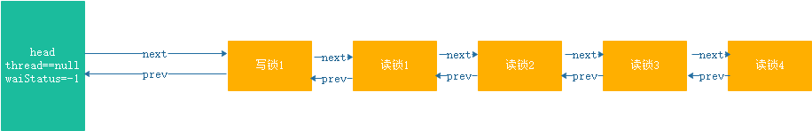
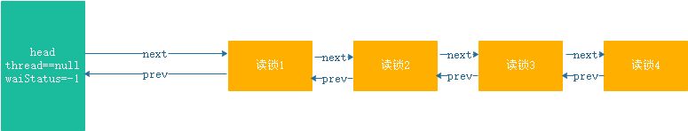
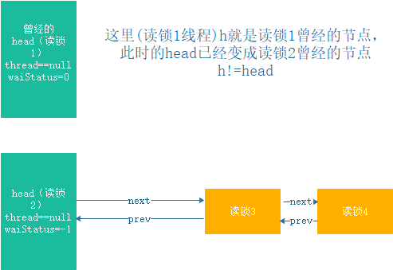

###文章结构
- 源码：对`doReleaseShared()`方法的源码进行一些注释
- 使用场景：介绍`doReleaseShared()`使用位置，及目的
- 以写锁开始的队列：分析写锁开始得同步等待队列在唤醒后续读锁节点的过程
- 以读锁开始的队列
- 总结

###源码

具体解析见注释
```
/**
 * Release action for shared mode -- signals successor and ensures
 * propagation. (Note: For exclusive mode, release just amounts
 * to calling unparkSuccessor of head if it needs signal.)
 */
private void doReleaseShared() {
    /*
     * Ensure that a release propagates, even if there are other
     * in-progress acquires/releases.  This proceeds in the usual
     * way of trying to unparkSuccessor of head if it needs
     * signal. But if it does not, status is set to PROPAGATE to
     * ensure that upon release, propagation continues.
     * Additionally, we must loop in case a new node is added
     * while we are doing this. Also, unlike other uses of
     * unparkSuccessor, we need to know if CAS to reset status
     * fails, if so rechecking.
     */
    for (;;) {
        Node h = head;
        if (h != null && h != tail) {
            int ws = h.waitStatus;
            if (ws == Node.SIGNAL) {
                if (!compareAndSetWaitStatus(h, Node.SIGNAL, 0))
                    continue;            // loop to recheck cases
                unparkSuccessor(h);
            }
            //在队列中的节点对应的线程阻塞之前，将前驱节点的waitStatus状态设置为SIGNAL
            //所以这块ws==0，其实是当前线程通过第一次循环将状态设置为了0，
            //第二次循环进入的时候头节点还没有被改变
            //cas操作失败的话会直接continue，为什么会失败，
            //可能是唤醒得其他节点在唤醒后续节点的时候已经进行了修改
            //修改失败则代表头节点已经修改，则进入下一次循环
            else if (ws == 0 &&
                     !compareAndSetWaitStatus(h, 0, Node.PROPAGATE))
                continue;                // loop on failed CAS
        }
        //特别注意这个出口判断
        //唤醒后继节点之后，后继节点没有更换头节点才会退出，整个后继节点可以是一个读锁，或者写锁
        //在唤醒到队列尾之后头节点将不再改变，可以结束
        if (h == head)                   // loop if head changed
            break;
    }
}
```
###使用场景

`doReleaseShared()`的作用唤醒其后后继节点，具体的说是需要唤醒其后到下一个尝试获取锁的的节点之间的所有尝试获取
读锁的线程。

在`AQS`中一共有两处使用到了`doReleaseShared()`方法，分别是：

- 在`setHeadAndPropagate()`中，`setHeadAndPropagate()`方法用于同步等待队列中获取共享锁的节点
在成功获取共享锁之后判断其是否有后继节点，以及后继节点是否是尝试获取共享锁，如果是则调用`doReleaseShared()`完成唤醒操作

- 在`releaseShared()`中当前线程释放完读锁后，读锁归零则调用`doReleaseShared()`方法唤醒后及线程

总之来说，`doReleaseShared()`就是用来唤醒后继节点的，但是这个方法体式一个死循环，而出口条件却不是很好理解；

```
//方法出口
if (h == head)                   // loop if head changed
    break;
```
如何能满足这个条件呢，以读锁为例说明:

### 以写锁开始的队列

假设当前读锁被线程A获取，考虑获取读锁的进入队列的条件，非公平模式下队列中头结点的后继节点尝试获取写锁，则会加入到队列中；
公平模式下，队列中有等候的节点就会加入到队列中排队，但是读锁是非阻塞式获取的，当一个线程获取读锁后，
其他线程也可以获取读锁，`CAS`操作放在一个死循环中完成，不会被加入到队列，所以第一个放到队列中的也是一个写锁的获取线程。
若当前是写锁被获取，则统统会被加入到队列中。

假设有这样一个队列(如下图)


当写锁被获取并刚释放的瞬间，还没有唤醒读锁1，则队列变为下面的样子


此时读锁1被阻塞再`doAcquireShared`方法上，这时唤醒读锁1，读锁1线程获取读锁成功后会调用`setHeadAndPropagate()`方法
，判断出其后面还有等待的线程读锁2则调用`doReleaseShared()`方法。现在再来看`doReleaseShared()`方法，
这里分为两种情况：

#### 在读锁1判断头节点之前，读锁2线程替换头节点成功
>读锁1将自身的`waitStatus`字段设置为0(`compareAndSetWaitStatus(h, Node.SIGNAL, 0`设置失败则循环设置)，
并唤醒读锁2之后，读锁2立刻加锁成功，会将头节点设置为自身节点(thread字段置空，如下图），读锁1的h会与头节点不同
>>
>>
>>    那么读锁1线程会在这个循环里不能退出，第二次循环的时候`h`字段会变成曾经的读锁2线程对应的节点，
>>    
>>    - 读锁2线程此时是被唤醒的，读锁2线程也会调用`setHeadAndPropagate()`方法去唤醒读锁3线程。
>>    假设是读锁2线程唤醒了读锁3，读锁3线程会将头节点设置为自身节点，而读锁1线程的`h`字段保存的头节点还没更改依然是
>>    读锁线程2的情况下，`CAS`更改头节点的`waitStatus`状态操作将会失败，会进入到`else if (ws == 0 &&
>>     !compareAndSetWaitStatus(h, 0, Node.PROPAGATE))`当中执行下一次循环，还是不能结束。
>>    
>>    - 由于读锁1在循环，所以有可能是读锁1唤醒了读锁3，读锁2对应的线程`CAS`更改头节点的`waitStatus`状态操作将会失败，
>>      会进入到`else if (ws == 0 && !compareAndSetWaitStatus(h, 0, Node.PROPAGATE))`当中执行下一次循环，还是不能结束。
>>      
>>    - 假设读锁3对应的线程由读锁2唤醒，读锁三完成了设置头节点的操作，此时读锁1刚好进行一次循环，并且没有竞争，那么读锁1可以立刻唤醒读锁4 
>>    
>>    假设队列长度足够，那么就会产生一个唤醒的风暴，前面的线程都在唤醒后面的线程，这样可以快速的唤醒起队列中下一个写锁之前的所有申请读锁的线程。
>>    这样的风暴会在碰到一个申请写锁的线程或者一直到队列尾都没有写锁，唤醒了所有的线程之后结束，当然中间可能存在部分的线程已经停止了唤醒操作(
>>    在判断`h==head`完成之前，头节点没有被替换)
>>
>>    - 碰到写锁：由于读锁已经被获取，唤醒一个写锁线程后，并不能完成加锁操作，因此头节点不会被替换，直到所有的读锁被释放，写锁才能尝试加锁
>>       所以在这个位置将会结束这场风暴。
>>
>>    - 到达队尾:到达队尾后头节点将不会变化，风暴结束
>>    

#### 在读锁1判断头节点完成之前，读锁2线程都没有替换头节点
>读锁1唤醒读锁2对应的线程，但是读锁2处于某些原因并没有立刻加锁成功，或者加锁成功但是换么有用自身节点将头节点替换，此时`if (h == head)`
将被满足，从而读锁1线程退出，后面的线程依然会被唤醒，因为读锁2线程已经被唤醒，可以继续后面的唤醒操作

### 以读锁开始的队列
就是以写锁开始得队列得写锁执行完成后得唤醒过程，(当前锁状态中读锁被获取，且队列的头节点得后继节点不存在写锁申请，不知道那种情况读锁会入队列)

###总结
`doReleaseShared()`方法会以一种风暴的形式唤醒后续的第一个获取写锁之前的所有获取读锁的节点，没有写锁将会唤醒整个队列                                             