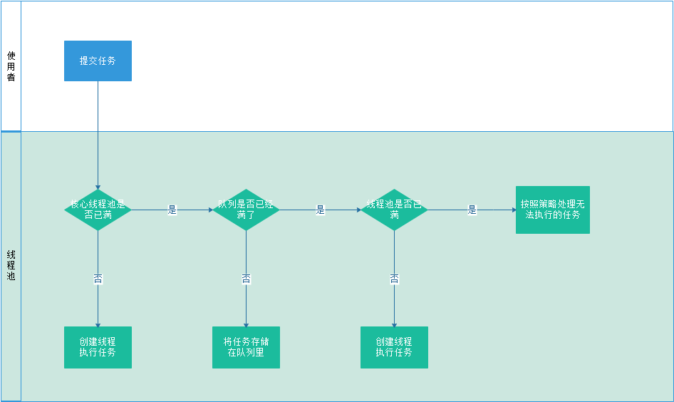

##线程池

####线程池概述


####构造方法
`ThreadPoolExecutor`最核心的构造方法如下
```
public ThreadPoolExecutor(int corePoolSize,
                          int maximumPoolSize,
                          long keepAliveTime,
                          TimeUnit unit,
                          BlockingQueue<Runnable> workQueue,
                          ThreadFactory threadFactory,
                          RejectedExecutionHandler handler) {
    if (corePoolSize < 0 ||
        maximumPoolSize <= 0 ||
        maximumPoolSize < corePoolSize ||
        keepAliveTime < 0)
        throw new IllegalArgumentException();
    if (workQueue == null || threadFactory == null || handler == null)
        throw new NullPointerException();
    this.acc = System.getSecurityManager() == null ?
            null :
            AccessController.getContext();
    this.corePoolSize = corePoolSize;
    this.maximumPoolSize = maximumPoolSize;
    this.workQueue = workQueue;
    this.keepAliveTime = unit.toNanos(keepAliveTime);
    this.threadFactory = threadFactory;
    this.handler = handler;
}
```
参数的含义如下：
- `corePoolSize`：核心线程池的大小，在创建线程池之后，默认没有任何线程，当收到需要处理的任务之后，才会创建线程。可以通过调用`prestartAllCoreThreads()`方法创建所有的核心线程
- `maximumPoolSize`：最大线程数，参考线程池工作原理，核心线程都在处理任务并且阻塞队列已满时，将会根据配置的最大线程数创建新的线程(如果没有达到最大线程数)。
- `keepAliveTime`：空闲线程生存的时间。如果当前线程池中的线程数量比核心线程的数量多，那么空闲的线程将在自旋等待新任务这么长时间后停止。默认核心线程不受这个参数的限制，将一直存活，
可以通过调用`allowCoreThreadTimeOut(boolean value)`方法设定`allowCoreThreadTimeOut`参数为`true`设定核心线程也将受这个参数控制。
- `unit`：`keepAliveTime`的时间单位，是一个枚举类型
- `workQueue`：阻塞队列，接收到任务时，如果核心线程都在工作中，将任务暂存在任务队列当中(如果阻塞队列没有满，关于阻塞队列，参考)
- `threadFactory`：线程工厂，默认使用`Executors`提供的`defaultThreadFactory()`来生成，也可以使用自定义的线程工厂。
- `handler`：拒绝策略，线程数量达到最大的线程数量，并且阻塞队列已满，将会使用这个参数规定的策略处理进入的任务。`ThreadPoolExecutor`默认提供了四种拒绝策略，分别是：
> `CallerRunsPolicy`：在线程池没有被关闭的情况下直接运行这个任务。即直接调用任务的`run`方法运行任务。注意这种策略将在主线程中直接执行`run`方法中的任务，而不是在一个新的线程当中。
>
> `AbortPolicy`：抛出一个`RejectedExecutionException`异常。默认使用这个策略
>
> `DiscardPolicy`：抛弃掉新来的任务。
>
> `DiscardOldestPolicy`：抛弃掉最早加入队列中的的任务。

#### 线程池的一些属性
除了构造方法使用的属性外，线程池还有一些其他的属性及常用的操作如下：
```

private final AtomicInteger ctl = new AtomicInteger(ctlOf(RUNNING, 0));

private static final int COUNT_BITS = Integer.SIZE - 3;

// 线程池的容量，最高2^29-1，同时可以用来计算线程状态和线程池中线程数量的掩码
private static final int CAPACITY   = (1 << COUNT_BITS) - 1;

private static int ctlOf(int rs, int wc) { return rs | wc; }

// 计算线程持运行状态
private static int runStateOf(int c)     { return c & ~CAPACITY; }

// 计算线程池中线程的个数
private static int workerCountOf(int c)  { return c & CAPACITY; }
```
在`ThreadPoolExecutor`当中，使用一个`AtomicInteger`类型的变量表示一个线程池的状态和线程池中线程的个数。其中高三位代表线程池的状态，低29位代表线程池的线程数。
所以java线程池中最大的线程数不是`2^31-1`，而是`2^29-1`个。

```
//线程池的状态
// runState is stored in the high-order bits
private static final int RUNNING    = -1 << COUNT_BITS;
private static final int SHUTDOWN   =  0 << COUNT_BITS;
private static final int STOP       =  1 << COUNT_BITS;
private static final int TIDYING    =  2 << COUNT_BITS;
private static final int TERMINATED =  3 << COUNT_BITS;
```
上面说到`ctl`变量的高三位代表线程池的状态，线程池一共有五种状态，分别是：
>- `RUNNING`：翻译过来就是运行中，新创建的线程池的默认状态，在这个状态下，线程持接受新的任务并且处理在阻塞队列中排队的任务
>- `SHUTDOWN`：关闭？？翻译的不准确。当调用`showdown()`方法之后，线程池就会进入这个状态，这个状态下线程池将不会接受新的任务，但是会处理阻塞队列中缓存的任务。
>- `STOP`：停止？？依然不知道怎么翻译才好。调用`shutdownNow()`方法后，线程持将进入这个状态，这个状态下线程池不会接受新的任务，而且也不会处理阻塞队列中的任务。
>- `TIDYING`：这个真不知道怎么翻译了，整理态，感觉怪怪的。所有的任务都已经停止，`workerCount`为零，将状态设定为`TIDYING`的线程将会调用`terminated()`方法，使得线程池状态转为`TERMINATED`
>- `TERMINATED`：中止状态，代表整个线程池的生命周期结束。

在所有的线程池状态当中，只有`RUNNING`态是小于0的，`SHUTDOWN`是等于0(其实也不能说等于0，因为线程个数可能不为0)，因此也经常采用比较大小的方式来确定线程池的状态。

线程池中状态转换关系如下图：


一些常用的判断操作，用于判断线程池的状态和线程池中线程的数量
```
/*
 * Bit field accessors that don't require unpacking ctl.
 * These depend on the bit layout and on workerCount being never negative.
 */
// s为目标状态，c为现在状态，判断当前线程池的状态是否处于某个状态集合当中
// 比如判断线程是否计需处理阻塞对列中的任务就可用使用 runStateLessThan(c,STOP)
private static boolean runStateLessThan(int c, int s) {
    return c < s;
}

// s为目标状态，c为现在状态，判断当前线程池的状态是否处于某个状态集合当中
// 比如添加任务的时候就可以通过使用runStateAtLeast(c, SHUTDOWN)判断当前线程池是否可以接受任务
private static boolean runStateAtLeast(int c, int s) {
    return c >= s;
}

// 判断线程池是否处于运行中
private static boolean isRunning(int c) {
    return c < SHUTDOWN;
}

/**
 * Attempts to CAS-increment the workerCount field of ctl.
 */
// 使用cas操作将ctl增1，代表线程池中新增加一个线程
private boolean compareAndIncrementWorkerCount(int expect) {
    return ctl.compareAndSet(expect, expect + 1);
}

/**
 * Attempts to CAS-decrement the workerCount field of ctl.
 */
// 使用cas操作将ctl增1，代表线程池中减少一个线程
private boolean compareAndDecrementWorkerCount(int expect) {
    return ctl.compareAndSet(expect, expect - 1);
}

/**
 * Decrements the workerCount field of ctl. This is called only on
 * abrupt termination of a thread (see processWorkerExit). Other
 * decrements are performed within getTask.
 */
private void decrementWorkerCount() {
    do {} while (! compareAndDecrementWorkerCount(ctl.get()));
}
```

```

/**
 * Lock held on access to workers set and related bookkeeping.
 * While we could use a concurrent set of some sort, it turns out
 * to be generally preferable to use a lock. Among the reasons is
 * that this serializes interruptIdleWorkers, which avoids
 * unnecessary interrupt storms, especially during shutdown.
 * Otherwise exiting threads would concurrently interrupt those
 * that have not yet interrupted. It also simplifies some of the
 * associated statistics bookkeeping of largestPoolSize etc. We
 * also hold mainLock on shutdown and shutdownNow, for the sake of
 * ensuring workers set is stable while separately checking
 * permission to interrupt and actually interrupting.
 */
private final ReentrantLock mainLock = new ReentrantLock();

/**
 * Set containing all worker threads in pool. Accessed only when
 * holding mainLock.
 */

private final HashSet<Worker> workers = new HashSet<Worker>();

/**
 * Wait condition to support awaitTermination
 */
private final Condition termination = mainLock.newCondition();

/**
 * Tracks largest attained pool size. Accessed only under
 * mainLock.
 */
private int largestPoolSize;

/**
 * Counter for completed tasks. Updated only on termination of
 * worker threads. Accessed only under mainLock.
 */
private long completedTaskCount;


/**
 * If false (default), core threads stay alive even when idle.
 * If true, core threads use keepAliveTime to time out waiting
 * for work.
 */
private volatile boolean allowCoreThreadTimeOut;

```
#### 任务的添加
当向线程池添加一个任务时，主线程需要先创建一个实现了`Runable`或者`Callable`接口的任务对象。可以使用`ThreadPoolExecutor#execute()`方法或者`ThreadPoolExecytor#submit()`方法来执行任务。
`ThreadPoolExecutor#execute()`可以接受一个实现了`Runable`接口的任务对象，`ThreadPoolExecytor#submit()`方法可以接受一个`Runable`或者`Callable`接口的对象，以及一个用于返回任务结果的对象。
但其实`submit()`是将传入的任务转化为一个`FutureTask`对象再调用`execute()`方法。

`ThreadPoolExecytor#submit()`方法如下：
```
// 构造一个FutureTask对象，
protected <T> RunnableFuture<T> newTaskFor(Runnable runnable, T value) {
    return new FutureTask<T>(runnable, value);
}

public Future<?> submit(Runnable task) {
    if (task == null) throw new NullPointerException();

    // 将传入的Runable对象转化为FutureTask对象，FutureTask对象可以有一个返回值，这里设置为null
    // 但这里写的是RunnableFuture接口对象，但是代码实现里确实是一个FutureTask对象
    RunnableFuture<Void> ftask = newTaskFor(task, null);

    // 再调用execute方法执行任务。RunableFuture接口是实现了Runable接口的
    execute(ftask);
    return ftask;
}

/**
 * @throws RejectedExecutionException {@inheritDoc}
 * @throws NullPointerException       {@inheritDoc}
 */
public <T> Future<T> submit(Runnable task, T result) {
    if (task == null) throw new NullPointerException();

    // 同上，但是这里多了一个返回值为result
    RunnableFuture<T> ftask = newTaskFor(task, result);
    execute(ftask);
    return ftask;
}

/**
 * @throws RejectedExecutionException {@inheritDoc}
 * @throws NullPointerException       {@inheritDoc}
 */
public <T> Future<T> submit(Callable<T> task) {
    if (task == null) throw new NullPointerException();

    // 将传入的Callable对象构造成一个FutureTask对象
    RunnableFuture<T> ftask = newTaskFor(task);
    execute(ftask);
    return ftask;
}
```

`ThreadPoolExecutor#execute()`方法如下：
```
/**
 * command代表的任务可以在将来将来某个时间使用线程池内已有的线程执行，也有可能创建新的线程来执行
 * 当线程池负载已满或者已经关闭，则将任务交由拒绝处理策略执行
 */
public void execute(Runnable command) {
    if (command == null)
        throw new NullPointerException();
    /*
     * Proceed in 3 steps:
     *
     * 1. If fewer than corePoolSize threads are running, try to
     * start a new thread with the given command as its first
     * task.  The call to addWorker atomically checks runState and
     * workerCount, and so prevents false alarms that would add
     * threads when it shouldn't, by returning false.
     *
     * 2. If a task can be successfully queued, then we still need
     * to double-check whether we should have added a thread
     * (because existing ones died since last checking) or that
     * the pool shut down since entry into this method. So we
     * recheck state and if necessary roll back the enqueuing if
     * stopped, or start a new thread if there are none.
     *
     * 3. If we cannot queue task, then we try to add a new
     * thread.  If it fails, we know we are shut down or saturated
     * and so reject the task.
     */
    // 获取ctl，即线程池的状态和线程数量
    int c = ctl.get();
    // 如果线程池中线程的数量小于核心线程数量，则尝试创建新的线程处理任务
    if (workerCountOf(c) < corePoolSize) {
        
        // 尝试创建新的线程处理任务，有可能创建失败
        // addWorker方法用来创建新的线程来执行任务
        if (addWorker(command, true))
            return;
        //如果创建失败，可能是由于线程池状态的改变，或者线程池内的线程数量已经达到最大线程数，因此需要重新获取线程池状态ctl
        c = ctl.get();
    }
    // 如果线程池中线程数量已经达到核心线程数两或者说是创建失败
    // 则需要判断线程池的运行状态，如果线程池还在运行中，则尝试将任务加入阻塞队列缓存，以在将来某个时间执行
    if (isRunning(c) && workQueue.offer(command)) {
        // 重新检查避免线程池状态已被修改
        int recheck = ctl.get();
        // 如果线程池已经不在Running态，则取消新加入阻塞队列的任务，并且执行拒绝策略
        // 如果线程池处于Runing态，则不用移除阻塞队列中的任务
        if (! isRunning(recheck) && remove(command))
            reject(command);
        // 如果线程池中没有线程，即可能在上述判断过程中线程池已经销毁了所有的线程，但是只要线程池还在Running态，就新建一个线程
        // 这里创建Worker的时候没有传入FirstTask，因为这个任务已经被加入阻塞队列，线程可以从阻塞对列中获得
        else if (workerCountOf(recheck) == 0)
            addWorker(null, false);
    }
    // 其他情况则尝试创建一个非核心线程来执行任务，
    // 但是这快没有判断线程池状态，将会在addWork中判断，但是只有线程池没有关闭的情况下才能创建
    else if (!addWorker(command, false))
        reject(command);
}
```
根据上述代码，线程池创建线程的流程如下：

但是在最后一步添加非核心线程，并且非核心线程已满(具体判断过程在`addWorker`中)，直接返回了`false`即`!addWorker(command, false)`为`true`时直接执行了拒绝策略

`addWorker`方法：
```
/*
 * 用来创建、运行、清理工作线程的方法
 */
private boolean addWorker(Runnable firstTask, boolean core) {
    retry:
    for (;;) {
        int c = ctl.get();
        // 获取线程池运行状态
        int rs = runStateOf(c);

        // Check if queue empty only if necessary.
        
        /**
         * 先把这个if判断条件拆开：rs >= SHUTDOWN && rs != SHUTDOWN 或者 rs >= SHUTDOWN && firstTask != null 
         * 或者 rs >= SHUTDOWN && workQueue.isEmpty()，满足这三个条件之一，则创建失败
         * rs >= SHUTDOWN && rs != SHUTDOWN ： 线程池已经处于STOP、TIDYING或者TERMINATED 线程池不再接受新的任务也不处理阻塞队列中的任务
         * rs >= SHUTDOWN && firstTask != null ： 线程池已经不再是Running态，线程池不再接受外部任务
         * rs >= SHUTDOWN && workQueue.isEmpty() ： 线程池已经不再是Running态，阻塞队列也已经空了，接下来线程池将会被关闭或者已经关闭
         * 以上情况将不被允许创建新的线程
         */
        if (rs >= SHUTDOWN &&
            ! (rs == SHUTDOWN &&
               firstTask == null &&
               ! workQueue.isEmpty()))
            return false;

        for (;;) {
            int wc = workerCountOf(c);
            // 现有的工作线程大于等于线程的最大容量或者根绝入参判断工作线程大于设定的线程数量则创建失败
            if (wc >= CAPACITY ||
                wc >= (core ? corePoolSize : maximumPoolSize))
                return false;
            // 尝试将工作线程数量加1，即代表创建一个工作线程，但是并不是真的创建
            // 使用cas操作，有可能创建失败。
            if (compareAndIncrementWorkerCount(c))
                break retry;
            // 创建失败则重新确定线程池的止状态饿线程数量
            c = ctl.get();  // Re-read ctl
            // 线程池的状态改变，则从外部循环重新进行判断过程
            if (runStateOf(c) != rs)
                continue retry;
            // 线程池状态没有改变则只需在内循环中不断判断线程的数量以及进行cas操作即可
            // else CAS failed due to workerCount change; retry inner loop
        }
    }

    // 用于判断worker是否被添加
    boolean workerStarted = false;
    boolean workerAdded = false;
    Worker w = null;
    try {
        // 创建一个工作线程，firstTask就是第一个需要完成的任务
        // worker不是线程，但是表示了一个线程以及一些其他的信息
        w = new Worker(firstTask);
        final Thread t = w.thread;
        if (t != null) {
            //线程创建成功则尝试执行任务
            final ReentrantLock mainLock = this.mainLock;
            mainLock.lock();
            try {
                // Recheck while holding lock.
                // Back out on ThreadFactory failure or if
                // shut down before lock acquired.
                int rs = runStateOf(ctl.get());
                // 判断线程池状态是否处于运行态或者shutdown，由于shutdown状态不接受新的任务，所以需要firstTask==null
                if (rs < SHUTDOWN ||
                    (rs == SHUTDOWN && firstTask == null)) {
                    //新创建的线程并没有启动，不应该是alive
                    if (t.isAlive()) // precheck that t is startable
                        throw new IllegalThreadStateException();
                    //线程池增加一个从线程
                    workers.add(w);
                    int s = workers.size();
                    //修改线程池中线程的的计数个数
                    if (s > largestPoolSize)
                        largestPoolSize = s;

                    //这里标识线程已经创建成功
                    workerAdded = true;
                }
            } finally {
                mainLock.unlock();
            }
            //线程池中线程创建成功则启动线程，启动线程会执行Runable的run方法
            if (workerAdded) {
                t.start();
                workerStarted = true;
            }
        }
    } finally {
        // 线程启动或者创建失败或者线程池状态已关闭，则回滚线程池状态
        if (! workerStarted)
            addWorkerFailed(w);
    }
    return workerStarted;
}
```
`addWorkerFailed()`方法，回滚线程池所有信息
```
/**
 * Rolls back the worker thread creation.
 * - removes worker from workers, if present
 * - decrements worker count
 * - rechecks for termination, in case the existence of this
 *   worker was holding up termination
 */
private void addWorkerFailed(Worker w) {
    final ReentrantLock mainLock = this.mainLock;
    mainLock.lock();
    try {
        if (w != null)
            // 如果线程已经创建了，则从线程池中移除线程
            workers.remove(w);
        // 线程数量-1
        decrementWorkerCount();
        // 尝试将线程池状态改变为Terminate
        tryTerminate();
    } finally {
        mainLock.unlock();
    }
}
```
`Worker#Run()`方法：
```

public void run() {
    runWorker(this);
}

final void runWorker(Worker w) {
    Thread wt = Thread.currentThread();
    Runnable task = w.firstTask;
    w.firstTask = null;
    w.unlock(); // allow interrupts
    boolean completedAbruptly = true;
    try {
        // getTask尝试从阻塞队列获取任务
        // 如果创建Worker的时候传入了FirstTask，并且还没有执行，那么第一次执行的就是firstTask
        // 之后将从阻塞队列中尝试获取任务
        while (task != null || (task = getTask()) != null) {
            w.lock();
            // If pool is stopping, ensure thread is interrupted;
            // if not, ensure thread is not interrupted.  This
            // requires a recheck in second case to deal with
            // shutdownNow race while clearing interrupt

            // 如果线程池已经处于Stop状态之后则需要判断线程是否中断，如果没有则中断线程
            if ((runStateAtLeast(ctl.get(), STOP) ||
                 (Thread.interrupted() &&
                  runStateAtLeast(ctl.get(), STOP))) &&
                !wt.isInterrupted())
                wt.interrupt();
            try {
                // 有时我们希望在某个任务直线或者之后给出一定的提示信息或者其他信息，
                // 这时候就可以通过重写beforeExecute和afterExecute完成
                beforeExecute(wt, task);
                Throwable thrown = null;
                try {
                    // 每个任务是一个Runable的对象，执行任务的本质就是执行任务的run方法
                    task.run();
                } catch (RuntimeException x) {
                    thrown = x; throw x;
                } catch (Error x) {
                    thrown = x; throw x;
                } catch (Throwable x) {
                    thrown = x; throw new Error(x);
                } finally {
                    afterExecute(task, thrown);
                }
            } finally {
                task = null;
                w.completedTasks++;
                w.unlock();
            }
        }
        completedAbruptly = false;
    } finally {
        // 当线程池中没有待办任务则尝试中止线程池。
        processWorkerExit(w, completedAbruptly);
    }
}
```

`processWorkerExit`方法
```
private void processWorkerExit(Worker w, boolean completedAbruptly) {
    // 如果线程是因为异常退出，那么线程已经结束，所以需要将线程数减一
    if (completedAbruptly) // If abrupt, then workerCount wasn't adjusted
        // 循环使用cas操纵进行将线程数减一
        decrementWorkerCount();

    final ReentrantLock mainLock = this.mainLock;
    mainLock.lock();
    try {
        // 将当前线程的工作数量加给总的处理数量
        completedTaskCount += w.completedTasks;
        // 线程池中移除当前线程
        workers.remove(w);
    } finally {
        mainLock.unlock();
    }

    // 尝试终止线程
    tryTerminate();

    int c = ctl.get();
    // 如果当前线程池处于运行态或者ShutDown，并且并不是意外结束线程的话
    // 如果当前线程池中已经没有线程或者线程数量小于核心线程数，则增加核心线程
    if (runStateLessThan(c, STOP)) {
        if (!completedAbruptly) {
            int min = allowCoreThreadTimeOut ? 0 : corePoolSize;
            if (min == 0 && ! workQueue.isEmpty())
                min = 1;
            if (workerCountOf(c) >= min)
                return; // replacement not needed
        }
        addWorker(null, false);
    }
}

```
`tryTerminate()`方法：
```
/**
 * Transitions to TERMINATED state if either (SHUTDOWN and pool
 * and queue empty) or (STOP and pool empty).  If otherwise
 * eligible to terminate but workerCount is nonzero, interrupts an
 * idle worker to ensure that shutdown signals propagate. This
 * method must be called following any action that might make
 * termination possible -- reducing worker count or removing tasks
 * from the queue during shutdown. The method is non-private to
 * allow access from ScheduledThreadPoolExecutor.
 */
final void tryTerminate() {
    for (;;) {
        int c = ctl.get();
        if (isRunning(c) ||
            runStateAtLeast(c, TIDYING) ||
            (runStateOf(c) == SHUTDOWN && ! workQueue.isEmpty()))
            return;
        if (workerCountOf(c) != 0) { // Eligible to terminate
            interruptIdleWorkers(ONLY_ONE);
            return;
        }

        final ReentrantLock mainLock = this.mainLock;
        mainLock.lock();
        try {
            if (ctl.compareAndSet(c, ctlOf(TIDYING, 0))) {
                try {
                    terminated();
                } finally {
                    ctl.set(ctlOf(TERMINATED, 0));
                    termination.signalAll();
                }
                return;
            }
        } finally {
            mainLock.unlock();
        }
        // else retry on failed CAS
    }
}

```


