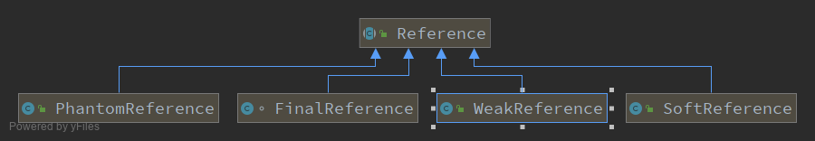

## 目录
- java中的引用
- 引用队列
- 虚引用、弱引用、软引用的实现
- ReferenceHandler线程
- 引用队列的实现
- 总结
- 参考资料

## java中的引用
`JDK 1.2`之后，把对象的引用分为了四种类型，分别为：强引用、软应用、弱引用和虚引用，以方便控制java对象的生命周期。

1. 强引用
> 强引用是工作开发中使用最多的引用类型。比如声明一个字符串变量`String str="abc"`。**只要对象与强引用关联，`JVM`就不会回收这个对象，即不会回收这个区域
> 的内存。** 如果我们希望回收`abc`这个对象，那么就需要显示的将`str`设置为`null`,即`str=null`。那么jvm就会在下一次`gc`时回收这部分内存区域。

2.软引用
> 软引用可以用来描述一些非必须的对象，`java`中使用`SoftRefence`来表示软引用。对于软引用的生命如下：
>```
>   SoftRefence<String> str = new SoftRefence<String>(new String("abc"))；
>   或者
>   SoftReference<String> str=new SoftReference<>("abc");
>```
>对于软引用关联的对象，只要系统内存足够，就不会回收这部分内存，只有当系统要发生内存泄漏之前才会将**只与**软引用关联的对象进行回收，当回收完之后内存还不足时
>会抛出内存溢出的异常。

3. 弱引用
> 弱引用用来描述非必须的对象。使用方法如下：
>```
>   WeakReference<String> str=new WeakReference<>("abc");
>   或者
>   WeakReference<String> str=new WeakReference<String>(new String("abc"));
>```
> 对于只使用弱引用描述的对象，这个对象可以通过弱引用用找到，但是他只能存活到下一次`gc`之前,也就是说，**只被弱引用关联的对象，在下一次`gc`时，会被垃圾回收掉。**
>验证如下：
>```java
>public class Weak {
>     public static void main(String[] args) throws InterruptedException {
>         String str="abc";
>         WeakReference<String> weakStr=new WeakReference<>(str);
>         System.out.println("=======当对象同时被强引用和弱引用关联，执行一次gc======");
>         System.gc();
>         System.out.println(weakStr.get());
>         System.out.println("========当对象只与弱引用关联======");
>         str = null;
>         System.out.println(weakStr.get());
>         System.out.println("========再次执行gc======");
>         System.gc();
>         Thread.sleep(10000);
>         System.out.println(weakStr);
>         System.out.println(weakStr.get());
>     }
> }
>```
>结果如下：
>```
>=======当对象同时被强引用和弱引用关联，执行一次gc======
>abc
>========当对象只与弱引用关联======
>abc
>========再次执行gc======
>java.lang.ref.WeakReference@1b6d3586
>abc
>```
>咦没回收！！！再来看个例子
>```java
>public class Weak {
>     public static void main(String[] args) throws InterruptedException {
>         Integer i=new Integer(10);
>         WeakReference<Integer> weakStr=new WeakReference<>(i);
>         System.out.println("=======当对象同时被强引用和弱引用关联，执行一次gc======");
>         System.gc();
>         System.out.println(weakStr.get());
>         System.out.println("========当对象只与弱引用关联======");
>         i = null;
>         System.out.println(weakStr.get());
>         System.out.println("========再次执行gc======");
>         System.gc();
>         Thread.sleep(10000);
>         System.out.println(weakStr);
>         System.out.println(weakStr.get());
>     }
> }
>```
>结果如下：
>```
>=======当对象同时被强引用和弱引用关联，执行一次gc======
>10
>========当对象只与弱引用关联======
>10
>========再次执行gc======
>java.lang.ref.WeakReference@1b6d3586
>null
>```
>回收了！！！为什么？？

4. 虚引用
>虚引用是引用关系中最弱的一种引用，也被称为幽灵引用或者幻影引用。一个对象是否存在虚引用，完全不会对其生存时间构成影响，也无法通过虚引用来获取一个对象实例，
>为对象设置虚引用的目的是为了能够在对象被回收器回收时得到一个通知。
>虚引用的使用必须和一个引用队列绑定，使用举例如下：
>```
>   PhantomReference<String> str= new PhantomReference<>("abc",new ReferenceQueue<>());
>```

## 引用队列
引用队列提供了一种可以直观了解垃圾回收的方式。引用队列可以和软引用、弱引用和虚引用搭配使用，当`JVM`进行垃圾收集的时候会将引用对象加入到引用队列中，
即：在引用队列中的节点(引用类型的对象)所关联的对象已经被回收。例子如下：
```
public static void main(String[] args) {
    Object object=new Object();
    ReferenceQueue<Object> objectReferenceQueue=new ReferenceQueue<>();
    WeakReference<Object> objectWeakReference=new WeakReference<>(object,objectReferenceQueue);
    object=null;
    System.gc();
    System.out.println(objectWeakReference.get());
    System.out.println(objectReferenceQueue.poll());
}
```
输出结果如下：
```
objectWeakReference.get()====null
objectWeakReference====java.lang.ref.WeakReference@1b6d3586
objectReferenceQueue.poll()====java.lang.ref.WeakReference@1b6d3586
```
上面的例子中`object`对象关联了一个弱引用`objectWeakReference`。从输出结果来看，当`object`对象垃圾回收之后，`objectWeakReference`对象被加入到了引用队列当中。

## 虚引用、弱引用、软引用的实现
虚引用、弱引用、软引用都继承自`Reference(引用类)`抽象类，另外还有一个`FinaReference`也是继承自这个类。他们之间的类图如下：
<center>
    
    <br>
    <div style="color:orange; border-bottom: 1px solid #d9d9d9;
    display: inline-block;
    color: #999;
    padding: 2px;">图1&nbsp;&nbsp;Reference的类图</div>
</center>

#### 引用类的实现
引用类定义了所有引用对象的通用的操作，这个类和垃圾回收机制紧密象关，是一个抽象类不能被直接实例化，类的定义成如下：
```java
public abstract class Reference<T> {
   
    //当创建一个引用对象并绑定一个强引用对象时，
    //就是对这个字段赋值，将这个字段指向强引用的对象
    //GC特殊处理的对象
    private T referent;         /* Treated specially by GC */

    // reference对象关联的引用队列。如果对象被回收，这个队列将作为通知的回调队列。
    // 当reference对象关联的对象将要被回收时，reference对象将会被放进引用队列，就可以从引用队列来监控垃圾回收情况
    volatile ReferenceQueue<? super T> queue;

    /* When active:   NULL
     *     pending:   this
     *    Enqueued:   next reference in queue (or this if last)
     *    Inactive:   this
     */
    // 这个字段用于在引用队列中构建单项链表。在引用队列中，队列中的每个元素是一个引用类型，这个字段用于指向下一个节点
    /**
     * 当引用对象处于不同状态时，这个字段的值不同
     * Active:NULL
     * Pending:THIS
     * Enqueue:NEXT
     * Inactive:THIS
     */
    @SuppressWarnings("rawtypes")
    volatile Reference next;

    /* When active:   next element in a discovered reference list maintained by GC (or this if last)
     *     pending:   next element in the pending list (or null if last)
     *   otherwise:   NULL
     */
    // 基于状态不同表示的链表不同
    // 主要是pending-reference列表的下一个元素
    // 需要和 pending属性搭配使用，
    transient private Reference<T> discovered;  /* used by VM */
    
    /* Object used to synchronize with the garbage collector.  The collector
     * must acquire this lock at the beginning of each collection cycle.  It is
     * therefore critical that any code holding this lock complete as quickly
     * as possible, allocate no new objects, and avoid calling user code.
     */
    // 这个锁用于垃圾收集器的同步，收集器在垃圾收集之前必须获取锁，所以任何获得整个锁的代码都必须尽快完成
    // 尽量不创建新的对象，尽量不调用用户代码。
    static private class Lock { }
    private static Lock lock = new Lock();


    /* List of References waiting to be enqueued.  The collector adds
     * References to this list, while the Reference-handler thread removes
     * them.  This list is protected by the above lock object. The
     * list uses the discovered field to link its elements.
     */
    /**
     * 一个处于pending状态链表，他们都在等待进入引用队列，
     * 垃圾收集器会向该列表添加reference对象，而ReferenceHandler线程会处理这个链表
     * 链表的节点使用discovered属性代表链表的下一个节点的位置
     * 就相当于链表的head和next
     * 在对链表操作时必须获得上面的锁对象，避免想成不安全
     * 因为可能有这里在尝试将pending状态的引用对象加入引用队列，jvm需要进行垃圾回收发现可达性改变的对象
     */
    private static Reference<Object> pending = null;

    
    // some code
}
```
上面的代码中有描述了四个引用的状态，分别是`Active`、`Pending`、`Enqueued`、`Inactive`,但是在类的定义中是没有一个属性来专门表示这个状态的。
它通过`queue`属性和`next`属性联合起来表示。
- `Active`：引用指向的对象还存在强引用，对于Active的Reference，它的next为null;如果在创建引用的时候传入了`ReferenceQueue`,那么`queue`为传入的`ReferenceQueue`，否则为`null`
- `Pending`：等待着加入到该`Reference`在创建时注册的`ReferenceQueue`，它的next为自己
- `Enqueued`：表示该`Reference`已经加入到其创建时注册的`ReferenceQueue`，它的`next`为`ReferenceQueue`中的下个元素
- `Inactive`：当从引用队列中`poll`出来之后将会处于这个状态，如果没有注册引用队列，会直接到这个状态。一旦进入此状态，不会对该Reference做任何事，该状态是最终态

构造方法：
```
    /* -- Constructors -- */

    Reference(T referent) {
        this(referent, null);
    }

    Reference(T referent, ReferenceQueue<? super T> queue) {
        this.referent = referent;
        this.queue = (queue == null) ? ReferenceQueue.NULL : queue;
    }
```
总体来说，构造方法只是对`reference`字段和`queue`字段赋值，如果没有传入引用队列，则为`ReferenceQueue.NULL`

其他一些实例方法：
```
// 获取关联的实例对象
@HotSpotIntrinsicCandidate
public T get() {
     return this.referent;
}

// 设置reference字段为null
public void clear() {
     this.referent = null;
}

// 判断是否处于enqeued状态
public boolean isEnqueued() {
     return (this.queue == ReferenceQueue.ENQUEUED);
}

// 将当前的引用放入引用队列，此时会将reference设置为null
public boolean enqueue() {
     this.referent = null;
     return this.queue.enqueue(this);
}

// 禁止clone方法
@Override
protected Object clone() throws CloneNotSupportedException {
     throw new CloneNotSupportedException();
}

// 确保给定的引用实例是强可达的
@ForceInline
public static void reachabilityFence(Object ref) {
}
```

## ReferenceHandler线程
在`reference`类的实现中还定义了一个继承了`Thread`类静态内部类。并且在`reference`还有一个静态代码块启动了一个线程，用来处理`pending`链中的对象。

`ReferenceHandler`类定义：
```java
private static class ReferenceHandler extends Thread {

    // 确保对应的类已经加载并初始化
    // 其实这列确保的就是InterruptedException类和Cleaner类
    private static void ensureClassInitialized(Class<?> clazz) {
        try {
            Class.forName(clazz.getName(), true, clazz.getClassLoader());
        } catch (ClassNotFoundException e) {
            throw (Error) new NoClassDefFoundError(e.getMessage()).initCause(e);
        }
    }

    static {
        // pre-load and initialize InterruptedException and Cleaner classes
        // so that we don't get into trouble later in the run loop if there's
        // memory shortage while loading/initializing them lazily.
        ensureClassInitialized(InterruptedException.class);
        ensureClassInitialized(Cleaner.class);
    }
 
    // 构造方法
    ReferenceHandler(ThreadGroup g, String name) {
        super(g, name);
    }

    public void run() {
        // 死循环处理pending状态的对象
        while (true) {
            tryHandlePending(true);
        }
    }
}

```
`tryHandlePending()`方法
```
/**
 * Try handle pending {@link Reference} if there is one.<p>
 * Return {@code true} as a hint that there might be another
 * {@link Reference} pending or {@code false} when there are no more pending
 * {@link Reference}s at the moment and the program can do some other
 * useful work instead of looping.
 *
 * @param waitForNotify if {@code true} and there was no pending
 *                      {@link Reference}, wait until notified from VM
 *                      or interrupted; if {@code false}, return immediately
 *                      when there is no pending {@link Reference}.
 * @return {@code true} if there was a {@link Reference} pending and it
 *         was processed, or we waited for notification and either got it
 *         or thread was interrupted before being notified;
 *         {@code false} otherwise.
 */
// 处理pending状态的reference，如果有的话。
// 如果链表的后续还有处于pending状态的节点则返回true
// 如果后续没有处于pending状态的节点，则返=返回false；
static boolean tryHandlePending(boolean waitForNotify) {
    Reference<Object> r;
    Cleaner c;
    try {
        synchronized (lock) {
            // pending定义在reference类中：private static Reference<Object> pending = null;
            // 这个字段代表了一个reference类型的链表，一系列等待进入队列的引用对象，
            // 垃圾收集器会向该列表添加reference对象，而ReferenceHandler线程会处理这个链表
            // 这个列表由上面的锁对象保护，避免线程不安全的事件。
            // pengding为静态属性，全局只有一份

            //pending不为null则这个链表中存在等待入队的元素
            if (pending != null) {
                r = pending;
                // 'instanceof' might throw OutOfMemoryError sometimes
                // so do this before un-linking 'r' from the 'pending' chain...
                c = r instanceof Cleaner ? (Cleaner) r : null;


                // unlink 'r' from 'pending' chain
                /**
                 * 这里使用discovered表示垃圾收集器发现的处于pengding状态的一个节点，
                 * 可以将起理解为链表的节点的next属性，代表指向下一个节点的指针
                 * 这里代表指向下一个处于pengding状态的引用对象
                 *
                 * 这个字段定义在reference类中：transient private Reference<T> discovered;  /* used by VM */
                 * 这个字段由jvm维护
                 */
                pending = r.discovered;
                
                // 将获取到的pending节点的下一个节点改为null
                // enqueue和Inactive状态的节点的discovered属性值为null
                r.discovered = null;
            } else {
                // The waiting on the lock may cause an OutOfMemoryError
                // because it may try to allocate exception objects.

                // 这块的返回值很有意思
                // 如果传入的waitForNotify值是true，当发现pending为null时，会执行Object.wait方法
                // 这时会释放自己持有的lock锁，然后由JVM发现对象的可达性发生变化并将对象加入pending队列时
                // 会使用到Object.notifyAll()方法从阻塞中唤醒，
                // 那么此时pending队列中就已经有了元素，可以继续循环将pending状态的节点放入queue

                // 如果waitForNotify是false，那么如果为null则直接返回null，代表后续没有pending状态的节点
                if (waitForNotify) {
                    lock.wait();
                }
                // retry if waited
                return waitForNotify;
            }
        }
    } catch (OutOfMemoryError x) {
        // Give other threads CPU time so they hopefully drop some live references
        // and GC reclaims some space.
        // Also prevent CPU intensive spinning in case 'r instanceof Cleaner' above
        // persistently throws OOME for some time...
        Thread.yield();
        // retry
        return true;
    } catch (InterruptedException x) {
        // retry
        return true;
    }

    // Fast path for cleaners
    if (c != null) {
        c.clean();
        return true;
    }
    // 对于获取的reference对象，获取其引用队列
    // 执行入队方法，入队方法在引用队列中实现。
    ReferenceQueue<? super Object> q = r.queue;
    if (q != ReferenceQueue.NULL) q.enqueue(r);

    //这里直接返回true，代表后续有等待pending的节点，但其实有没有无所谓，下一次再进来的时候还是会判断pending状态的节点存在不存在。
    return true;
}
```
#### ReferenceHandler线程的启动
`ReferenceHandler`线程的启动在`reference`类的静态代码块中，`ReferenceHandler`是以守护线程的方式启动。
```
static {
    ThreadGroup tg = Thread.currentThread().getThreadGroup();
    for (ThreadGroup tgn = tg;
         tgn != null;
         tg = tgn, tgn = tg.getParent());
    //创建ReferenceHandler对象
    Thread handler = new ReferenceHandler(tg, "Reference Handler");
    /* If there were a special system-only priority greater than
     * MAX_PRIORITY, it would be used here
     */
    //设置线程优先级
    handler.setPriority(Thread.MAX_PRIORITY);
    //设置为守护线程
    handler.setDaemon(true);
    //启动线程
    handler.start();

    // 注意这里覆盖了全局的jdk.internal.misc.JavaLangRefAccess实现
    // 但这里不太明白这段代码是为了做什么
    // provide access in SharedSecrets
    SharedSecrets.setJavaLangRefAccess(new JavaLangRefAccess() {
        @Override
        public boolean tryHandlePendingReference() {
            return tryHandlePending(false);
        }
    });
}
```

## 引用队列的实现
引用队列因为同时有`ReferenceHandler`线程在使用也由用户线程在使用，因此需要进行同步。

引用队列的本质是一个单链表，并且链表的的节点就是`reference`对象，定义如下：
```java
/**
 * Reference queues, to which registered reference objects are appended by the
 * garbage collector after the appropriate reachability changes are detected.
 *
 * @author   Mark Reinhold
 * @since    1.2
 */
// 引用队列，他在实例化引用对象的时候被注册到引用对象当中，当引用对象关联的对象的可达性发生变化时，由`ReferenceHandler`线程将其加入注册的引用队列
public class ReferenceQueue<T> {

    /**
     * Constructs a new reference-object queue.
     */
    public ReferenceQueue() { }

    private static class Null<S> extends ReferenceQueue<S> {
        //重写enqueue方法，对于在创建引用对象时未指定引用队列的对象，引用队列就是NULL
        boolean enqueue(Reference<? extends S> r) {
            return false;
        }
    }
    
    // 对于在创建引用对象时未指定引用队列的对象，引用队列就是这个字段
    static ReferenceQueue<Object> NULL = new Null<>();
    // 对于已经咋引用队列中的对象，其关联的引用队列就是这个属性
    static ReferenceQueue<Object> ENQUEUED = new Null<>();

    static private class Lock { };
    private Lock lock = new Lock();
    //引用队列的头结点。引用队列访问的入口有且仅有一个头结点
    private volatile Reference<? extends T> head = null;
    private long queueLength = 0;

    // 将引用对象加入队列
    boolean enqueue(Reference<? extends T> r) { /* Called only by Reference class */
        synchronized (lock) {
            // Check that since getting the lock this reference hasn't already been
            // enqueued (and even then removed)
            //获取待入队的引用对象关联的引用队列
            ReferenceQueue<?> queue = r.queue;
            // 引用对象关联的对象为NULL或者ENQUEUED代表其已经出了对列或者已经在队列中，直接返回false
            // 这里为什么不说NULL可能是引用对象在创建时没有注册引用队列呢？
            // 因为在调用入队方法前已经进行了判断，
            if ((queue == NULL) || (queue == ENQUEUED)) {
                return false;
            }
            assert queue == this;
            // 将引用对象关联的引用队列改为ENQUEUED，代表其已经入队
            r.queue = ENQUEUED;
            //入队方式：修改链表的头结点
            r.next = (head == null) ? r : head;
            //移动头结点
            head = r;
            queueLength++;
            if (r instanceof FinalReference) {
                sun.misc.VM.addFinalRefCount(1);
            }
            //唤醒阻塞在这个锁上的其他线程
            lock.notifyAll();
            return true;
        }
    }
 
    // 引用对象出队的方法，在调用这个方法之前必须获取锁
    private Reference<? extends T> reallyPoll() {       /* Must hold lock */
        Reference<? extends T> r = head;
        // head != null,代表队列不为null
        if (r != null) {
            @SuppressWarnings("unchecked")
            Reference<? extends T> rn = r.next;
            //移动head位置，并将去出队的对象赋值给r
            head = (rn == r) ? null : rn;
            // 设置出队的对象关联的引用队列为null
            r.queue = NULL;
            // 引用对象的下一个节点指向自己，代表引用已经失效，引用的状态将转移到Inactive
            r.next = r;
            queueLength--;
            //解释在后面
            if (r instanceof FinalReference) {
                sun.misc.VM.addFinalRefCount(-1);
            }
            return r;
        }
        return null;
    }

    /**
     * Polls this queue to see if a reference object is available.  If one is
     * available without further delay then it is removed from the queue and
     * returned.  Otherwise this method immediately returns <tt>null</tt>.
     *
     * @return  A reference object, if one was immediately available,
     *          otherwise <code>null</code>
     */
    // 从引用队列中获取引用对象
    public Reference<? extends T> poll() {
        if (head == null)
            return null;
        synchronized (lock) {
            // 执行reallyPoll之前必须获取锁
            return reallyPoll();
        }
    }

    /**
     * Removes the next reference object in this queue, blocking until either
     * one becomes available or the given timeout period expires.
     *
     * <p> This method does not offer real-time guarantees: It schedules the
     * timeout as if by invoking the {@link Object#wait(long)} method.
     *
     * @param  timeout  If positive, block for up to <code>timeout</code>
     *                  milliseconds while waiting for a reference to be
     *                  added to this queue.  If zero, block indefinitely.
     *
     * @return  A reference object, if one was available within the specified
     *          timeout period, otherwise <code>null</code>
     *
     * @throws  IllegalArgumentException
     *          If the value of the timeout argument is negative
     *
     * @throws  InterruptedException
     *          If the timeout wait is interrupted
     */
    // poll方法不保证一定能拿到一个引用队列中的引用对象(如果引用队列没有引用对象则拿不到)
    // remove当拿的时候没有引用队列为空的话，会阻塞线程，直到队列中添加了引用对象或者超时
    // 因此不能保证时效性
    // 这也就解释了为什么在enqueue方法的最后调用了Object.notifyAll方法
    // remove也有可能拿到空对象
    // 同时会响应中断
    public Reference<? extends T> remove(long timeout)
        throws IllegalArgumentException, InterruptedException
    {
        if (timeout < 0) {
            throw new IllegalArgumentException("Negative timeout value");
        }
        synchronized (lock) {
            // 执行reallyPoll之前必须获取锁
            Reference<? extends T> r = reallyPoll();
            if (r != null) return r;
            long start = (timeout == 0) ? 0 : System.nanoTime();
            // 循环获取引用队列中head指向的引用对象
            for (;;) {
                lock.wait(timeout);
                r = reallyPoll();
                if (r != null) return r;
                if (timeout != 0) {
                    long end = System.nanoTime();
                    timeout -= (end - start) / 1000_000;
                    if (timeout <= 0) return null;
                    start = end;
                }
            }
        }
    }

    /**
     * Removes the next reference object in this queue, blocking until one
     * becomes available.
     *
     * @return A reference object, blocking until one becomes available
     * @throws  InterruptedException  If the wait is interrupted
     */
    // 同remove方法
    public Reference<? extends T> remove() throws InterruptedException {
        return remove(0);
    }

    /**
     * Iterate queue and invoke given action with each Reference.
     * Suitable for diagnostic purposes.
     * WARNING: any use of this method should make sure to not
     * retain the referents of iterated references (in case of
     * FinalReference(s)) so that their life is not prolonged more
     * than necessary.
     */
    // 迭代整个引用队列，并对每个引用对象执行给定的操作。
    void forEach(Consumer<? super Reference<? extends T>> action) {
        for (Reference<? extends T> r = head; r != null;) {
            action.accept(r);
            @SuppressWarnings("unchecked")
            Reference<? extends T> rn = r.next;
            if (rn == r) {
                if (r.queue == ENQUEUED) {
                    // still enqueued -> we reached end of chain
                    r = null;
                } else {
                    // already dequeued: r.queue == NULL; ->
                    // restart from head when overtaken by queue poller(s)
                    r = head;
                }
            } else {
                // next in chain
                r = rn;
            }
        }
    }
}
```
个人感觉不论添加缓缓i删除元素都是从`head`处，叫引用栈更合适。感觉特性更像一个栈。

## 总结
`Reference`是非强引用的其他三种类型的引用的父类。而`ReferenceQueue`的结构指保存了一个链表的头结点，通过头结点来完成入队和出对的操作(感觉更像栈)。
在`Reference`类中使用静态代码块创建了一个`ReferenceHandler`守护线程来完成将`pending`状态的引用对象放到引用队列中。本文其实还差了一个`FinaReference`，
这个等总结垃圾回收的时候再总结。

## 参考资料
- [深入理解JDK中的Reference原理和源码实现](https://www.cnblogs.com/throwable/p/12271653.html)


