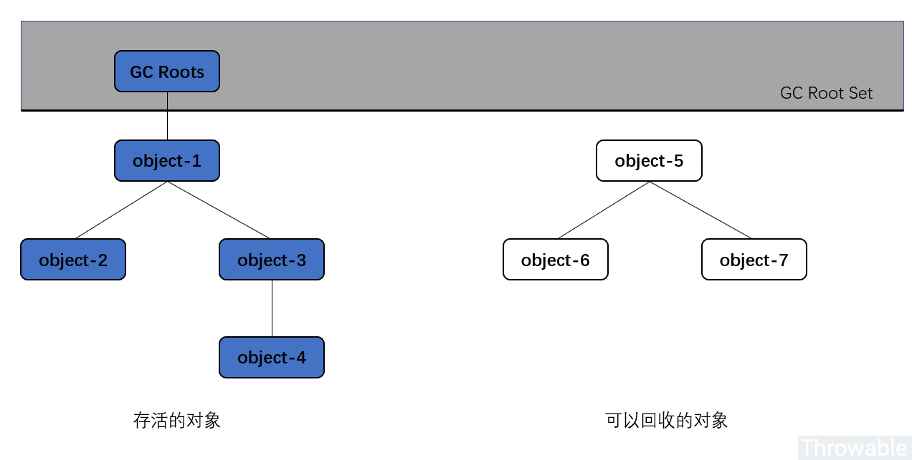
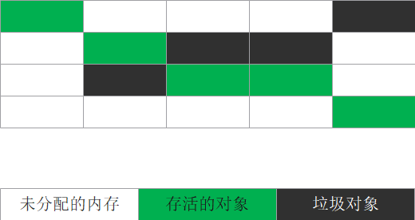
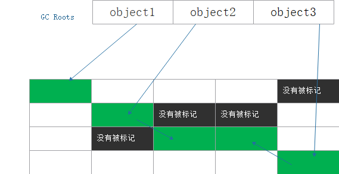
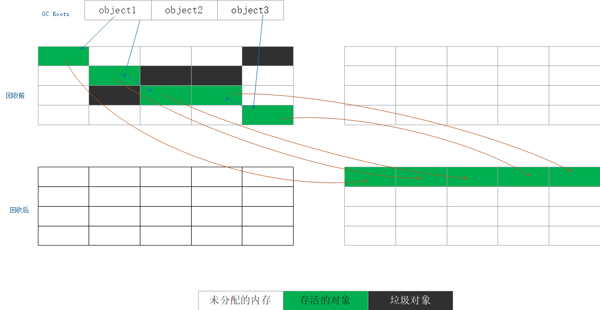
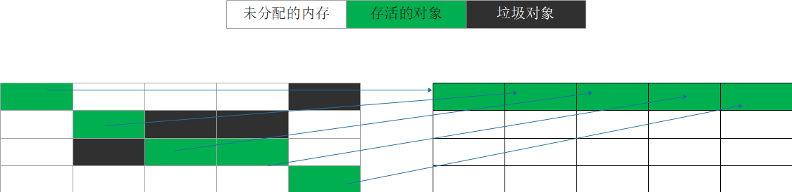

##目录
- 垃圾回收发生的区域
- 如何判断对象是否可以被回收
- HotSpot实现
- 垃圾回收算法
- JVM中使用的垃圾收集算法
- GC的分类
- 总结
- 参考资料

## 垃圾回收发生的区域
堆是`java`创建对象的区域(`String`对象在常量池中)，也是垃圾回收最多的地方。但是除了堆空间还有方法区存在需要回收的垃圾

#### 回收方法区
**废弃的常量**
在常量池中存在一个字面量`A`，如果系统中没有一个地方引用`A``，这时候发生垃圾回收，**如果有必要**这个字面量就会被清理出常量池。

注意是如果有必要。比如上一篇文章中引用的例子，就没有回收字符串。

**无用的类**
当满足以下条件时，这个类就可以被回收，而不是一定会回收。
>1. 所有的类实例都已经被回收也就是java堆里面不存在该类的任何实例
>2. 加载类的`ClassLoader`已经被回收
>3. 该类对应的`Java.long.Class`对象任何地方被引用，无法通过反射访问该类的方法。

## 如何判断对象是否可以被回收
 `java`有一个非常大的好处就是会自动进行垃圾回收，而不用手动释放对象所占用的内存。当以一个对象不再被引用的时候就可以进行垃圾回收，那么如何判断一个对象是否在被使用呢？
 
#### 引用计数法
引用计数法很简单，只需要在对象创建之初给对象加一个引用计数器，每当有一个地方引用他就+1，引用失效就-1，当引用计数器为0，则对象不再被引用。每次垃圾回收，
只需要遍历一遍所有的引用计数器就可以。但是对于循环引用，引用计数法则无法释这两个对象。

#### 可达性分析算法
通过一系列被称为`GC Root`的对象为起点，从这些节点往下搜索，搜索走过的路径称之为引用链，当一个对象到`GC Root`没有任何引用链的时候，则证明此对象不可达。

    
     
    
图1&nbsp;&nbsp;可达性分析示例图

在`JVM`中，可以被用作`GC Root`的对象有：
- 虚拟机栈中引用的对象
- 方法区中静态属性引用的对象
- 方法区中常量引用的对象
- 本地方法栈中引用的对象

## HotSpot实现

#### 枚举根节点
**对于根节点的枚举有如下的问题：**

1. 可以作为根节点(`GC Roots`)的节点主要是全局性的引用(方法去中静态属性引用的对象和方法区中常量引用的对象)与执行上下文(栈中引用的对象)

2. 在一次可达性分析过程中，不能出现分析过程中对象引用关系还在不断变化的情况，否则无法保证分析结果的准确性，为了达到这一目的，`GC`过程中就必须停顿所有的java线程

3. 垃圾收集时，手机线程会对栈上的内存进行扫描，看看哪些位置存储了`Reference`类型，如果发现某个位置确实存的是`Reference`类型，整个`Reference`所引用的对象就可以作为根节点，
他所能到达的对象都不能被回收。

4. 栈上的本地变量表中只有一部分是`Reference`类型，而那些非`Reference`类型的数据对于垃圾回收毫无用处，但是如果对于栈进行全栈扫描将会是一种对时间和资源的浪费，尤其是暂停了用户线程

**解决方法**
是否可以用额外的空间记录下每个`Reference`的位置，这样的话`GC`的时候从这个结构中直接读取这个结构，而不用进行全栈扫描。事实上，大部分主流的虚拟机也确实是这样做的，
以`HotSpot`为例，它使用一种`OopMap`的数据结构来保存这类信息。

一个栈意味着一个线程，而一个栈桢代表了一个方法，每个被`JIT`编译过后的方法会在一些特定的位置记录下`OopMap`记录了执行到该方法的某条指令的时候，栈上和寄存器的哪些位置是引用，
这样`GC`在扫描到这些栈的时候就会查询这些`OopMap`就知道哪里是引用。这些位置主要在：
- 循环的末尾
- 方法临返回前/调用方法的`call`指令之后
- 可能抛出异常的位置
而这些位置就被称之为“**安全点**”，之所以要选择一些特定位置来记录`OopMap`，是因为如果对每条指令的位置都记录`OopMap`的话，这些记录就会比较大，那么空间开销就会显得不值得。

`GC`发生时，程序首先运行到最近的一个安全点停下来，然后更新自己的`OopMap`,枚举根节点时，递归遍历每个栈桢的`OopMap`，通过栈中记录的被引用的对象的内存地址，即可找到这些对象。

#### 安全点与安全区域
**安全点**
程序在执行时并不是任何时间都可以进行`GC`，只有到达有`OopMap`记录的位置才可以执行`GC`，整个位置称之为安全点

安全点的选定基本是以程序“是否具有让程序长时间执行的特征”为标准选定的。程序一般不会因为指令流太长而长时间执行(每个指令执行的时间都很短)。“长时间执行”
的典型特征就是指令序列的服用，例如：循环、递归、方法调用。所以具有这些功能的指令才会产生安全点。

**安全区域**
安全区域指在这一段代码之中，引用关系不会发生变化，在这一段代码之中，任一点都是安全点。任何一个地方都可以中断线程开始`GC`。

当线程执行到安全区域后，首先标识自己已经进入安全区域，那么这段时间`JVM`要发起`GC`时就不用管标记自己进入安全区的线程。线程要离开安全区时，首先需要先检查
系统是否已经完成了根节点的选举，如果完成则线程继续执行，否则要继续等待收到可以安全离开安全区的信号。

**如何保证`GC`发生时，所有的线程都跑到了安全点上呢？**
当要进行`GC`的时候，会让所有的线程都在安全点中断，就有两种方式：
- 抢占式中断：不需要代码配合。当`GC`发生时，让所有的线程都终端，然后让不在安全点的线程继续执行到安全点上。不过一般不采用这种方式
- 主动式中断：当`GC`需要中断线程时，不对线程进行操作，仅设置一个标识。各个线程轮询这个标识，当发现这个标识被设置时，使得程序运行到最进的安全点时，主动挂起。
标识的设置和安全点是重合的，标识的设置和安全点是重合的。除此之外还有一个创建对象需要分配内存的地方。

## 垃圾回收算法
假设存在如下的内存区域：

    
     
    
图2&nbsp;&nbsp;原始情况内存中对象的分布

下文将以这块内存为例进行垃圾收集算法的分析

#### 标记-清除算法
顾名思义，标记清除算法会为两个阶段，1-标记，2-清除。

1. 标记：垃圾收集器从`GC Roots`出发，进行搜索，然后对所有可以访问的对象打上标识，标记其为可达的对象，标记一般保存在header中

    
     
    
图3&nbsp;&nbsp;标记阶段

2. 清除：垃圾收集器对堆内存进行线性遍历，如果发现某个对象没有被标记为可达，就会将其回收，回收后效果如下图

    
     
    
图4&nbsp;&nbsp;标记清除算法进行垃圾回收

**优点**
>1. 实现简单
>2. 与保守式`GC`算法兼容

**缺点**
>1. 内存碎片化严重
>2. 分配速度缓慢，由于空闲块的维护是用链表实现的，分块可能不连续，每次分配都需要遍历链表，极端情况下要遍历震整个链表。
>3. 标记和清除的效率都不高，

#### 复制算法
复制算法，就是将内存划分为相等的两块，每次只是用其中一块，当这块内存使用完了就将还存活的对象复制到另一块，然后将这块空间清理掉，这样使得每次对内存的回收都是半区回收。
复制算法的示意图如下图：

    
     
    
图5&nbsp;&nbsp;复制算法

**优点**
>1. 内存分配时不用考虑碎片的情况只需要移动栈顶指针分配内存即可
>2. 实现简单，高效

**缺点**
>1. 可用内存缩小为原来的一半

#### 标记—整理算法
复制算法在对象存活较多的时候会进行较多的操作，如果对象全部存活复制将会进行100%，并且浪费50%的内存空间作为担保。

标记—整理算法和标记—清除算法前半部分一样，只是后续不是清理，而是让所有存活的对象都向一端移动，然后清理掉边界以外的内存。

    
     
    
图6&nbsp;&nbsp;标记整理算法

## JVM中使用的垃圾收集算法
在当前主流的垃圾收集器当中(`g1`除外)，基本都采用一种分代收集算法。根据对象存活周期，将java堆分为新生堆和老年堆。对于新生堆，采用复制算法，对于老年堆采用标记-清除或者标记-整理算法。

研究人员发现大多数的对象都是“朝生夕灭”，对于这样的对象，生存周期很短，可以将其放入新生堆，因为其生存时间很短，所以新生堆采用复制算法的时候没有必要使用1:1的比例划分内存。
而是分为较大的`Eden`空间和两块较小的`Suvivor`空间;`HotSpot`的`Eden`和`Suvivor`的比例为8:1。回收时将`Eden`和一块`Suvivor`上还存活的对象，一次性copy到另一块`Suvivor`
上，然后清理掉以前的两块区域。这样每次新生代可用的内存空间占整个新生堆的90%，只有10%会被浪费。

我们没有办法保证新生代回收的时候只剩下不多于10%的对象存活。当`Suvivor`空间不够用时，就需要依赖其他内存(老年堆)进行分配担保。对于存活过一定gc次数的对象放进老年堆。

老年堆对象存活率高，使用复制算法可能就需要1:1的空间，这样就会浪费内存，因此使用的是标记-清除或者标记-整理算法。

## GC的分类

#### 保守式GC
`HotSpot`虚拟机在栈上使用`OopMap`记录下了哪些位置是引用类型，根据记录的类型类型开始查找堆中存活的对象。

虚拟机最初的实现当中是没有记录每个数据的类型的，`JVM`也无法区分内存里某个位置的数据到底应该解读为引用类型还是其他数据类型，这种条件下，实现出来的`GC`
就是“保守式`GC`”。在进行`GC`时，`JVM`开始从一些已知的位置(例如栈)开始扫描内存，扫描的时候每看到一个数字就看看它“像不像是一个指向GC堆中的指针”。
这里会涉及上下边界检查（GC堆的上下界是已知的）、对齐检查（通常分配空间的时候会有对齐要求，假如说是4字节对齐，那么不能被4整除的数字就肯定不是指针），之类的。然后递归的这么扫描出去。

**优点**
>1. 实现简单
**缺点**
>1. 会有部分对象本来应该已经死了，但有疑似指针指向它们，使它们逃过`GC`的收集。会有一部分已经不需要的数据占用着`GC`堆空间，但是所有应该存活的对象都会活着，对程序语义来说时安全的
>2. 由于是疑似指针，那么就不知道这个到底是不是指针，所以这些值就都不能改写。移动对象就需要改写指针，也就是说对象不可移动，因此一般使用标记-清除的方式来进行垃圾回收。
>有一种办法可以在使用保守式`GC`的同时支持对象的移动，那就是增加一个间接层，不直接通过指针来实现引用，而是添加一层“句柄”(`handle`)在中间，所有引用先指到一个句柄表里，再从句柄表找到实际对象。这样，要移动对象的话，只要修改句柄表里的内容即可。

#### 半保守式GC
保守式`GC`没有在`JVM`中记录任何类型信息，半保守式`GC`会在对象上记录类型信息，这样的话，扫描栈的时候仍然和保守式`GC`一样，但是扫描到堆上的时候，对象上带了足够的类型信息，
`JVM`就能判断出栈中这个位置是不是一个指向堆中对象的指针，以及这个对象内什么位置数据是引用类型，这种是“半保守式`GC`”，也称之为“根上保守”。

由于半保守式`GC`在堆内部的数据是准确的，所以它可以在直接使用指针来实现引用的条件下支持部分对象的移动，方法是只将保守扫描能直接扫到的对象设置为不可移动（`pinned`），而从它们出发再扫描到的对象就可以移动了。

#### 准确式GC
对于垃圾回收，`JVM`关心的就是扫描的根节点是不是一个指向堆内存的指针，那么就是在栈上记录下那个位置式引用类型，是指向堆上对象的指针，在`HotSpot`虚拟机中这个数据结构就是`OopMap`

## 总结
1. 垃圾回收不止是发生在堆区，对于方法区中产生的垃圾有可能会被回收。在之前的**从JDK源码理解java引用**一文中举了不会被回收的例子
2. 虚拟机一般采用引用可达性分析算法来寻找不被使用的对象，其实寻找到的是正在被使用的对象，剩下的就是不再被使用的对象。
3. 除了`g1`垃圾收集器。其他的垃圾收集器都有明显的区分老年代和新生代进行垃圾回收，由于老年代和新生代对象存货时间不一样，采用不同的垃圾回收算法

## 参考资料
- 深入理解Java虚拟机 周志明著
- [JVM 之 OopMap 和 RememberedSet](https://www.iteye.com/blog/dsxwjhf-2201685)
- [找出栈上的指针/引用](https://www.iteye.com/blog/rednaxelafx-1044951)

