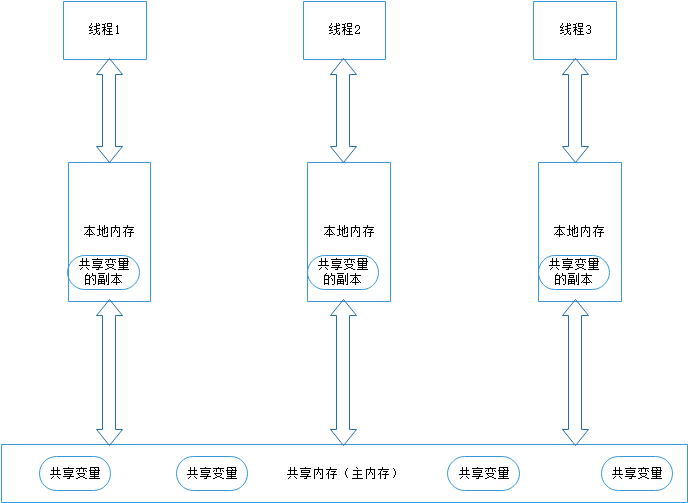

##目录
- 多线程需要解决的问题
  - 线程之间的通信
  - 线程之间的通信
- Java内存模型
  - 内存间的交互操作
  - 指令屏障
  - happens-before规则
- 指令重排序
  - 从源程序到字节指令的重排序
  - as-if-serial语义
  - 程序顺序规则
- 顺序一致性模型
  - 顺序一致性模型特性
  - 顺序一致性模型特性
  - 当程序未正确同步会发生什么
- 参考资料
  

## 多线程需要解决的问题

在多线程编程中，线程之间如何通信和同步是一个必须解决的问题：

####线程之间的通信:
线程之间有两种通信的方式：消息传递和共享内存
- 共享内存：线程之间共享程序的公共状态，通过读——写修改公共状态进行隐式通信。如上面代码中的`num`和`Lock`可以被理解为公共状态
- 消息传递：线程之间没有公共状态，必须通过发送消息来进行显示通信
在java中，线程是通过共享内存来完成线程之间的通信

####线程之间的通信：
同步指程序中永固空值不同线程间的操作发生的相对顺序的机制
- 共享内存：同步是显示进行的，程序员需要指定某个方法或者某段代码需要在线程之间互斥执行。如上面代码中的`Lock`加锁和解锁之间的代码块，或者被`synchronized`包围的代码块
- 消息传递：同步是隐式执行的，因为消息的发送必然发生在消息的接收之前，例如使用`Objetc#notify()`，唤醒的线程接收信号一定在发送唤醒信号的发送之后。

## Java内存模型

在java中，所有的实例域，静态域、数组都被存储在堆空间当中，堆内存在线程之间共享。

所有的局部变量，方法定义参数和异常处理器参数不会被线程共享，在每个线程栈中独享，他们不会存在可见性和线程安全问题。

从Java线程模型(JMM)的角度来看,线程之间的共享变量存储在主内存当中，每个线程拥有一个私有的本地内存(工作内存)本地内存存储了该线程读——写共享的变量的副本。
本地内存只是JMM的一个抽象概念，并不真实存在，它涵盖了缓存，写缓冲区、寄存器及其他的硬件编译器优化。 其中所有的存储区域都在堆内存当中。JMM的模型图如下图所示：


而java线程对于共享变量的操作都是对于本地内存（工作内存）中的副本的操作，并没有对共享内存中原始的共享变量进行操作；

以线程1和线程2为例，假设线程1修改了共享变量，那么他们之间需要通信就需要两个步骤：
1. 线程1本地内存中修改过的共享变量的副本同步到共享内存中去
2. 线程2从共享内存中读取被线程1更新过的共享变量
这样才能完成线程1的修改对线程2的可见。


#### 内存间的交互操作
为了完成这一线程之间的通信，JMM为内存间的交互操作定义了8个原子操作，如下表：

|操作|作用域|说明|
|:---:|:---:|:---:|
|lock(锁定)|共享内存中的变量|把一个变量标识为一条线程独占的状态|
|unlock(解锁)|共享内存中的变量|把一个处于锁定的变量释放出来，释放后其他线程可以进行访问|
|read(读取)|共享内存中的变量|把一个变量的值从共享内存传输到线程的工作内存。供随后的load操作使用|
|load(载入)|工作内存|把read操作从共享内存中得到的变量值放入工作内存的变量副本当中|
|use(使用)|工作内存|把工作内存中的一个变量值传递给执行引擎|
|assign(赋值)|工作内存|把一个从执行引擎接受到的值赋值给工作内存的变量|
|store(存储)|作用于工作内存|把一个工作内存中的变量传递给共享内存，供后续的write使用|
|write(写入)|共享内存中的变量|把store操作从工作内存中得到的变量的值放入主内存|

JMM规定JVM四线时必须保证上述8个原子操作是不可再分割的，同时必须满足以下的规则：
1. 不允许`read`和`load`、`store`和`write`操作之一单独出现，即不允许只从共享内存读取但工作内存不接受，或者工作捏村发起回写但是共享内存不接收
2. 不允许一个线程舍弃`assign`操作，即当一个线程修改了变量后必须写回工作内存和共享内存
3. 不允许一个线程将未修改的变量值写回共享内存
4. 变量只能从共享内存中诞生，不允许线程直接使用未初始化的变量
5. 一个变量同一时刻只能由一个线程对其执行`lock`操作，但是一个变量可以被同一个线程重复执行多次`lock`，但是需要相同次数的`unlock`
6. 如果对一个变量执行`lock`操作，那么会清空工作内存中此变量的值，在执行引擎使用这个变量之前需要重新执行load和assign
7. 不允许`unlock`一个没有被锁定的变量，也不允许`unlock`一个其他线程`lock`的变量
8. 对一个变量`unlock`之前必须把此变量同步回主存当中。

>对`long`和`double`的特殊操作
在一些32位的处理器上，如果要求对64位的`long`和`double`的写具有原子性，会有较大的开销，为了照固这种情况，
java语言规范鼓励但不要求虚拟机对64位的`long`和`double`型变量的写操作具有原子性，当JVM在这种处理器上运行时，
可能会把64位的long和double拆分成两次32位的写

#### 指令屏障

为了保证内存的可见性，JMM的编译器会禁止特定类型的编译器重新排序；对于处理器的重新排序，
JMM会要求编译器在生成指令序列时插入特定类型的的内存屏障指令，通过内存屏障指令巾纸特定类型的处理器重新排序

JMM规定了四种内存屏障，具体如下：

|屏障类型|指令示例|说明|
|:---:|:---:|:---:|
|LoadLoad Barriers|Load1;LoadLoad;Load2|确保Load1的数据先于Load2以及所有后续装在指令的装载|
|StoreStore Barries|Store1;StoreStore;Store2|确保Store1数据对于其他处理器可见（刷新到内存）先于Store2及后续存储指令的存储|
|LoadStore Barriers|Load1;LoadStore;Store2|确保Load1的装载先于Store2及后续所有的存储指令|
|StoreLoad Barrier|Store1;StoreLoad;Load2|确保Store1的存储指令先于Load1以及后续所所有的加载指令|

`StoreLoad`是一个“万能”的内存屏障，他同时具有其他三个内存屏障的效果，现代的处理器大都支持该屏障（其他的内存屏障不一定支持），
但是执行这个内存屏障的开销很昂贵，因为需要将处理器缓冲区所有的数据刷回内存中。


#### happens-before规则
在JSR-133种内存模型种引入了`happens-before`规则来阐述操作之间的内存可见性。在JVM种如果一个操作的结果过需要对另一个操作可见，
那么两个操作之间必然要存在happens-bsfore关系：
>- 程序顺序规则：一个线程中的个每个操作，happens-before于该线程的后续所有操作
>- 监视器锁规则：对于一个锁的解锁，happens-before于随后对于这个锁的加锁
>- volatitle变量规则：对于一个volatile的写，happens-before于认意后续对这个volatile域的读
>- 线程启动原则：对线程的start()操作先行发生于线程内的任何操作
>- 线程终止原则：线程中的所有操作先行发生于检测到线程终止，可以通过Thread.join()、Thread.isAlive()的返回值检测线程是否已经终止
>- 线程终端原则：对线程的interrupt()的调用先行发生于线程的代码中检测到中断事件的发生，可以通过Thread.interrupted()方法检测是否发生中断
>- 对象终结原则：一个对象的初始化完成（构造方法执行结束）先行发生于它的finalize()方法的开始。
>- 传递性：如果A happens-before B   B happends-beforeC，那么A happends-before C


##指令重排序

#### 从源程序到字节指令的重排序

众所周知，JVM执行的是字节码，Java源代码需要先编译成字节码程序才能在Java虚拟机中运行，但是考虑下面的程序;
```java
int a = 1;
int b = 1;
```
在这段代码中，`a`和`b`没有任何的相互依赖关系，因此完全可以先对`b`初始化赋值，再对`a`变量初始化赋值；

事实上，为了提高性能，编译器和处理器通常会对指令做重新排序。重排序分为3种：
1. 编译器优化的重排序。编译器在不改变单线程的程序语义的前提下，可以安排字语句的执行顺序。编译器的对象是语句，不是字节码，
但是反应的结果就是编译后的字节码和写的语句顺序不一致。
2. 执行级并行的重排序。现代处理器采用了并行技术，来将多条指令重叠执行。如果不存在数据依赖性，处理器可以改变语句对应机器指令的执行顺序。
3. 内存系统的重排序，由于处理器使用了缓存和读/写缓冲区，这使得加载和存储操作看上去可能是在乱序执行。

数据依赖性：如果两个操作访问同一个变量，且两个操作有一个是写操作，则这两个操作存在数据依赖性，改变这两个操作的执行顺序，就会改变执行结果。

尽管指令重排序会提高代码的执行效率，但是却为多线程编程带来了问题，多线程操作共享变量需要一定程度上遵循代码的编写顺序，
也需要将修改的共享数据存储到共享内存中，不按照代码顺序执行可能会导致多线程程序出现内存可见性的问题，那又如何实现呢？

#### as-if-serial语义
`as-if-serial`语义：不论程序怎样进行重排序，(单线程)程序的执行结果不能被改变。编译器、`runtime`和处理器都必须支持`as-if-serial`语义。

#### 程序顺序规则
假设存在以下`happens-before`程序规则：
```
    1) A happens-before B
    2) B happens-before C
    3) A happens-before C
```
尽管这里存在`A happens-before B`这一关系，但是JMM并不要求`A`一定要在`B`之前执行，仅仅要求`A`的执行结果对`B`可见。
即JMM仅要求前一个操作的结果对于后一个操作可见，并且前一个操作按照顺序排在后一个操作之前。
但是若前一个操作放在后一个操作之后执行并不影响执行结果，则JMM认为这并不违法，JMM允许这种重排序。


## 顺序一致性模型
在一个线程中写一个变量，在另一个线程中同时读取这个变量，读和写没有通过排序来同步来排序，就会引发数据竞争。

数据竞争的核心原因是程序未正确同步。如果一个多线程程序是正确同步的，这个程序将是一个没有数据竞争的程序。

顺序一致性模型只是一个参考模型。

#### 顺序一致性模型特性
- 一个线程中所有的操作必须按照程序的顺序来执行。
- 不管线程是否同步，所有的线程都只能看到一个单一的执行顺序。

在顺序一致性模型中每个曹祖都必须原子执行且立刻对所有线程可见。

#### 当程序未正确同步会发生什么

当线程未正确同步时，JMM只提供最小的安全性，当读取到一个值时，这个值要么是之前写入的值，要么是默认值。
JMM保证线程的操作不会无中生有。为了保证这一特点，JMM在分配对象时，首先会对内存空间清0，然后才在上面分配对象。

未同步的程序在JMM种执行时，整体上是无序的，执行结果也无法预知。位同步程序子两个模型中执行特点有如下几个差异：
- 顺序一致性模型保证单线程内的操作会按照程序的顺序执行，而JMM不保证单线程内的操作会按照程序的顺序执行
- 顺序一致性模型保证所有线程只能看到一致的操作执行顺序，而JMM不保证所有线程能看到一致的操作执行顺序
- JMM不保证对64位的`long`和`double`型变量具有写操作的原子性，而顺序一致性模型保证对所有的内存的读/写操作都具有原子性

## 参考资料
java并发编程的艺术-方腾飞，魏鹏，程晓明著


