## 目录
- synchronized简介
- 同步的原理
- 对象头与锁的实现
- 锁的优化与升级
- Monitor Record
- 锁的对比

## synchronized简介
`synchronized`关键字，一般称之为“同步锁”或者重量级锁(JAVA SE 1.6之后引入了`偏向锁`和`轻量级锁`)。它具有可重入性.
根据锁的锁的“对象”不同可以分为对象锁和类锁：
- 对象锁：
    - 对于普通的同步方法，锁的是当前实例的对象
    - 对于同步方法块，如果`synchronized`括号里配置的是类的实例对象，则锁的是配置的对象
- 类锁：`Class`对象锁
    - 对于静态同步方法，锁的是当前类(具体说是当前类的Class对象)
    - 对于同步方法块，如果`synchronized`括号里配置的是类的`Class`对象，则锁的是当前类
类锁其实也锁的是一个对象，不过是特殊的`Class`对象，所以类锁并不是真实存在的。但是他们之间有不同的目的

- 对象锁用来控制实例方法之间的同步
- 类锁是用来控制静态方法（或者静态变量互斥体）之间的同步的。

## 同步的原理
`JVM`基于进入和退出`Monitor`对象来实现方法的同步和代码块同步。每个对象都有一个`Monitor`与之关联,当其被占用就会处于锁定的状态。
`Monitor`并不是一个对象，只是习惯了这样一个称呼，他被保存在对象头的`Mark Word`中。
在Java虚拟机（HotSpot）中，Monitor是由ObjectMonitor实现的。

#### 代码块的同步
测试代码如下：
```java
public class SynchronizedTest {
    private void test2(){
        synchronized (this){
            System.out.println(Thread.currentThread().getName()+"获取锁"+this.toString());
        }
    }
}
```
查看编译后的字节码文件如下(省略部分内容)：
```
...
 2 astore_1
 3 monitorenter  
 4 getstatic #2 <java/lang/System.out>
 ....
38 invokevirtual #11 <java/io/PrintStream.println>
41 aload_1
42 monitorexit
43 goto 51 (+8)
46 astore_2
47 aload_1
48 monitorexit
...
```
在编译后的字节码文件中出现了`monitorenter`和`monitorexit`两个指令，作用如下：
- `monitorenter`指令会尝试获取``monitor`的所有权，即会尝试获取对象的锁(保存在对象头中)。过程如下：
    - 如果`monitor`的进入数位0，则该线程进入`monitor`，然后将进入数设置为1，该线程即为`monitor`的所有者。
    - 如果线程已经占有了该`monitor`，则是重新进入，将`monitor`的进入数加1.
    - 如果其他线程已经占有了`monitor`则该西安城进入阻塞状态，直到`monitor`的进入数为0，再尝试获取`monitor`所有权

- `monitorexit`指令的执行线程必须是`monitor`的持有者。指令执行时`monitor`的进入数减1，如果减1后计数器为0，
则该线程将不再持有这个`monitor`，其他被这个monitor阻塞的线程可以尝试去获取这个 monitor 的所有权。
    - monitorexit指令出现了两次，第1次为同步正常退出释放锁；第2次为发生异步退出释放锁；

`Synchronized`的底层是通过一个`monitor`的对象来完成，其实`wait/notify`等方法也依赖于`monitor`对象，
这就是为什么只有在同步的块或者方法中才能调用`wait/notify`等方法，否则会抛出`java.lang.IllegalMonitorStateException`的异常的原因。

#### 同步方法
源代码如下
```java
public class SynchronizedTest {
    public   synchronized  void test() {
        System.out.println(Thread.currentThread().getName()+"获取锁"+this.toString());
    }
}
```
编译后字节码文件如下(省略部分内容)：

```
public synchronized void test();
    descriptor: ()V
    flags: ACC_PUBLIC, ACC_SYNCHRONIZED
    Code:
      stack=3, locals=1, args_size=1
...
```
对于同步方法，在字节码文件中没有使用`monitorenter`和`monitorexit`来完成同步(理论上可以)，但是多了一个`ACC_SYNCHRONIZED`的标记，
对于静态方法还会多出`ACC_STATIC`标记。JVM就是根据该标记来实现方法同步的。

当方法调用时，调用指令会检查方法的`ACC_SYNCHRONIZED`访问标记是否被设置，如果设置了执行线程将先法获取`monitor`，获取成功才能执行方法体，
方法体执行完成后释放`monitor`，在方法执行期间，任何一个其他的线程都无法再获取同一个`monitor`对象。


#### 总结
两种同步方式本质上没有区别，只是方法的同步是一种隐式的方式来实现，无需通过字节码来完成。
**两个指令的执行是JVM通过调用操作系统的互斥原语mutex来实现，
被阻塞的线程会被挂起、等待重新调度，会导致“用户态和内核态”两个态之间来回切换，对性能有较大影响。**

## 对象头与锁的实现
在`JVM`中，对象在内存中的布局分为三个部分：对象头、实例数据、填充信息
- 对象头：`Java`对象头一般占2个机器码(在32位虚拟机中，一个机器码占4个字节，64位机器中占8个字节)，
对于数组类型需要额外的一个机器码来保存数组的长度，也就是需要3个机器码。

- 实例数据： 存放类的属性数据信息，包括父类的属性信息

- 填充信息：由于虚拟机要求，对象的起始地址必须是8字节的整数倍，填充数据不是必须的，仅仅用于字节对齐

**而`synchronized`用的锁就存放在对象头里面**。在`Hospot`虚拟机中,对象头主要包括以下信息：
- `Mark Word`(标记字段)：用于存储对象自身运行时的数据，他是实现偏向锁和轻量级锁的关键。
- `Class Pointer`(类型指针)：对象指向他的类元数据的指针，虚拟机可以通过这个指针确定对象是那个类的实例。 

> `Mark Word`用于存储对象自身运行时的数据，如哈希码(HashCode),GC分代信息，锁状态标志，线程持有的锁，偏向线程ID，偏向时间戳等，
>下图是无所状态下`Mark Word`的存储结构：
>

>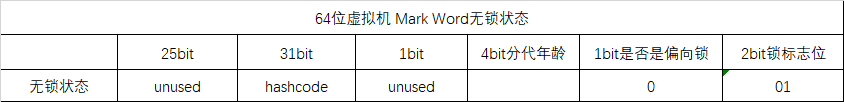
对象头的信息是与对象自身定义的数据无关的额外的存储成本，考虑到虚拟机的空间效率，`mark word`被设计成一个非固定的数据结构，
>以便在极小的空间内存储尽量多的信息，随着对象状态的改变复用自己的存储空间。当对象状态改变时可能会变为以下四种结构：
>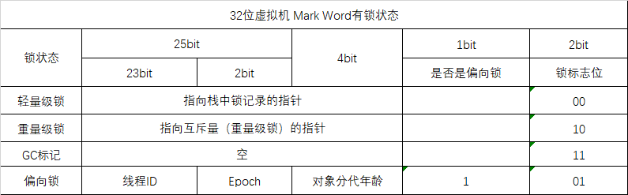
>
>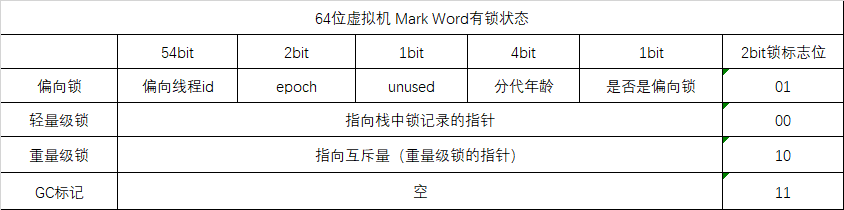

## 锁的优化与升级
`JDK5`引入了`CAS`原子操作，`JDK6`对`synchronized`进行了较大的改动，包括`JDK5`引入的`CAS`自选之外，还增加了自适应的`CAS`自旋、
锁消除、锁粗化、偏向锁、轻量级锁等等优化策略。由于此关键字的的优化使得新跟那个极大提高了、同时语义清晰、操作简单、无需手动关系，
所以推荐情况下尽量使用此关键字，同时在性能上此关键字还有优化的空间。

>- 锁的四种状态——无锁状态、偏向锁状态、轻量级锁状态、重量级锁状态
>- 锁的升级——锁的升级是单向的、也就是说只能从低到高升级，不会出现锁的降级。
>- 在`JDK6`中默认是开启偏向锁和轻量级锁，可通过设置虚拟机参数：`-XX:-UseBiasedLocking`来禁用偏向锁。

### 自旋锁
读线程可以通过三种方式实现：
- 用户态线程
- 内核线程
- 混合实现
`Java`线程是通过混合实现的。**因此`Java`线程的阻塞和唤醒需要从用户态转为内核态**，而且对于临界区比较小的代码，
对象锁状态只会持续很短的时间，而为此频繁的阻塞和唤醒后续的线程是一件非常不划算的事情。因此引入了自旋锁：
- 自旋锁：当一个线程尝试获取某个锁时，如果该锁已经被其他线程占用，就会一直循环检测是否被释放，而不是进入线程挂起或者睡眠状态。

**自旋锁适用于保护临界区很小的情况，临界区很小话，所占用的时间就很短**。自旋锁索然可以避免线程切换带来的开销。但是`CPU`这段时间一直时空转，
因此浪费了这段时间的`CPU`的计算能力。**如果持有锁的线程很快就释放了锁，那么自旋的效率就非常好，反之，自旋的线程就会白白消耗掉处理器的时间。
因此自旋的次数必须要有一个限度，如果自选超过了定义的是按仍然没有获取到锁，线程就应该被挂起**

自旋锁在`JDK 1.4.2`中引入，默认关闭，但是可以使用`-XX:+UseSpinning`开开启;
在`JDK1.6`中默认开启,同时自旋的默认次数为10次，可以通过参数`-XX:PreBlockSpin`来调整。
假如将参数调整为10，但是系统很多线程都是等你刚刚退出的时候就释放了锁（假如多自旋一两次就可以获取锁），是不是很尴尬。
于是`JDK1.6`引入自适应的自旋锁，让虚拟机会变得越来越聪明。

### 自适应性自旋锁
**所谓自适应就意味着自旋的次数不再是固定的，它是由前一次在同一个锁上的自旋时间及锁的拥有者的状态来决定。**

上一个线程如果通过自旋成功获取了锁，那么当前线程就会有很大的概率也自旋成功，所以在一定程度商会增加自旋的次数。
反之，如果对于某个锁，很少能有线程通过自旋成功获取锁，那么以后有线程尝试获取这个锁的时候可能会减少自选的次数甚至省略掉自旋过程，以免浪费处理器资源。

### 锁消除
锁消除是指虚拟机即时编译器在运行时，对代码上要求同步，但是被检测到不可能存在共享数据竞争的锁进行消除。

如果一段代码中，堆上的数据都不会逃逸出去从而被其他线程访问，那么就可以把他们当作线程私有的数据对待，自然加锁也就不需要进行。

例如下面代码：
```
public String concatString(String s1,String s2){
    return s1+s2;
}
```
上面的代码看起来和加锁没有什么关系，但是`String`是一个不可变类，在`JDK1.5`之前会转化成`StringBuffer`对象的连续`append()`
操作，在`JDK1.5`之后会转化为`StringBuilder`都对象连续的`append()`操作；代码如下：
```
public String concatString(String s1,String s2){
    StringBuffer sb=new StringBuffer();
    sb.append(s1);
    sb.append(s2);
    return sb.toString();
} 
```
在`StringBuffer#append()`中有一个同步块，锁的对象就是`sb`。虚拟机观察sb，很快就会发现它的动态作用域被限制在concatString()方法内部。
因此这里虽然有锁，但是可以被安全的消除掉，在即时编译之后，这段代码会忽略掉所有的同步而直接执行了。

`StringBuffer#append()`代码如下：
```
public synchronized StringBuffer append(StringBuffer sb) {
    toStringCache = null;
    super.append(sb);
    return this;
}
```

### 锁粗化
在使用同步锁的时候，需要让同步块作用范围尽可能的小——仅在共享数据的是作用域才进行同步，
**这样做可以式临界区内的操作尽可能的小，如果存在竞争那儿等待锁的线程也能尽快获得锁。尽管这种想法是正确的，
但是如果一系列的连续的加锁解锁操作，可能会导致不必要要的性能损失，所以引入了锁粗化**

>- 锁粗化：将多个连续的加锁、解锁的操作连接在一起，扩展成一个作用范围更大的锁。

```
public String concatString(String s1){
    StringBuffer sb=new StringBuffer();
    for(ing i=0;i<10;i++){
        sb.append(s1)
    }
    return sb.toString();
} 
```
`sb.append()`的每次擦做都需要加锁，`JVM`检测到同一个对象的连续的加锁解锁操作，
会将其合并成一个范围更大锁，加锁加锁的过程将会被移到`for`之外。

### 偏向锁

HotSpot作者经过研究实践发现，**在大多数情况下，锁不仅不存在多线程竞争，
而且总是由同一线程多次获得，**为了让线程获得锁的代价更低，引进了**偏向锁**。

**偏向锁是在单线程只想代码块时使用的机制，或者说在没有竞争的情况下才有用**，
在多线程竞争的情况下（即：线程A尚未执行完同步代码块，线程B发出了申请锁的申请），
则一定转化为轻量级锁或者重量级锁。

引入偏向锁的目的时：为了在没有多县城竞争的情况下尽量减少不必要的轻量级锁的的执行。
因为轻量级锁的加锁解锁操作时需要依赖`CAS`原子指令的，而偏向锁只需要在置换`ThreadId`
的时候依赖一次`CAS`原子指令。**轻量级锁是为了在县城交替执行同步块时提高性能，
而偏向锁则时在只有一个线程执行同步块时进一步提高性能**。

#### 偏向锁获得和撤销

>- 偏向锁的核心思想：一旦线程第一次获得监视器对象，之后让监视器对象“偏向”这个线程，
>之后多次调用则可以避免`CAS`操作。

当一个线程访问同步块并获取锁时，会在对象头和栈桢中的锁记录存储偏向的线程`ID`，
以后该线程进入和退出时不需要花费`CAS`操作来争夺锁资源，只需要检查是否为偏向锁、
锁标识以及`ThreadId`即可，处理流程如下。
>1. 检查`Mark Word`是否是可偏向状态，即是否为偏向锁1，锁标识位为01；
>2. 若为可偏向状态，则测试线程`ID`是否为当前线程`ID`，如果是，则执行第5，否则执行3
>3. 如果测试线程`ID`不是当前线程`ID`，则通过`CAS`操作竞争锁，竞争成功，
>则将`MarkWord`的偏向线程`ID`替换为当前线程`ID`，否则执行4
>4. 通过`CAS`竞争失败，证明当前存在多线程竞争的情况，当到达全局安全点，
>获得偏向锁的线程被挂起，偏向锁升级为轻量级锁，然后被阻塞在安全点的线程继续往下执行同步代码块
>5. 执行同步代码块

**偏向锁是一种乐观锁，采用了一种竞争出现才会释放锁的机制，线程是不会主动去释放偏向锁，
需要等待其他线程来竞争，偏向锁的撤销需要等到全局安全点(这个时间点上没有任何正在执行的代码)**。步骤如下
>1. 暂停拥有偏向锁的线程
>2. 判断锁对象是否还处于被锁定的状态，否，则恢复到无所状态(01)，以允许其他线程竞争，
>是则挂起持有锁的当前写线程。并将指向当前线程的锁即可路地址的指针放入对象头`MarkWord`，
>升级为轻量级锁状态(00)，然后恢复持有锁的当前线程，进入轻量级锁竞争模式
>
>这里当前线程被挂起再恢复的过程中没有发生锁的转移，仍然在当前线程手中，只是穿插了个“将对象头中的线程ID
>变更为指向锁记录地址的指针”这么个事。

流程图如下：
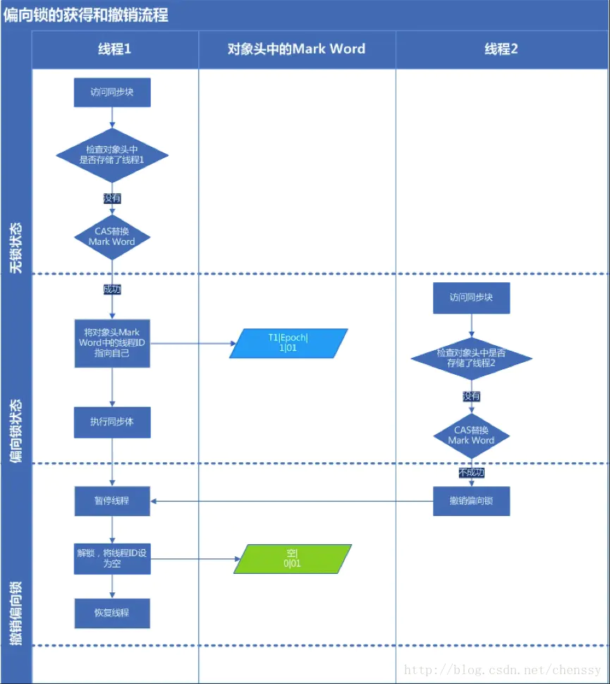

#### 偏向锁的关闭
在JDK5中偏向锁默认是关闭的，而JDK以后的版本中偏向锁已经默认开启。
但是他应用程序启动后几秒钟内才会激活，如果有必要可以使用参数`-XX:BiasedLockingStartupDelap=0`来关闭延迟。
如果并发数较大同时同步代码块执行时间较长，则被多个线程同时访问的概率就很大，
就可以使用参数`-XX:-UseBiasedLocking=false`来禁止偏向锁(但这是个JVM参数，不能针对某个对象锁来单独设置)。


### 轻量级锁

轻量级锁考虑的是竞争锁对象的线程不多，而且线程持有锁的时间也不长的情景。
因为阻塞线程需要CPU从用户态转到内核态，代价较大，如果刚刚阻塞不久这个锁就被释放了，
那这个代价就有点得不偿失了，因此这个时候就干脆不阻塞这个线程，让它自旋这等待锁释放。
当关闭偏向锁功能或者多个线程竞争偏向锁导致偏向锁升级为轻量级锁，则会尝试获取轻量级锁，其步骤如下：

#### 轻量级锁加锁
>1. 在线程进入同步代码块的时候，如果统不独额对象没有被锁定(锁标志为为01，是否是偏向锁为0)，
> 则虚拟机首先在当前线程的栈中创建保存锁对象的`Mark Word`的拷贝的锁记录(Lock Record)空间，
>官方把这个拷贝称之为`Displaced Mark Word`，此时线程堆栈与对象头的状态如下图
>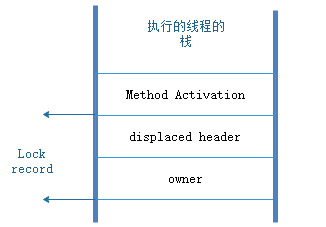
>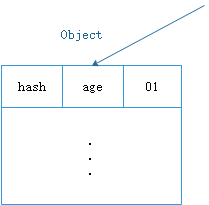
>2. 将对象头中的`Mark Word`复制到锁记录(Lock Record)中
>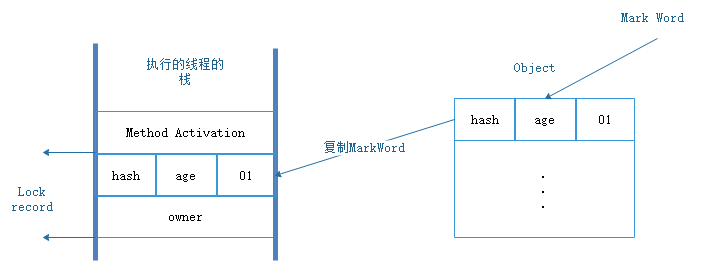
>```
>// 将Mark Word保存在锁记录中
>lock->set_displaced_header(mark);
>```
>```
>class BasicLock VALUE_OBJ_CLASS_SPEC {
>  friend class VMStructs;
>  private:
>   volatile markOop _displaced_header;
>  public:
>   void         set_displaced_header(markOop header)   { _displaced_header = header; }
>   ......  
> };
>```
>3. 拷贝成功后，虚拟机将使用`CAS`操作尝试将对象`Mark Word`替换为指向锁记录
>(当前线程的`Lock Record`)的指针，并将`Lock Record`中的`owner`指针指向`object mark word`
>如果成功则指向步骤(4),否则指向步骤(5).
>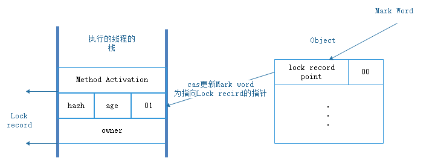
>```
>// lock: 指向Lock Record的指针
>// obj()->mark_addr(): 锁对象的Mark Word地址
>// mark: 锁对象的Mark Word
>if (mark == (markOop) Atomic::cmpxchg_ptr(lock, obj()->mark_addr(), mark)) {
>    TEVENT (slow_enter: release stacklock) ;
>    return ;
>}
>```

>4. 如果这个更新操作成功了，那么当前线程就拥有了该对象的锁，并且`Mark Word`锁标志为设置为"00"，
>即标识此对象处于轻量级锁定状态，此时线程堆栈与对象头的状态如下图：
>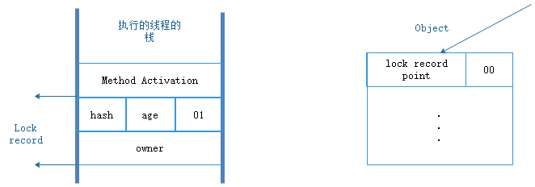
>
>5. 如果这个更新操作失败了，虚拟机首先会检查对象`Mark Word`中的`Lock Word`是否是指向
>当前的栈桢范围内，是则执行步骤(6)，否则执行步骤(7)
>6. **如果是指向当前线程的栈桢的地址范围则表明该线程已经获得了这个对象的锁，现在是重入的获得锁。**
>但是线程在每次获取锁的时候都会创建锁记录(`Lock Record`)的空间。所以**锁重入的时候也会创建锁记录空间。
>但是除了第一次设置`Displaced Mark Word`，其余的设置为`null`。**
>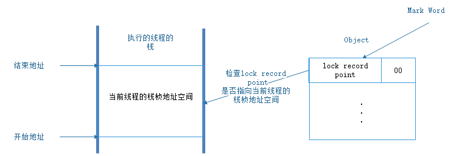
>```
>// Mark Word 处于加锁状态，当前线程持有的锁(Mark Word 指向的是当前线程的栈帧地址范围)
> if (mark->has_locker() && THREAD->is_lock_owned((address)mark->locker())) {
>   assert(lock != mark->locker(), "must not re-lock the same lock");
>   assert(lock != (BasicLock*)obj->mark(), "don't relock with same BasicLock");
>   // 锁重入，将 Displaced Mark Word 设置为 null
>   lock->set_displaced_header(NULL);
>   return;
> }
>```
>7. 如果锁对象的`Mark Word`中的`Lock Word`不是指向当前线程的栈桢范围，则表明存在的多个线程竞争，
>当前线程会自选执行步骤(3)，若自旋结束时仍未获得锁，轻量级锁就要膨胀为重量级锁，锁标志状态值变为“10”，
>`Mark Word`中存储的就是指向重量级锁(互斥量)的指针，当前线程以及后面等待锁的线程也要进入阻塞状态
>```
>// The object header will never be displaced to this lock,
>// so it does not matter what the value is, except that it
>// must be non-zero to avoid looking like a re-entrant lock,
>// and must not look locked either.
>lock->set_displaced_header(markOopDesc::unused_mark());
>ObjectSynchronizer::inflate(THREAD, obj())->enter(THREAD);
>```

#### 轻量级锁解锁
解锁过程如下：
>1. 通过`CAS`操作尝试用线程中复制的`Displaced Mark Word`替换当前的`Mark Word`
>2. 如果替换成功，整个同步过程就完成了，恢复到无锁状态(01)
>3. 如果替换失败，则说明有其他线程尝试过获取该锁(此锁已经膨胀)，要在释放同时唤醒被挂起的线程

整个流程如下：
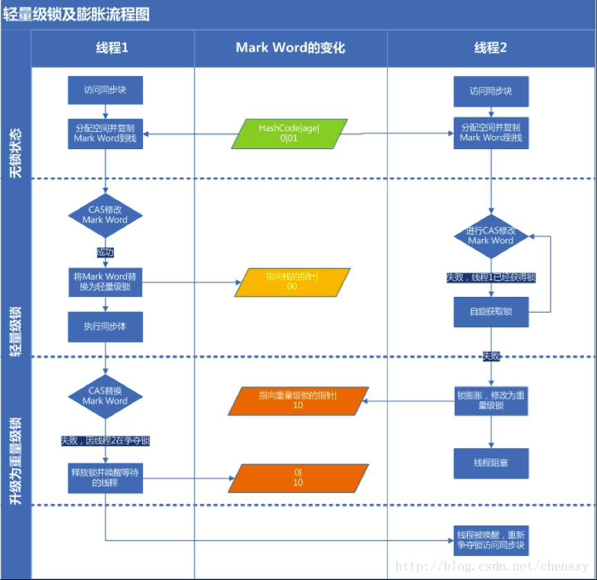

### 重量级锁
Synchronized是通过与对象关联的监视器锁（Monitor）来实现的。
但是监视器锁本质又是依赖于底层的操作系统的Mutex Lock来实现的。
而操作系统实现线程之间的切换这就需要从用户态转换到核心态，这个成本非常高，
状态之间的转换需要相对比较长的时间，这就是为什么Synchronized效率低的原因。
因此，这种依赖于操作系统Mutex Lock所实现的锁我们称之为 “重量级锁”。


### 锁的变化过程
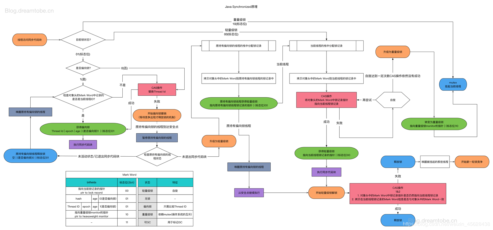

## Monitor Record


`Monitor Record`是线程私有的数据结构，每一个线程都有一个可用的`Monitor Record`列表，同
时还有一个全局可用列表，每一个被锁住的对象的`Mark Word`都会和一个`Lock Record`关联(
对象头的`MarkWord`中的`Lock Word Point`指向与之关联的`Lock Record`的起始地址)。
同时`Lock Record`中有一个`Owner`字段存放拥有该锁的线程`ID`，表示该锁被这个线程占有。


`Lock Record`的数据结构
| 属性|描述|
|:---:|:---:|
|Owner|初始时为NULL表示当前没有任何线程拥有该monitor record，当线程成功拥有该锁后保存线程唯一标识，当锁被释放时又设置为NULL|
|EntryQ	|关联一个系统互斥锁（semaphore），阻塞所有试图锁住monitor record失败的线程|
|RcThis|表示blocked或waiting在该monitor record上的所有线程的个数|
|Nest|用来实现 重入锁的计数|
|HashCode|保存从对象头拷贝过来的HashCode值（可能还包含GC age）|
|Candidate|用来避免不必要的阻塞或等待线程唤醒，因为每一次只有一个线程能够成功拥有锁，如果每次前一个释放锁的线程唤醒所有正在阻塞或等待的线程，会引起不必要的上下文切换（从阻塞到就绪然后因为竞争锁失败又被阻塞）从而导致性能严重下降。Candidate只有两种可能的值0表示没有需要唤醒的线程1表示要唤醒一个继任线程来竞争锁。|
           
## 锁的对比
|类型|优点|缺点|使用场景|
|:---:|:---:|:---:|:---:|
|偏向锁|加锁和解锁不需要额外的消耗，和执行同步方法相比，仅存在纳秒级的差距|如果线程间存在锁竞争，会带来额外的锁撤销的消耗|适用于一个线程访问同步块场景|
|轻量级锁|竞争的线程不会阻塞，提高了程序的响应速度|如果始终得不到锁竞争的线程，使用自旋会消耗cpu|追求响应时间，同步块执行速度非常快|
|重量级锁|线程竞争不使用自旋，不消耗cpu|线程阻塞，响应时间缓慢|追求吞吐量，同步块执行速度较长|

## 参考资料
- `Java`并发编程的艺术——机械工业出版社
- [啃碎并发（七）：深入分析Synchronized原理](https://juejin.im/post/5b4eec7df265da0fa00a118f)
- [轻量级锁加锁&解锁过程](https://gorden5566.com/post/1019.html)
- [synchronized（三） 锁的膨胀过程（锁的升级过程）深入剖析](https://www.cnblogs.com/JonaLin/p/11571482.html#autoid-3-0-0)
- [偏向锁、轻量级锁，重量级锁膨胀过程](https://blog.csdn.net/RebelHero/article/details/85308122)


