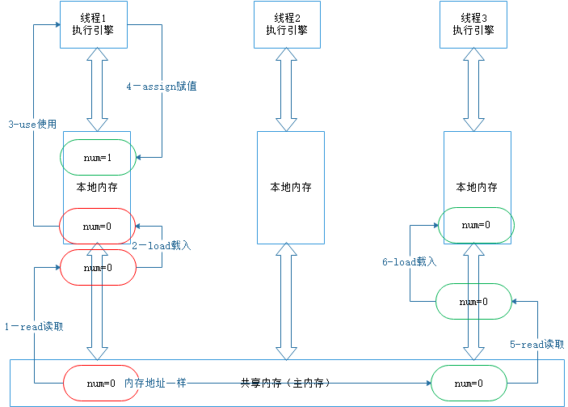
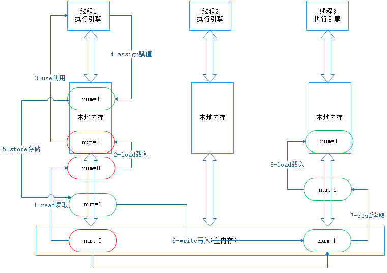
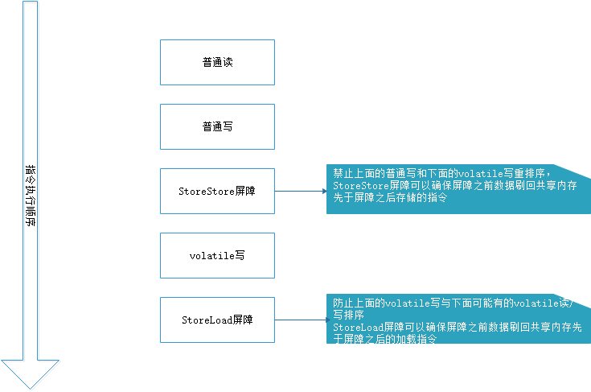
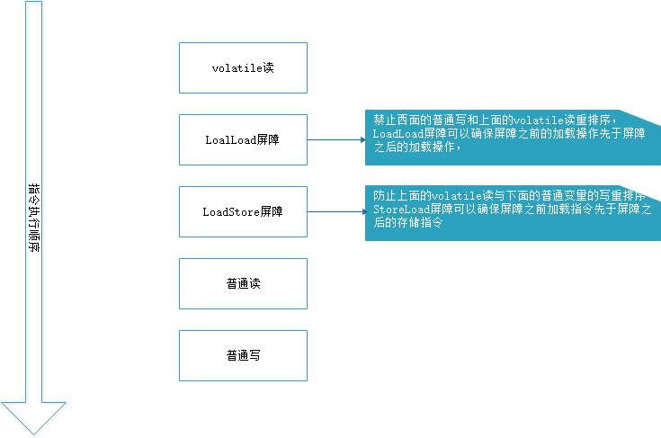
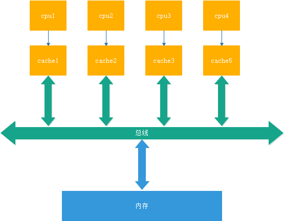

## 本文目录
- 从多线程交替打印A和B开始
- Java 内存模型中的可见性、原子性和有序性
- Volatile原理
    - volatile的特性
    - volatile happens-before规则
    - volatile 内存语义
    - volatile 内存语义的实现
- CPU对于Volatile的支持
    - 缓存一致性协议
- 工作内存(本地内存)并不存在
- 总结
-参考资料

## 从多线程交替打印A和B开始
面试中经常会有一道多线程交替打印A和B的问题，可以通过使用`Lock`和一个共享变量来完成这一操作，代码如下，其中使用`num`来决定当前线程是否打印
```java
public class ABTread {

    private static int num=0;
    private static Lock lock=new ReentrantLock();

    public static void main(String[] args) throws InterruptedException {

        Thread A=new Thread(new Runnable() {
            @Override
            public void run() {
                while (true){
                    lock.lock();
                    if (num==0){
                        System.out.println("A");
                        num=1;
                    }
                    lock.unlock();
                }
            }
        },"A");
        Thread B=new Thread(new Runnable() {
            @Override
            public void run() {
                while (true){
                    lock.lock();
                    if (num==1){
                        System.out.println("B");
                        num=0;
                    }
                    lock.unlock();
                }
            }
        },"B");
        A.start();
        B.start();
    }
}
```
这一过程使用了一个可重入锁，在以前可重入锁的获取流程中有分析到，当锁被一个线程持有时，后继的线程想要再获取锁就需要进入同步队列还有可能会被阻塞。
现在假设当`A`线程获取了锁，`B`线程再来获取锁且`B`线程获取失败则会调用`LockSupport.park()`导致线程`B`阻塞，线程`A`释放锁时再还行线程`B`。
是否会经常存在阻塞线程和还行线程的操作呢，阻塞和唤醒的操作是比较费时间的。是否存在一个线程刚释放锁之后这一个线程又再一次获取锁，由于共享变量的存在，
则获取锁的线程一直在做着毫无意义的事情。

可以使用`volatile`关键字来修饰共享变量来解决，代码如下：
```java
public class ABTread {

    private static volatile  int num=0;
    public static void main(String[] args) throws InterruptedException {

        Thread A=new Thread(new Runnable() {
            @Override
            public void run() {
                while (true){
                    if (num==0){        //读取num过程记作1
                        System.out.println("A");
                        num=1;          //写入num记位2
                    }
                }
            }
        },"A");
        Thread B=new Thread(new Runnable() {
            @Override
            public void run() {
                while (true){
                    if (num==1){        //读取num过程记作3
                        System.out.println("B");
                        num=0;          ////写入num记位4
                    }
                }
            }
        },"B");
        A.start();
        B.start();
    }
}
```
`Lock`可以通过阻止同时访问来完成对共享变量的同时访问和修改，必要的时候阻塞其他尝试获取锁的线程，那么`volatile`关键字又是如何工作，
在这个例子中，是否效果会优于`Lock`呢。

## Java 内存模型中的可见性、原子性和有序性

- 可见性：指线程之间的可见性，一个线程对于状态的修改对另一个线程是可见的，也就是说一个线程修改的结果对于其他线程是实时可见的。
可见性是一个复杂的属性，因为可见性中的错误总是会违背我们的直觉(JMM决定)，通常情况下，我们无法保证执行读操作的线程能实时的看到其他线程的写入的值。
为了保证线程的可见性必须使用同步机制。退一步说，最少应该保证当一个线程修改某个状态时，而这个修改时程序员希望能被其他线程实时可见的，
那么应该保证这个状态实时可见，而不需要保证所有状态的可见。在 `Java` 中 `volatile`、`synchronized` 和 `final` 实现可见性。

- 原子性：如果一个操作是不可以再被分割的，那么我们说这个操作是一个原子操作，即具有原子性。但是例如`i++`实际上是`i=i+1`这个操作是可分割的，他不是一个原子操作。
非原子操作在多线程的情况下会存在线程安全性问题，需要是我们使用同步技术将其变为一个原子操作。`java`的`concurrent`包下提供了一些原子类，
我们可以通过阅读API来了解这些原子类的用法。比如：`AtomicInteger`、`AtomicLong`、`AtomicReference`等。在 `Java` 中 `synchronized` 和在 `lock`、`unlock` 中操作保证原子性

- 有序性：一系列操作是按照规定的顺序发生的。如果在本线程之内观察，所有的操作都是有序的，如果在其他线程观察，所有的操作都是无序的；
前半句指“线程内表现为串行语义”后半句指“指令重排序”和“工作内存和主存同步延迟”
`Java` 语言提供了 `volatile` 和 `synchronized` 两个关键字来保证线程之间操作的有序性。`volatile` 是因为其本身包含“禁止指令重排序”的语义，
`synchronized` 是由“一个变量在同一个时刻只允许一条线程对其进行 `lock` 操作”这条规则获得的，此规则决定了持有同一个对象锁的两个同步块只能串行执行。

## Volatile原理
>`volatile`定义：Java编程语言允许线程访问共享变量，为了确保共享变量能被准确和一致的更新，线程应该通过获取排他锁单独获取这个变量；
>java提供了`volatile`关键字在某些情况下比锁更好用。

 - `Java`语言提供了`volatile`了关键字来提供一种稍弱的同步机制，他能保证操作的可见性和有序性。当把变量声明为`volatile`类型后，
 编译器与运行时都会注意到这个变量是一个共享变量，并且这个变量的操作禁止与其他的变量的操作重排序。
 
 - 访问`volatile`变量时不会执行加锁操作。因此也不会存在阻塞竞争的线程，因此volatile变量是一种比sychronized关键字更轻量级的同步机制。
 
 #### volatile的特性
 `volatile`具有以下特性：
- 可见性：对于一个`volatile`的读总能看到最后一次对于这个`volatile`变量的写
- 原子性：对任意单个`volatile`变量的读/写具有原子性，但对于类似于`i++`这种复合操作不具有原子性。
- 有序性：
 
 #### volatile happens-before规则
 根据`JMM`要求，共享变量存储在共享内存当中，工作内存存储一个共享变量的副本，
 线程对于贡献变量的修改其实是对于工作内存中变量的修改，如下图所示：
 
 以**从多线程交替打印A和B开始**章节中使用`volatile`关键字的实现为例来研究`volatile`关键字实现了什么：
 假设线程`A`在执行`num=1`之后`B`线程读取`num`指，则存在以下`happens-before`关系
```
1)  1 happens-before 2，3 happens-before 4
2)  根据volatile规则有：2 happens-before 3
3)  根据heppens-before传递规则有： 1 happens-before 4
```
至此线程的执行顺序是符合我们的期望的，那么`volatile`是如何保证一个线程对于共享变量的修改对于其他线程可见的呢？
#### volatile 内存语义
根据`JMM`要求，对于一个变量的独写存在8个原子操作。对于一个共享变量的独写过程如下图所示：

对于一个没有进行同步的共享变量，对其的使用过程分为`read`、`load`、`use`、`assign`以及不确定的`store`、`write`过程。
整个过程的语言描述如下：
```
- 第一步：从共享内存中读取变量放入工作内存中(`read`、`load`)
- 第二步：当执行引擎需要使用这个共享变量时从本地内存中加载至**CPU**中(`use`)
- 第三步：值被更改后使用(`assign`)写回工作内存。
- 第四步：若之后执行引擎还需要这个值，那么就会直接从工作内存中读取这个值，不会再去共享内存读取，除非工作内存中的值出于某些原因丢失。
- 第五步：在不确定的某个时间使用`store`、`write`将工作内存中的值回写至共享内存。
```
由于没有使用锁操作，两个线程可能同时读取或者向共享内存中写入同一个变量。或者在一个线程使用这个变量的过程中另一个线程读取或者写入变量。
即**上图中1和6两个操作可能会同时执行，或者在线程1使用num过程中6过程执行**，那么就会有很严重的线程安全问题，
一个线程可能会读取到一个并不是我们期望的值。

**那么如果希望一个线程的修改对后续线程的读立刻可见，那么只需要将修改后存储在本地内存中的值回写到共享内存
并且在另一个线程读的时候从共享内存重新读取而不是从本地内存中直接读取即可；事实上
当写一个`volatile`变量时，JMM会把该线程对应的本地内存中共享变量值刷新会共享内存；
而当读取一个`volatile`变量时，JMM会从主存中读取共享变量**，这也就是`volatile`的写-读内存语义。

**`volatile`的写-读内存语义：**
>- `volatile`写的内存语义：当写一个`volatile`变量时，JMM会把该线程对应的本地内存中共享变量值刷新会共享内存
>- `volatile`读的内存语义：当读一个`volatile`变量时，JMM会把该线程对应的本地内存置为无效，线程接下来将从主内存中读取共享变量。

如果将这两个步骤综合起来，那么线程3读取一个`volatile`变量后，写线程1在写这个`volatile`变量之前所有可见的共享变量的值都将乐客变得对线程3可见。

`volatile`变量的读写过程如下图：

需要注意的是：在各个线程的工作内存中是存在`volatile`变量的值不一致的情况的，只是每次使用都会从共享内存读取并刷新，执行引擎看不到不一致的情况，
所以认为`volatile`变量在本地内存中不存在不一致问题。

#### volatile 内存语义的实现
在前文[Java内存模型](../JMM/JMM.md)中有提到重排序。为了实现`volatile`的内存语义，JMM会限制重排序的行为，具体限制如下表：

|是否可以重排序|第二个操作|第二个操作|第二个操作|
|:---:|:---:|:---:|:---:|
|第一个操作|普通读/写|`volatile`读|`volatile`写|
|普通读/写| | |NO|
|`volatile`读|NO|NO|NO|
|`volatile`写| |NO|NO|
说明：
```
- 若第一个操作时普通变量的读写，第二个操作时volatile变量的写操作，则编译器不能重排序这两个操作
- 若第一个操作是volatile变量的读操作，不论第二个变量是什么操作不饿能重排序这两个操作
- 若第一个操作时volatile变量的写操作，除非第二个操作是普通变量的独写，否则不能重排序这两个操作
```

为了实现`volatile`变量的内存语义，编译器生成字节码文件时会在指令序列中插入内存屏障来禁止特定类型的处理器排序。
为了实现`volatile`变量的内存语义，插入了以下内存屏障，并且在实际执行过程中，只要不改变`volatile`的内存语义，
编译器可以根据实际情况省略部分不必要的内存屏障
```
- 在每个volatile写操作前面插入StoreStore屏障
- 在每个volatile写操作后面插入StoreLoad屏障
- 在每个volatile读操作后面插入LoadLoad屏障
- 在每个volatile读操作后面插入LoadStore屏障
```
插入内存屏障后`volatile`写操作过程如下图：

插入内存屏障后`volatile`读操作过程如下图：


至此在共享内存和工作内存中的`volatile`的写-读的工作过程全部完成

但是现在的CPU中存在一个缓存，CPU读取或者修改数据的时候是从缓存中获取并修改数据，那么如何保证CPU缓存中的数据与共享内存中的一致，并且修改后写回共享内存呢？
## CPU对于Volatile的支持

>缓存行：cpu缓存存储数据的基本单位，cpu不能使数据失效，但是可以使缓存行失效。

对于CPU来说，CPU直接操作的内存时高速缓存，而每一个CPU都有自己L1、L2以及共享的L3级缓存，如下图：


那么当CPU修改自身缓存中的被`volatile`修饰的共享变量时，如何保证对其他CPU的可见性。

#### 缓存一致性协议
在多处理器的情况下，每个处理器总是嗅探总线上传播的数据来检查自己的缓存是否过期，当处理器发现自己对应的缓存对应的地址被修改，
就会将当前处理器的缓存行设置为无效状态，当处理器对这个数据进行操作的时候，会重新从系统中把数据督导处理器的缓存里。这个协议被称之为缓存一致性协议。

缓存一致性协议的实现又`MEI`、`MESI`、`MOSI`等等。

`MESI`协议缓存状态

|状态|描述|
|:---:|:---:|
|M(modified)修改|该缓存指被缓存在该`CPU`的缓存中并且是被修改过的，即与主存中的数据不一致，该缓存行中的数据需要在未来的某个时间点写回主存，当写回注册年之后，该缓存行的状态会变成E(独享)|
|E(exclusive)独享|该缓存行只被缓存在该`CPU`的缓存中，他是未被修改过的，与主存中数据一致，该状态可以在任何时候，当其他的CPU读取该内存时编程共享状态，同样的，当CPU修改该缓存行中的内容时，该状态可以变为M(修改)|
|S(share)共享|该状态意味着该缓存行可能被多个`CPU`缓存，并且各个缓存中的数据与主存中的数据一致，当有一个CPU修改自身对应的缓存的数据，其它CPU中该数据对应的缓存行被作废|
|I(Invalid)无效|该缓存行无效|

`MESI`协议可以防止缓存不一致的情况，但是当一个`CPU`修改了缓存中的数据，但是没有写入主存，也会存在问题，那么如何保证`CPU`修改共享被`volatile`修饰的共享变量后立刻写回主存呢。

在有`volatile`修饰的共享变量进行写操作的时候会多出一条带有`lock`前缀的汇编代码，而这个`lock`操作会做两件事：
1. 将当前处理器的缓存行的数据协会到系统内存。`lock`信号确保声言该信号期间`CPU`可以独占共享内存。在之前通过锁总线的方式，现在采用锁缓存的方式。
2. 这个写回操作会使其他处理器的缓存中缓存了该地址的缓存行无效。在下一次这些`CPU`需要使用这些地址的值时，强制要求去共享内存中读取。

如果对声明了`volatile`的共享变量进行写，`JVM`会向`CPU`发送一条`lock`指令，使得将这个变量所在的缓存行缓存的数据写回到内存中。而其他`CPU`通过嗅探总线上传播的数据，
使得自身缓存行失效，下一次使用时会从主存中获取对应的变量。


## 工作内存(本地内存)并不存在
根据`JAVA`内存模型描述，各个线程使用自身的工作内存来保存共享变量，那么是不是每个`CPU`缓存的数据就是从工作内存中获取的。这样的话，在`CPU`缓存写回主存时，
协会的是自己的工作内存地址，而各个线程的工作内存地址并不一样。`CPU`嗅探总线时就嗅探不到自身的缓存中缓存有对应的共享变量，从而导致错误？

事实上，工作内存并不真实存在，只是`JMM`为了便于理解抽象出来的概念，它涵盖了缓存，写缓冲区、寄存器及其他的硬件编译器优化。所以缓存是直接和共享内存交互的。
每个`CPU`缓存的共享数据的地址是一致的。

##总结
- `volatile`提供了一种轻量级同步机制来完成同步，它可以保操作的可见性、有序性以及对于单个`volatile`变量的读/写具有原子性，对于符合操作等非原子操作不具有原子性。

- `volatile`通过添加内存屏障及缓存一致性协议来完成对可见性的保证。

最后`Lock#lock()`是如何保证可见性的呢？？

`Lock#lock()`使用了`AQS`的`state`来标识锁状态，而`state`是`volatile`标记的，由于对于`volatile`的独写操作时添加了内存屏障的，所以在修改锁状态之前，
一定会将之前的修改写回共享内存。

## 参考资料
- java并发编程的艺术-方腾飞，魏鹏，程晓明著
- 深入理解`JAVA`虚拟机-周志明著


 


