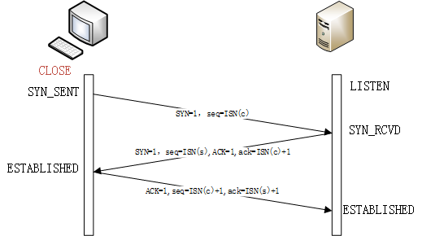
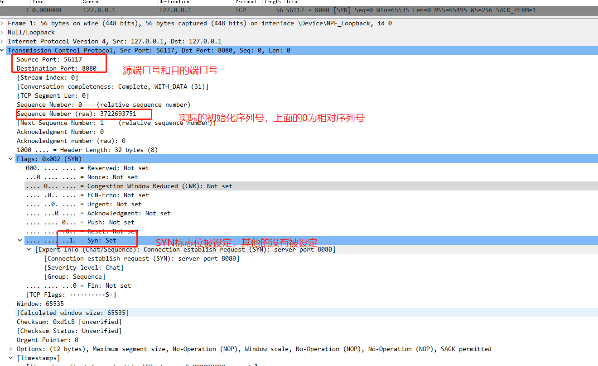
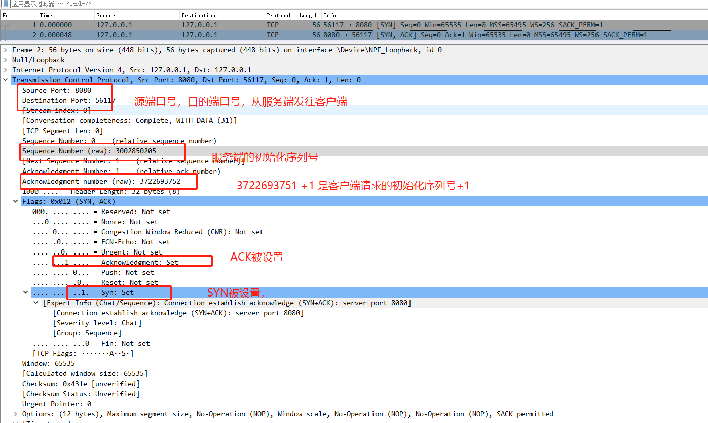
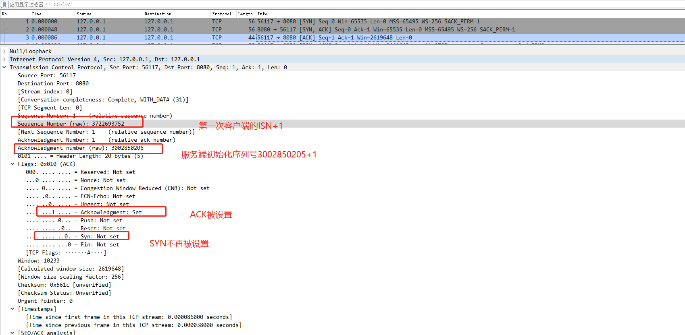
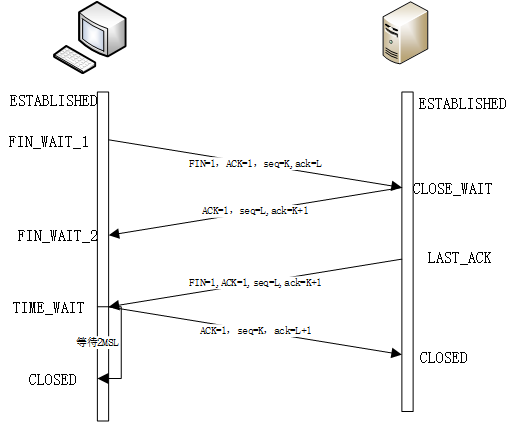
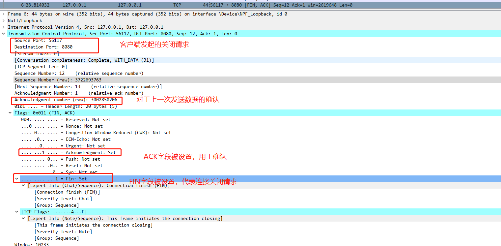
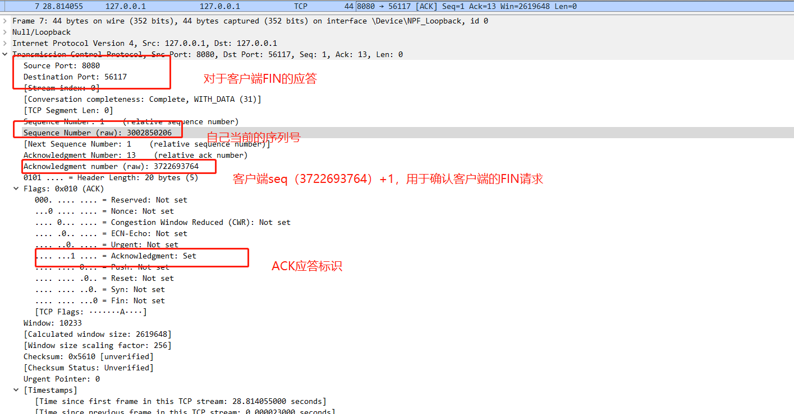
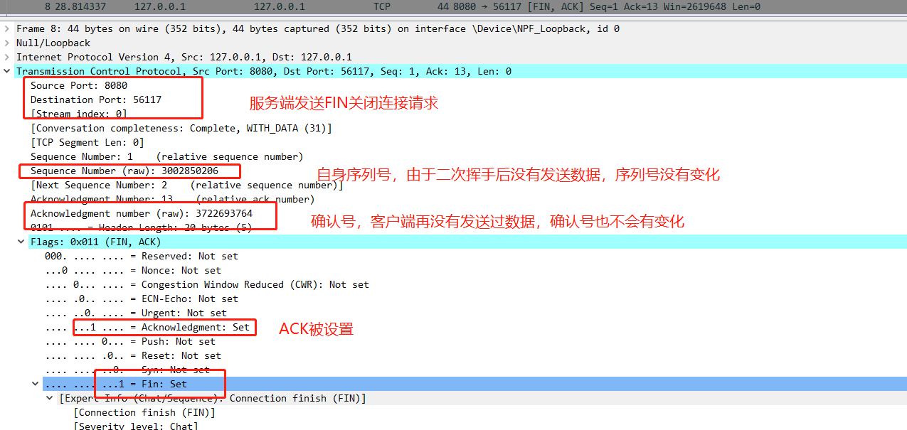
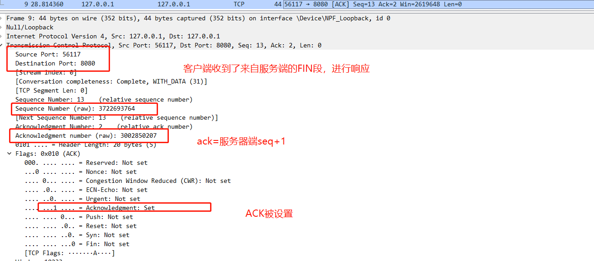

## 目录
- TCP协议报头
- 三次握手
- 四次挥手
- 差错控制
- 流量控制
- 选择重发

在网络基础里面有提到TCP协议是一种面向连接的可靠的传输协议，那么本文主要介绍TCP协议是如何实现连接及可靠性传输的。
## TCP协议报头

    
     
    
图1：TCP报头

`TCP`协议的报头如图1所示，标准长度为20个子节，除非出现可选项，其各个字段的含义如下：

> - `Source Port`:源端口号
> - `Destination Port`:目的端口号。
每个TCP头部包含了源和目的端口号，这两个值与IP头部中的源和目的IP地址一起，唯一的标识了一个连接。
> - `Sequence Number`:序列号。标识了本次TCP连接所传输的所有应用层数据的一个子节（位置），这个子节是当前报文段的第一个子节（用完了就从0再开始循环）。
> - `Acknowledgment Number`：确认号（ACK号）。当一方发出确认号时代表该方已经成功接收对方`ACK号-1`之前的子节，下一次报文期望收到的时`ACK号`的子节。这个字段只有在`ACK`标识位被设置才有效果。
> - `Data Offset`:给出了报文头的长度，以4字节为单位，因为只有4位，所以TCP头部长度最大为60子节。
> - `Reserved`:保留位6位（新的实现已经时4位，使用了低两位来进行速率控制）
> - `URG`:紧急字段，很少使用
> - `ACK`:确认标识，启用后（`ACK=1`时），确认号才有效，连接建立后一般都是启用的
> - `PSH`:推送标识，就是催一下发送方尽快发送数据
> - `RST`:重置连接。连接取消，一般是因为错误信息
> - `SYN`:用于初始化一个连接的同步序列号
> - `FIN`:表示该报文段的发送发已经结束向对方发送数据（应用层数据）
> - `Window`:表示窗口大小
> - `Checksum`:TCP校验和
> - `Urgent Pointer`:紧急指针，只有`URG`字段被启用后才有效
> - `DATA`:TCP报文段携带的数据内容，该部分是可选的，比如在连接建立和终止时，报文段就只有TCP头部。

上面说到TCP头部的源和目的端口号，IP协议头部的源和目的Ip地址唯一的标识了一个连接，更加准确的来说一个TCP连接是由一对端点或套接字构成，
其中通信对策每一段都由一对`IP地址`和`端口号`组成，那么TCP连接具体是怎么建立和拆除的呢？？

## 建立TCP连接——三次握手

    
     
    
图2：TCP建立连接

TCP连接建立过程如图2所示：详细描述如下：

> 1. 客户端（连接主动发起者）发送一个`SYN`报文段（即`TCP`头部`SYN`字段设置为1），并指明连接的端口号和初始化序列号——`ISN(c)`，客户端进入`SYN_SENT`状态。
> 2. 服务端（连接被动建立者）收到客户端发送的报文段后需要进行响应，发送自己的`SYN`报文段，设置`ACK`为1代表是一个响应报文，同时初始化自己的初始化序列号——`ISN(s)`，服务端进入`SYN_RCVD`状态
同时为了响应客户端的`SYN`，服务端会将请求报文中的`ISN(c)`+1，作为自己的确认序列号`ack`的值
> 3. 为了确认服务器端的`SYN`报文段，客户端将`ISN(s)`+1作为自己的确认序列号返回服务端。客户端此时会认为连接成功进入`ESTABLISHED`状态，
服务端在收到客户端的`ACK`报文后，进入`ESTABLISHED`状态

#### 抓包分析

    
     
    
图3：TCP连接建立——第一次握手

第一次握手的TCP请求头如图3所示，其中指明了

> - 源端口号：56117
> - 目的端口号：8080
> - 序列号：3722693751
> - 确认号：0
> - 连接标志位（SYN）：1 代表这是一个请求连接报文
> - 窗口大小：65535

当服务端收到客户端发来的第一个连接报文之后，会发送ACK报文来进行应答，并设置确认号为客户端的序列号+1，于是就有了第二次握手，抓包数据如图4所示

    
     
    
图4：TCP连接建立——第二次握手

第二次握手，服务端将源端口号和目的端口号“对调”，同时确认号（ack）设置为3722693752，并且SYN标志位被设置为1，代表是一个连接报文，ACK标志位设置为1，
代表是确认报文。具体确认的信息就是确认号的内容。

客户端收到来自服务端的应答报文后，会对其进行确认，即第三次握手，详细信息如图5所示

    
     
    
图5：TCP连接建立——第三次握手

注意：此时客户端会完成连接资源的分配，并且第三次握手的报文目的是用于对服务端的连接请求进行应答，所以第三次连接`SYN`不会被设置

#### 一些问题
Q：如果握手信息丢失会怎样
> 1. 如果是第一次握手信息丢失，那么服务端就不会收到来自客户端的连接请求，服务端则不会做任何事情，客户端由于收不到服务端的确认信息，会进行重传，重传超过一定次数，客户端会销毁这个连接。
重传次数由内核参数`net.ipv4.tcp_syn_retries`控制，`Linux`默认为6
> 2. 第二次握手丢失，客户端会收不到服务端的确认报文，同时服务端也收不到客户端的第三次握手报文，两边都会进行重传，由于初始序列号是随机的，重传过程中可能会变化
> 3. 第三次丢失会复杂一些：如果客户端发送应答报文后，没有发送其他数据，那么服务端由于长时间接收不到来自客户端的应答报文，会进行重发。如果客户端紧接着发送数据，由于发送数据的报文段
里面会携带`ACK`和`ack`信息，服务端也会进入到连接状态。进行数据接收。

Q：为什么不能二次握手
> 如果TCP采用两次握手就建立连接，那么服务端就必须在二次握手报文发出的时候认为连接已经建立
> 
> 假设由于某种原因，客户端请求很久之后才到达服务端，客户端此时已经关闭了连接，那么服务端就会认为有客户端希望与其建立连接
> 并发出确认连接报文，一直都等待客户端数据到来，而没有客户端真正连接，这样服务端的资源就会被浪费

## TCP连接拆除——四次挥手

    
     
    
图6：TCP四次挥手

TCP连接拆除过程如图6所示：TCP规定通过发送一个`FIN`字段来发起关闭操作，详细描述如下：

1. 客户端（连接主动关闭方）会发送一个`FIN`段来发起关闭连接请求，同时会携带自己当前的序列号K，另外`ack`确认号用于确认对方最近一次发来的数据，状态变为`FIN_WAIT_1`
2. 服务端（被动关闭方）会将K+1作为响应的`ack`值，表明已经成功接收到客户端的`FIN`请求，同时上层的应用程序也会被告知对方发起了关闭连接请求，由于此时服务端有可能还存在待发送的数据，服务端不会发送`FIN`请求。服务端状态变为`CLOSE_WAIT`
3. 等到服务端数据发送完成后，服务端会发送`FIN`段，请求关闭连接并进入`LASK_ACK`状态
4. 为了关闭连接，客户端还会发送`ACK`应答，`ack=L+1`来表示收到了来自服务端的`FIN`段。如果出现`FIN`段丢失的情况，那么服务端也就接收不到`ACK`确认，服务端就会重传`FIN`段。客户端进入`TIME_WAIT`状态，等待`2MSL`。

#### 抓包分析

    
     
    
图7：TCP连接拆除——第一次挥手

第一次握手的TCP请求头如图7所示，其中指出来
> 1. 客户端设置了`FIN`字段用于标识这是一个关闭连接请求
> 2. `ack=3002850206`对最近一次的数据进行了确认
> 3. `ACK=1`确认标志位
> 4. 客户端当前序列号为3722693763

服务端收到客户端的`FIN`段后进行响应，如图8所示。服务端使用`ack=3722693764`来对客户端的`FIN`段进行应答

    
     
    
图8：TCP连接拆除——第二次挥手

    
     
    
图9：TCP连接拆除——第三次挥手

由于服务端在对客户端的`FIN`段响应后，没有额外数据发送，因此直接发送了服务端的`FIN`段，如图9所示。
其中`FIN`被设置，`ack`和`seq`没有变化，因为服务端和客户端都没有再发送数据。

客户端收到服务端的`FIN`段后，进行响应，`ack=3002850207`，如图10所示

    
     
    
图10：TCP连接拆除——第四次挥手

#### 一些问题
Q；最后一次握手后为什么要等待`2MSL`
> 因为网络是不可靠的，网络无法保证最后一次`ACK`段会被服务端收到。因此处在`LASK_ACK`状态下的服务
> 端可能会因为超时未收到`ACK`而重发`FIN`段，
> 这个`2MSL`就是用来重发可能丢失的`ACK`段的
> 
> 也有可能关闭连接后立马又打开新的连接复用同一套`socket`，等待足够长的事件可以防止和第二次连接搞混

Q：如果挥手信息丢失会怎样
1. 如果第一次挥手信息丢失，客户端长时间收不到服务端的确认信息，会进行重发，重发次数由内核参数`net.ipv4.tcp_orphan_retries `控制，重发次数超过设定值后，就会直接进入`CLOSE`状态
2. 如果是第二次挥手信息丢失，客户端也会因为长时间收不到服务端的确认信息进行重发
3. 如果客户端的长时间没有收到服务端的第三次挥手信息，客户端会直接关闭连接，等待事件由内核参数`net.ipv4.tcp_fin_timeout`控制
4. 服务端发送的`FIN`丢失，服务端会长时间收不到第四次挥手信息，也会进行重传
5. 客户端四次挥手后，本可以直接跑路，但是怕服务端没收到消息，会等待一段时间，处理服务端重发的`FIN`

Q：为什么需要四次挥手而不是三次
> 关闭连接时，当服务端收到客户端的`FIN`报文通知时，它仅仅表示客户端没有数据需要发送了，
> 但此时未必服务端就没有数据需要发送给客户端了，所以不会立刻关闭SOCKET,而是将所有数据发送完后，
> 再发送FIN报文给客户端来表示服务端可以关闭连接了，所以它这里的ACK报文和FIN报文多数情况下都是分开发送的

 