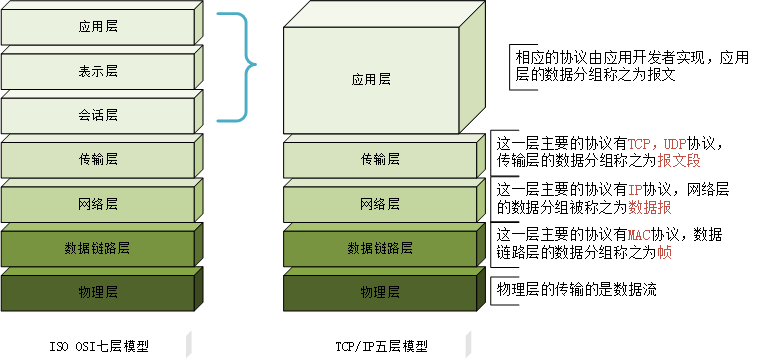
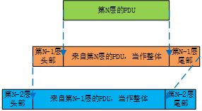

## 目录

## 协议分层与网络模型
七层网络模型，即开放式系统互联模型（Open System Interconnection Model，缩写：OSI；简称为OSI模型），是由国际化标准组织提出的一种概念模型。
该模型将通信系统中的数据流划分为七层，**从上至下**分别为：
- **应用层**：用户应用程序与网络之间的接口，该层的协议通常由应用开发者自己设计与实现，如：HTTP、FTP
- **表示层**：将数据转换为能与接收者的系统兼容的、合适的传输格式，例如：加解密，数据编码
- **会话层**：负责维护通信过程中端到端之间的连接，并提供基础的访问验证和会话管理，如：登陆验证，断点续传
- **传输层**：负责建立连接，校验数据包错误，为应用进程提供逻辑通信，如：TCP、UDP、socket（端口号）
- **网络层**：为数据在节点之间的传输建立逻辑链路，并进行数据分组转发。路由器、三层交换机工作在这一层，IP协议也工作在这一层
- **链路层**：负责网络寻址，在通信实体之间建立数据链路连接，(二层)交换机在这一层工作。平时这一层可以分为两个子层：
  - 逻辑链路控制层（logical link control，LLC）：<留坑>
  - 介质访问控制层（Media access control，MAC）：<留坑>
- **物理层**：为端到端通信提供原始的比特流的传输，网卡、集线器等工作在这一层。

图1（左）展示了OSI七层模型，相较于OSI七层模型，TCP/IP将网络分层将整个网络体系分为五层，分别为：应用层、传输层、
网络层、数据链路层、物理层。对比OSI最直观的差异就是没有正式的**会话层**和**表示层**。但**并不是**这两层不重要，而是交给了应用程序的开发者来判断
这两层内容是否重要，是否需要实现，如果需要，右应用程序开发者进行实现。图1（右）展示了TCP/IP五层模型

    
     
    
图1：网络分层模型

**分层的优点**：
分层最大的优点是能够进行协议复用，下层协议不用关心上层协议的实现，上层协议可以直接复用下层协议。当上层的协议数据单元（PDU）被传递到下一层时。
会进行数据封装（将上层数据当作一个不透的明的整体），并添加本层协议信息（添加头部和尾部），如图2所示：

    
     
    
图2：数据封装与协议复用

## 应用层
**应用层协议**定义了运行在不同端系统上上应用程序如何相互传递报文，包括：
- 交换的报文类型，例如请求报文和请求报文
- 各种报文类型的语法，如报文中的各个字段及这些字段时如恶化描述的
- 字段的语义，即这个字段中的信息含义
- 确定一个进程何时以及如何发送报文，对报文响应的规则

应用层是大多数需要网络的程序通过网络和其他程序通信使用的层，这个层的处理过程是应用特有的。
数据在应用内部以特定的格式（编码）在网络上进行传传送。常见的应用层协议有：
- **HTTP**：超文本传输协议，主要用于普通文本浏览
- **FTP**：文件传输协议，主要用于文件传输
- **POP3**：邮局协议，主要用于邮件传送
- **DNS**：域名服务，用于网络上主机地址查找

## 传输层
传输层协议为运行在不同主机上的应用进程之间提供了**逻辑通信**功能。运输层将从应用程序接收到的报文进行分组，称之为**报文段**。

