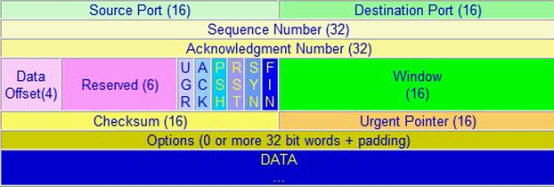
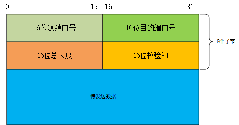
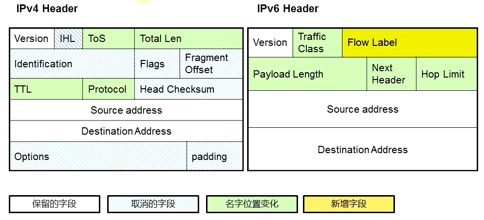
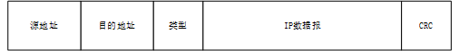

## 目录
- 协议分层与网络模型
- 应用层
- 传输层
- 网络层
- 数据链路层

## 协议分层与网络模型
七层网络模型，即开放式系统互联模型（Open System Interconnection Model，缩写：OSI；简称为OSI模型），是由国际化标准组织提出的一种概念模型。
该模型将通信系统中的数据流划分为七层，**从上至下**分别为：
> - **应用层**：用户应用程序与网络之间的接口，该层的协议通常由应用开发者自己设计与实现，如：HTTP、FTP
> - **表示层**：将数据转换为能与接收者的系统兼容的、合适的传输格式，例如：加解密，数据编码
> - **会话层**：负责维护通信过程中端到端之间的连接，并提供基础的访问验证和会话管理，如：登陆验证，断点续传
> - **传输层**：负责建立连接，校验数据包错误，为应用进程提供逻辑通信，如：TCP、UDP、socket（端口号）
> - **网络层**：为数据在节点之间的传输建立逻辑链路，并进行数据分组转发。路由器、三层交换机工作在这一层，IP协议也工作在这一层
> - **链路层**：负责网络寻址，在通信实体之间建立数据链路连接，(二层)交换机在这一层工作。平时这一层可以分为两个子层：
>  - 逻辑链路控制层（logical link control，LLC）：<留坑>
>  - 介质访问控制层（Media access control，MAC）：<留坑>
> - **物理层**：为端到端通信提供原始的比特流的传输，网卡、集线器等工作在这一层。

图1（左）展示了OSI七层模型，相较于OSI七层模型，TCP/IP将网络分层将整个网络体系分为五层，分别为：应用层、传输层、
网络层、数据链路层、物理层。对比OSI最直观的差异就是没有正式的**会话层**和**表示层**。但**并不是**这两层不重要，而是交给了应用程序的开发者来判断
这两层内容是否重要，是否需要实现，如果需要，右应用程序开发者进行实现。图1（右）展示了TCP/IP五层模型

    
     
    
图1：网络分层模型

**分层的优点**：
分层最大的优点是能够进行协议复用，下层协议不用关心上层协议的实现，上层协议可以直接复用下层协议。当上层的协议数据单元（PDU）被传递到下一层时。
会进行数据封装（将上层数据当作一个不透的明的整体），并添加本层协议信息（添加头部和尾部），如图2所示：

    
     
    
图2：数据封装与协议复用

## 应用层
**应用层协议**定义了运行在不同端系统上上应用程序如何相互传递报文，包括：
> - 交换的报文类型，例如请求报文和请求报文
> - 各种报文类型的语法，如报文中的各个字段及这些字段时如恶化描述的
> - 字段的语义，即这个字段中的信息含义
> - 确定一个进程何时以及如何发送报文，对报文响应的规则

应用层是大多数需要网络的程序通过网络和其他程序通信使用的层，这个层的处理过程是应用特有的。
数据在应用内部以特定的格式（编码）在网络上进行传传送。常见的应用层协议有：
- **HTTP**：超文本传输协议，主要用于普通文本浏览
- **FTP**：文件传输协议，主要用于文件传输
- **POP3**：邮局协议，主要用于邮件传送
- **DNS**：域名服务，用于网络上主机地址查找
- **DHCP**: 动态主机配置协议

## 传输层
传输层协议为运行在不同主机上的应用进程之间提供了**逻辑通信**功能。运输层将从应用程序接收到的报文进行分组，称之为**报文段**。

传输层可以提供以下服务：
> - **面向连接的通信**：即在交换数据之前需要建立会话连接，一种逻辑上链接，并不是端到端的电路连接
> - **正确的交付次序**：即保证接收方接收到的次序和发送发送的顺序相同
> - **保证数据传输的可靠性**：由于网络本身是不可靠的，保证传输的数据正确是非常必要的，传输协议可以检验数据是否损坏，并通过发送ACK/NACK确认消息正确接受；自动重发机制可以用于重新传输丢失或者损坏的数据
> - **流量控制**：控制两个节点之间数据传输的速率
> - **拥塞控制**：控制进入到电信网络中的流量
> - **多路复用**

传输层重要的协议：
> - **TCP协议**：传输控制协议
> - **UDP协议**：用户数据报协议
> - **DCCP协议**：数据拥塞控制协议
> - **SCTP**:流控制传输协议

#### TCP协议
TCP协议是一个点对点的**面向连接**的协议，也就是说，在两台主机发送数据之前，一定要先建立一条
点对点的“连接”。在数据交换结束后需要拆除这个“连接”，这个“连接”是一个虚拟的，逻辑上的连接，并不是FDM/TDM那种物理意义上的连接。
对于两台主机之间的所有交换路由设备，这种“连接”都是不可见的，它们看到只是数据报。

建立可拆除连接的过程就是非常著名的**三次握手**和**四次挥手**，由于在数据交换之前需要建立“连接”，在数据交换中要确数据的可靠性交付、拥塞控制等
因此TCP协议在传输数据时，有着很多额外的开销，导致数据交换的效率会比较低。

常见的运行在TCP协议之上的应用层协议有：`HTTP`、`DNS`、`POP3`等等

    
     
    
图3：TCP协议报头（图片来源于网络）

#### UDP协议
既然有面向连接的协议，那么就有**面向无连接**的协议，即UDP协议。UDP协议在数据交换时，无无需建立“连接”，以及关心连接状态，
UDP协议相较于TCP协议有着更高的数据交换效率。

某些应用中更多的希望数据被尽快发送出去，不希望有比较高的延迟，并且可以容忍部分数据的丢失，这种应用和就比较适合使用UDP协议

常见的运行的UDP协议之上的应用层协议有：`DNS`、`FTP`、`DHCP`等等

    
     
    
图4：UDP协议报头

## 网络层
网络层其实做一件非常简单的事情，就是将报文从源主机移动到目标主机，为了完成这一见事，
网络层需要具备三个能力：
> - **寻址**：指寻找目标主机在网络中的虚拟地址（IP地址）
> - **路由**：通过路由选择算法为通过的分组选择最适当的转发路径。
> - **转发**：当一个分组到达路由器的某一条输入链路时，该路由器必须将该分组移动到适当的输出链路

除此之外，网络层还具有下述功能：
> - **分组与分组交换**：把从传输层接收到的报文段进行封装分组，再传递给链路层
> - **网络连接复用**：为分组在通信子网中节点之间的传输创建逻辑链路，在一条数据链路上复用多条网络连接(FDM/TDM)
> - **差错检测**：分组中的头部校验和进行差错校验（IPv6去除）
> - **服务选择**：网络层可为传输层提供数据报和虚电路两种服务，但 Internet的网络层仅为传输层提供数据报一种服务

网络层最有名的协议就是`IPv4`以及`IPv6`等IP协议,除此之外还有`ARP（地址解析协议）`、
`ICMP（因特网控制报文协议）`以及`IGMP（因特网组管理协议）`

图5为`IPv4`以及`IPv6`的报头

    
     
    
图5：IP报头（图片来源于网络）

## 数据链路层
数据链路层负责将再网络通信链路中将数据报从一个节点转移到与之相邻的另一个节点，链路层可以提供以下服务（根据协议不同，不一定全部提供）：

> - **成帧**：网络层的数据报在经数据链路传送之前，几乎所有的链路层协议都要将其用链路层帧封装起来
> - **链路接入**：MAC协议（媒体访问控制协议）规定了帧在链路上传输的规则
> - **可靠交付**：保证无差错的经链路层移动每个网络层数据报
> - **差错检测和纠正**

链路层的主体部分时在网络适配器（网卡）上实现的，而我们常说的`MAC`地址就是描述一个物理设备的地址，而并不是所有的硬件都具有这个地址，
`MAC`地址通常只存在于网络接入设备上。图6展示了MAC帧的数据结构

    
     
    
图6：MAC帧

## 备注
在区域传输的时候使用TCP协议，其他时候使用UDP协议。

 