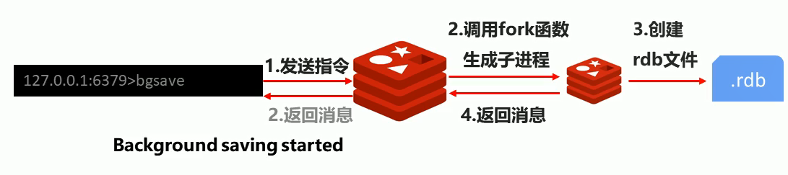
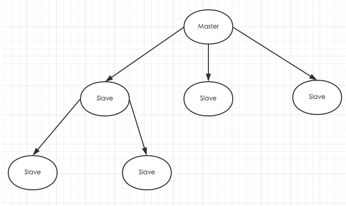

## redis是什么
`redis`是一个C语言开发的开源的高性能键值对的内存数据库，可以用作数据库，消息中间件，缓存等，它是一种`NoSql`的数据库。

特点：
>1. 性能优秀：数据在内存中读写速度非常快，支持并发10WQPS，
>2. 单进程单线程：是线程安全的，采用IO多路复用机制
>3. 丰富的数据类型：`String`(字符串类型)、`Hash`(哈希类型)、`List`(列表类型)、`Set`(集合类型)、`Zset`(有序集合类型)。
>4. 支持数据持久化，可以将内存中的数据保存在磁盘中，重启时加载。
>5. 提供高可用方案：主从复制，哨兵机制
>6. 可用作分布式锁
>7. 可以做为消息中间件，支持发布订阅

## redis数据类型

`redis`支持5种数据类型：`String`(字符串类型)、`Hash`(哈希类型)、`List`(列表类型)、`Set`(集合类型)、`Zset`(有序集合类型)。
`redis`支持的数据类型与`JAVA`数据类型对应关系如下:

|类型名称|类型|JAVA类型|备注|
|:---:|:---:|:---:|:---:|
|字符串类型|String|String|最大存储512M，String是二进制安全，可以用来存储任何数据|
|列表类型|List|LinkedList|关注列表，粉丝列表可以使用List实现|
|散列类型|Hash|HashMap||
|集合类型|Set|HashSet|无序集合，通过HashTable实现|
|有序集合类型|Zset|TreeSet|有序集合|

#### 常用的操作

## Redis的持久化
`Redis`提供了两种持久化方案：
- 保存数据(快照)(RDB)；将当前的数据状态进行保存，关注点在于数据本身。
- 保存日志(过程)(AOF)：存储数据库的操作过程，存储格式复杂，重点关注数据的操作历史。

#### RDB：
`redis`提供了三种生成保存数据快照的方式：`save`、`bgsave`、自动化

##### save触发方式
- 作用：手动执行一次保存操作，用于在服务启动的时候恢复数据
- 原理：redis单线程并且顺序执行，使用save命令后会阻塞当前线程，直到RDB过程完成，有可能会造成长时间的阻塞。执行时如果存在老的RDB文件，会将其替换。
- 缺陷：执行时阻塞线程，此时将不能对外提供服务

##### bgsave触发方式
- 作用：Redis会在后台异步进行快照操作，快照同时还可以响应客户端请求，但不是立刻执行
- 优点：不会阻塞当前线程
- 原理：客户端发送请求指令给redis，调用fork系统调用，生成新的子进程，创建rdb文件，返回消息；

##### 自动触发
自动触发是通过配置配置文件(redis.conf)来完成的。
- 配置项：save
- 格式：save second changes
- 作用：在second的时间内监控到数据的变化数量打到changes的数量，就触发保存操作
- 原理：同bgsave

##### 三种方式对比以及RDB的优缺点
- `save`、`bgsave`、自动化的对比
|方式|save|bgsave|自动化|
|:---:|:---:|:---:|:---:|
|读写方式|同步|异步|异步|
|是否阻塞客户端指令|是|否|否|
|额外内存消耗|否|是|是|
|启动新的进程|否|是|是|

- 优点
>1. rdb是一个紧凑压缩的二进制文件，存储效率高
>2. rdb存储redis某个时间点的所有数据的快照，非常适合用于数据备份
>3. rdb恢复速度要比aof快的多
>应用：服务器每x小时执行bgsave呗分，并将rdb文件拷贝到远程服务器用于灾难恢复。

- 缺点
>1. rdb方式无论是执行指令还是利用配置，都无法做到实时持久化，举有较大的可能会丢失数据
>2. bgsave指令每次运行要fork操作创建子进程，要牺牲掉一部分性能
>3. redis众多版本中rdb文件格式未进行同意，有可能出现不兼容问题
>4. 存储数据量大、效率低、大数据量下IO性能较低
>5. 某个时间的快照不是实时的，会有数据丢失

#### AOF
- 原理：AOF的方式通过以独立日志的方式记录每次写命令，重启时再重新执行AOF文件中命令打到恢复数据的目的
- 触发机制：
   - always(每次)：每次写入操作均同步到AOF文件中，数据性能零误差，性能较低
   - everysec(每秒)：每秒将缓冲区中的指令同步到AOF文件中，数据准确性较高，新跟那个较高，对多丢失一秒的数据
   - no(系统控制)：由操作系统每次同步AOF文件，整体不控

- 优点：数据的完整性和一致性高
- 缺点：因为AOF记录的内容多，文件也会越来越大，数据恢复也会越来越慢
##### AOF重写：
随着命令不断写入AOF，文件会越来越大，为了解决这个问题，redis引入AOF文件重写机制压缩文件体积，AOF文件重写机制是将Redis进程内的数据转化为写命令同步到新的AOF文件的过程。
简单来说就是将对同一数据的若干条命令的执行结果转化为最终结果数据相应的指令进行记录

重写规则：
1. 进程内已超时的数据不在写入文件
2. 忽略无效指令，重写时使用进程内的数据直接生成，这样的AOF文件只保留最终数据的写入命令
3. 对同一数据的多条写入命令合并成为一条命令

触发机制：当AOF文件大小是上次rewrite后大小的一倍且文件大于64M时触发。这里的“一倍”和“64M” 可以通过配置文件修改。

#### RDB和AOF的对比

|持久化方式|RDB|AOF|
|:---:|:---:|:---:|
|存储大小|小|大|
|存储速度|慢|快|
|恢复速度|快|慢|
|数据安全性|丢失数据|依据策略决定|
|资源消耗|高/重量级|低/轻量级|
|启动优先级|低|高|

- RDB和AOF选择：对于数据非常敏感，使用AOF持久化方案

## 主从复制
redis虽然读写速度都非常快，但是也会产生单节点压力过大的情况，为了分担读压力，redis支持主从复制，redis的主从结构可以采用一主多从或者级联结构。
redis的同步可以分为全量同步和增量同步。

- 角色与职责
> master:写数据，执行写操作时将变化的数据同步到slave，
> slave：读数据，禁止写数据

- 作用
>1. 读写分离：提高服务器的读写负载能力
>2. 负载均衡：基于主从结构，配合读写分离
>3. 故障恢复：当master出现问题时，由slave提供服务，实现快速恢复
>4. 数据冗余：实现数据备份，是持久化的以种冗余方式
>5. 高可用的基石，基于主从复制，构建哨兵模式和集群，实现redis的高可用方案

##### 数据同步
- 全量复制：用于初次复制或其他无法进行增量复制的情况，将主节点中所有的数据发送给从节点，是一个非常重要的操作
- 增量复制：用于网络中断等情况后的复制，只将中断期间主节点执行的命令发送给从节点，与全量复制相比更加高效。需要注意的是，如果网络中断时间过长，导致主节点没有能够完整地保存中断期间执行的写命令，则无法进行部分复制，仍使用全量复制。

